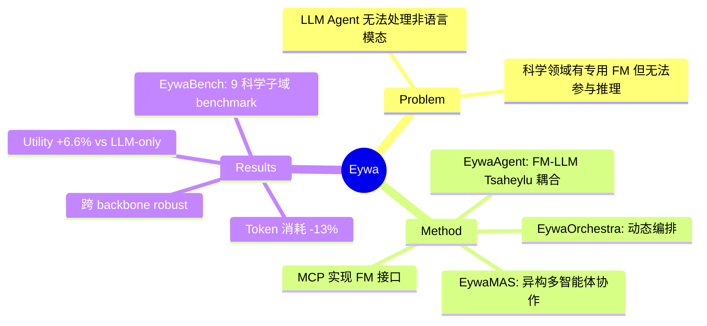

## Summary

提出了 Eywa 框架，通过 "Tsaheylu" 接口将 LLM 与领域专用 Foundation Model（如时间序列模型 Chronos、表格模型 TabPFN）耦合，让 LLM 负责高层推理规划、FM 负责领域计算，解决了纯语言 Agent 无法处理非语言模态科学任务的问题。

## Problem & Motivation

现有 Agentic LLM 系统以语言为通用接口，在科学领域（物理、生命、社会科学）的 structured data（时序、表格）上表现受限。这些领域已有专用 Foundation Model（如 Chronos for time series、TabPFN for tabular），但它们通常只做预测、无法参与高层推理决策。核心问题：如何让 LLM Agent 与这些非语言模态的 FM 协作？

## Method

**EywaAgent**：FM-LLM "Tsaheylu" 耦合单元。LLM 通过 query compiler 配置 FM 的输入控制参数，FM 执行领域计算，输出通过 response parser 重新注入语言推理流程。接口基于 MCP (Model Context Protocol) 实现。

**EywaMAS**：将多个 EywaAgent 组成多智能体系统，支持异构 FM（如 Chronos + TabPFN）协作。

**EywaOrchestra**：动态编排框架，planner 根据任务自动选择 agent 配置、FM 类型、执行拓扑，实现 zero-configuration 的异构协作。

理论贡献：提出 Domain Advantage 假设，证明 EywaAgent 的 function class 严格包含 language-only agent（Theorem 3）。

## Key Results

**EywaBench**：新 benchmark，覆盖 9 个科学子域（Material、Energy、Space、Biology、Clinic、Drug、Economy、Business、Infrastructure），包含时序预测、表格分类/回归等任务。

**Main Results (Table 1)**：
- **EywaAgent** vs Single-LLM-Agent：Overall utility 0.6558 vs 0.6154 (+6.6%)，token 消耗 3882 vs 4469 (-13%)
- **EywaMAS** vs homogeneous MAS baselines（Debate、Refine）：utility 达 0.6761，超越所有同构多智能体基线
- **EywaOrchestra**：接近 EywaMAS 的 utility（0.6746），但无需专家配置，自动选择合适拓扑

**Ablation**：跨 backbone（gpt-4.1-nano、gpt-5-nano、gpt-5-mini）稳定有效；LLM temperature、FM temperature、prompt design 变化下 robust。

## Strengths & Weaknesses

**Strengths**：
- 问题定位精准：LLM Agent 处理 structured data 的局限是真实痛点，而非虚构问题
- 架构设计简洁：FM-LLM 耦合单元 + MCP 实现，工程上可落地
- 理论支撑：Domain Advantage 假设 + function class 包含关系证明，比纯 empirical work 有深度
- EywaBench 填补空白：现有科学 benchmark 多为单一模态，EywaBench 覆盖时序+表格+跨域

**Weaknesses**：
- FM 选择有限：只用 Chronos（时序）和 TabPFN（表格），对其他模态（如分子、图像）未验证泛化性
- Utility metric 定义模糊：评分标准依赖 LLM judge，可能有 bias
- EywaOrchestra 的 planner 本身也是 LLM，存在 bootstrap 问题：planner 如何知道哪个 FM 适合任务？需要任务-FM mapping 的先验知识
- 与 tool-use paradigm 的本质区别不够清晰：本质上就是 tool call，包装成 "Tsaheylu" 好像更 fancy 但核心机制类似

## Mind Map

## Notes

- 名字 "Eywa" 和 "Tsaheylu" 来自 Avatar 电影，有点 over-marketing
- MCP 作为接口标准是正确选择，与 Anthropic 的 tool-use 方向一致
- 核心 insight：heterogeneous collaboration 的关键是让 FM 的输出能被 LLM "理解"并整合，而非简单调用
- 对 GUI Agent 可能的启发：类似地，VLM/grounding model 可以作为 FM，LLM 作为 reasoning interface——但 GUI 任务的语言输出占比更高，与科学预测任务的结构不同