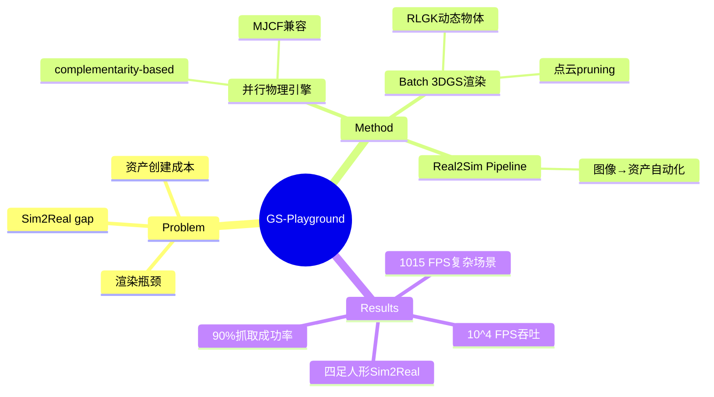

## Summary

GS-Playground 是一个高吞吐量逼真模拟器，将自定义并行物理引擎与 batch 3DGS 渲染管线整合，实现 10^4 FPS at 640x480，并配备自动化 Real2Sim pipeline，在 locomotion、navigation、manipulation 任务上验证了有效的 Sim2Real transfer。

## Problem & Motivation

现有大规模并行模拟器（如 IsaacLab、Genesis）在 proprioception-based locomotion 上取得了突破，但在 vision-informed 任务上受限于：
1. **渲染瓶颈**: 大规模逼真渲染的计算开销巨大，传统 ray-tracing 方法内存效率差
2. **资产创建**: simulation-ready 3D 资产依赖人工建模，成本高
3. **Sim2Real gap**: contact-rich manipulation policy 因物理 gap 难以迁移

这些问题阻碍了 end-to-end perceptual learning（如 VLA、VLN）的规模化训练。

## Method

### 核心架构

**1. 并行物理引擎**
- 基于 complementarity-based 约束求解（而非 soft contact），避免 "spongy" 物理交互
- 支持 MJCF 格式兼容（MuJoCo model 直接导入）
- CPU/GPU 双模式，复杂场景下 CPU 模式更稳定

**2. Batch 3DGS 渲染管线**
- Rigid-Link Gaussian Kinematics (RLGK): 将 3D Gaussian 点云与刚体 link 绑定，实现动态物体渲染
- 点云 pruning 策略: 静态场景保留 30% Gaussians，动态物体可压缩 90%，内存效率显著提升
- 与物理引擎高精度同步（timestep 对齐）

**3. Real2Sim Pipeline ("Image-to-Physics")**
- 单张 RGB 图像 → simulation-ready asset 全流程自动化
- 分割 + inpainting（背景重建）→ AnySplat 3DGS → SAM3D mesh 生成 → pose alignment
- 物理属性估计（质量、摩擦等）自动注入

**4. 开发生态**
- Python API + Gym-style 接口
- 支持 domain randomization（光照、相机 pose）

## Key Results

### 物理稳定性

| Benchmark | GS-Playground vs MuJoCo vs IsaacSim |
|:----------|:-------------------------------------|
| Newton's Cradle | 更好的 momentum transfer，less energy bleed |
| Boston Spot (10ms timestep) | 更小的 base displacement，减少 drift |
| Dense store shelf | 收敛稳定，MuJoCo 有 jitter/contact drift |
| N=50 humanoids | **1015 FPS** (32x MuJoCo CPU, 600x MjWarp GPU) |

### 渲染性能

| Metric | Raw 3DGS | GS-Playground (30% pruning) |
|:-------|:---------|:----------------------------|
| PSNR | 27.15 | 26.87 |
| SSIM | 0.83 | 0.80 |
| LPIPS | 0.22 | 0.28 |
| Throughput | - | **10^4 FPS** @ 640x480 |

vs Isaac Sim ray-tracing: 在 1280x720 分辨率下，Isaac Sim 频繁 OOM，GS-Playground 保持高吞吐。

### Locomotion Sim2Real

| Robot | Training Time | Deployment |
|:------|:--------------|:-----------|
| Unitree Go2 (quadruped) | 10 min (1024 envs) | 成功 velocity tracking |
| Unitree G1 (humanoid) | 6 hours (2048 envs) | 成功 balancing + walking |

vs IsaacLab: 在 stairs terrain 上更快收敛、更高 reward（相同 decimation）。

### Vision-Centric Tasks

| Task | Policy | Deployment Success |
|:-----|:-------|:-------------------|
| Navigation (Go2) | Hierarchical RL + RGB obs | Zero-shot 成功找到 cone |
| Manipulation (Airbot Play) | RGB + proprio → 6-DoF action | **90% success rate** zero-shot |

关键: 无需简化背景或受控光照，直接在复杂真实场景工作。

## Strengths & Weaknesses

### Strengths

1. **工程规模**: 42 人作者团队，完整的 full-stack 解决方案（physics + render + asset pipeline + ecosystem）
2. **性能数字亮眼**: 10^4 FPS、1015 FPS (N=50 humanoids)、90% manipulation success——这些数字比同类工作（GaussGym ~650 FPS）显著更好
3. **Sim2Real 实证充分**: 四足、人形、视觉导航、抓取四种任务都做了 real deployment，不是 paper-only demo
4. **Real2Sim 自动化**: 单张图像 5 分钟生成 asset，解决了资产创建痛点

### Weaknesses

1. **光照/阴影处理**: 3DGS 本身无法处理 dynamic lighting/shadows，依赖 source image 的光照条件——domain randomization 只能部分缓解，无法真正 decouple
2. **刚体假设**: RLGK 只支持 rigid body，soft body/cloth/fluid 无法处理（论文承认，计划集成 PBD/MPIM）
3. **CPU 模式依赖**: 在复杂场景（N=50）CPU 模式才稳定，GPU kernel fusion 还在优化中——可能影响大规模并行训练效率
4. **机构信息模糊**: 42 人作者来自多个机构但未明确列出，难以追踪贡献分工

### 潜在影响

为 VLA/VLN 大规模训练提供了可行的 simulation 基础设施，可能推动 end-to-end perceptual learning 从 "state-based" 向 "vision-based" 的范式转移。但要真正 scale，仍需解决光照 decoupling 和 soft body 支持。

## Mind Map

## Notes

- **与 GaussGym 比较**: GaussGym 也是 3DGS-based simulator，但 throughput ~650 FPS，不支持 batch physics。GS-Playground 在 Table I 中明确对比，声称优势在于 batch physics + batch render + dynamic 3DGS scene
- **Bridge-GS dataset**: 论文提到将发布基于 Bridge-v2 生成的 Bridge-GS dataset，包含 3DGS + mesh + pose + camera params——可能成为新的 benchmark
- **RLHF/VLA 的潜在应用**: 论文 Discussion 提到计划用 GS-Playground 为 VLA/VLN 生成大规模视觉数据，这是合理的扩展方向