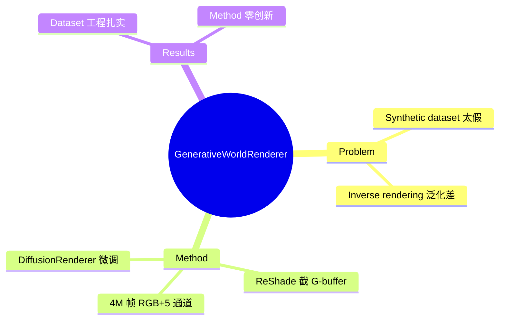

## Summary

现有 synthetic dataset 太假，inverse rendering 泛化不了。从 Cyberpunk 2077 和黑神话里用 ReShade 截 G-buffer，凑了 4M 帧 RGB+5 通道 G-buffer 数据集。拿这个微调 DiffusionRenderer。又提了 VLM-based evaluation 替代人工评测。

## Problem & Motivation

现有 synthetic dataset 问题：
- 太假，inverse rendering 泛化不了
- 缺少真实游戏场景的 G-buffer 数据

## Method

**数据采集**：
- 从 Cyberpunk 2077 和黑神话用 ReShade 截 G-buffer
- 4M 帧 RGB+5 通道 G-buffer 数据集
- 长序列、多天气采集

**方法**：
- 微调 DiffusionRenderer
- VLM-based evaluation 替代人工评测

## Key Results

- 数据集工程扎实
- 方法零创新

## Strengths & Weaknesses

**亮点**：
- 4M 帧、长序列、多天气采集工程活干得扎实
- dataset 本身有价值

**局限**：
- 标题叫 "Generative World Renderer"，实际是个 dataset paper
- 法线从 depth 有限差分重建，在 depth discontinuity 和遮挡处必然炸
- Gated access + 商业游戏素材，数据集能活多久取决于游戏厂商的心情

## Mind Map

## Notes

> [基于月度总结的点评，未获取全文]

核心方法 = fine-tune DiffusionRenderer。本质是 dataset paper。