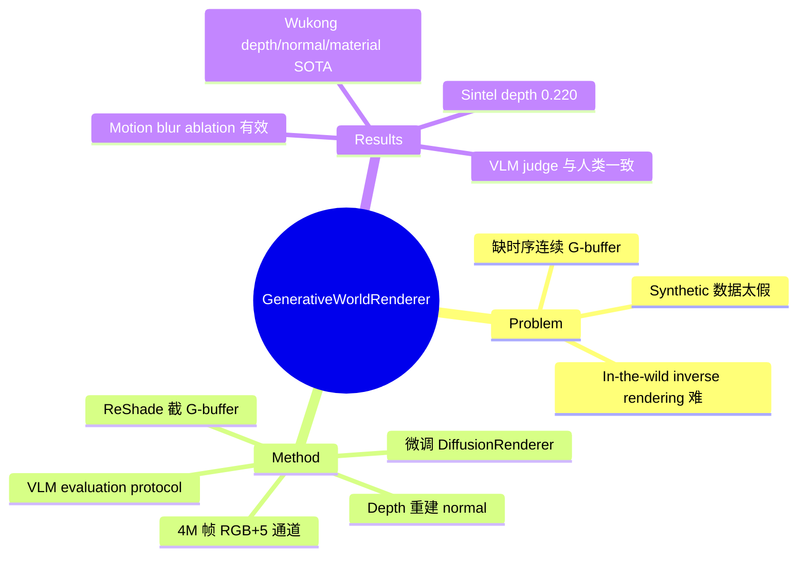

## Summary

针对 in-the-wild inverse rendering 缺少高保真 G-buffer 数据的瓶颈，从 Cyberpunk 2077、Black Myth: Wukong 等视觉复杂的 AAA 游戏中用 ReShade 截取 4M 帧 RGB + 5 通道 G-buffer 数据，微调 DiffusionRenderer 显著提升跨数据集泛化，并提出 VLM-based evaluation protocol 替代昂贵的人工评测。

## Problem & Motivation

双向 rendering（inverse rendering 把图像分解为 G-buffer，forward rendering 反之）的核心瓶颈是数据。现有 synthetic 数据集存在四类缺陷：scene complexity 有限、camera trajectory 静态、material model 过度简化、缺少 adverse weather。这导致模型在真实视频上的 complex reflection、temporal coherence、dynamic element、long-range dependency 上崩坏。

作者的判断是：把 bidirectional rendering 扩展到 in-the-wild 场景的关键障碍，是缺少**大规模、时序连续、带高保真 ground-truth G-buffer 的视频序列**。AAA 游戏恰好提供了视觉复杂度接近真实、且 G-buffer 可被拦截的素材源。

## Method

### 数据采集 pipeline

- **G-buffer 拦截**：用 ReShade 在 graphics API 层拦截渲染（避免反编译），先用 RenderDoc 离线分析定位候选 render pass，再为每款游戏写专用 ReShade add-on，监控 per-frame render-target binding（依赖 format / extent / 周期性 binding 等稳定不变量）。
- **Camera-space normals**：游戏内拿不到可靠的 world-to-camera 变换，因此从 depth 经 inverse projection + finite difference 重建 camera-space normal：`n = normalize(∂P/∂x × ∂P/∂y)`（P 为 view-space position）。这是该方法的一个已知薄弱点（见下）。
- **同步多屏录制**：逐帧 GPU readback 代价过高，改为把所有 G-buffer 着色到屏幕，用 OBS 硬件加速近无损录制；用 mosaic compositing 把两块 2K 显示器拼接，每通道有效 720p，并严格保持时序同步。
- **场景遍历**：Cyberpunk 2077 用 long-range waypoint 半自动驾驶生成连续轨迹；Black Myth: Wukong 用通关存档的探索序列，刻意避开战斗以最大化环境多样性。
- **Motion blur 合成**：用 RIFE 在两帧间插 88 个 RGB sub-frame，在 linear domain 平均后转回 RGB，合成 motion-blurred 变体以弥合 sim-to-real gap。

### 数据规模与标注

4M 连续帧，720p/30fps，同步 RGB + 5 个 G-buffer 通道（depth、normals、albedo、metallic、roughness）。用 Qwen3-VL-235B 做 VLM annotation（每 clip 采 5 帧），标注 texture、weather（sunny/cloudy/foggy/rainy/snowy）、scene type（indoor/outdoor）、motion dynamics（camera-scene 运动的四类组合）。

### 模型与评测

- **Inverse rendering**：在该数据集上微调 DiffusionRenderer。
- **Game editing**：在 Wan 2.1-T2V 上微调（480p、16 FPS、81 帧 clip），用 G-buffer 做 conditioning。
- **VLM-based evaluation protocol**：用 Gemini 3 Pro 作 judge，对真实视频上的 material decomposition 给 semantic score 和 temporal consistency 排名，替代昂贵的人工评测。

## Key Results

- **Black Myth: Wukong 测试集**（39 clip × 57 帧）：Depth RMSE log 0.430（DiffusionRenderer 0.723、DNF-Intrinsic 0.918）；Normal Angular Error 42.57°（45.01°/53.21°）；Metallic RMSE 0.104（0.230/0.245）；Roughness RMSE 0.266（0.281/0.566）。在 depth、normal、material 全面领先。
- **MPI-Sintel final pass**（含 motion blur 和 DoF）：Depth RMSE 0.220（baseline 0.268）；Albedo PSNR 15.40（14.87）；Depth δ<1.25³ 0.776（0.707）。
- **真实视频 VLM 评测**（40 视频，越低越好）：Roughness Semantic 1.78（baseline 2.45）；Metallic Semantic 1.90（2.35）；含 motion blur 的 Metallic temporal consistency 1.85（2.00）。
- **User study**（25 名 CG 专家做 pairwise preference）：VLM 偏好其模型时人类一致率 metallic 85%、roughness 75%，验证 VLM judge 与人类判断相关。
- **Ablation（motion blur）**：加 motion augmentation 后 Depth RMSE log 0.773→0.745、δ<1.25³ 0.756→0.776、Albedo si-PSNR 17.37→17.80，并显著降低强运动下的 real-video flicker。
- **应用**：inverse 输出接 DiffusionRenderer 冻结的 forward renderer 做 relighting，在 sky region 明显优于 baseline；game editing 上优于 ControlNet（edge map）、SDEdit、physics-informed DiffusionRenderer baseline。

## Strengths & Weaknesses

**亮点**：
- 数据工程扎实：4M 帧、长序列、多天气、严格时序同步，且用 ReShade 在 API 层拦截避免反编译，方法可复现性较好。
- 不只是 dataset paper：完整给出微调模型 + VLM 评测 protocol，并在 Wukong / Sintel / 真实视频三类测试上量化提升，user study 也佐证了 VLM judge 的有效性。
- VLM-based evaluation 是有价值的 contribution——为缺乏 ground truth 的真实视频 inverse rendering 提供了可扩展的 ranking 手段。

**局限**：
- **Normal 来自 depth 有限差分**：在 depth discontinuity 和遮挡边界处必然不准，这是 G-buffer ground truth 质量的硬伤，作者自己的 Normal Angular Error 也高达 42.57°（绝对值并不低）。
- **数据可持续性**：依赖商业游戏素材 + gated access，数据集长期可用性受游戏厂商版权约束。
- **material model 表达受限**：只有 5 个通道，复杂 BRDF / 透明 / 次表面散射等无法表达；泛化能力上限由所采集游戏的环境复杂度界定。
- VLM 评测在 roughness 上一致率偏低（视觉线索更模糊），说明该 protocol 并非对所有 channel 都同等可靠。

## Mind Map

```mermaid
mindmap
  root((GenerativeWorldRenderer))
    Problem
      Synthetic 数据太假
      缺时序连续 G-buffer
      In-the-wild inverse rendering 难
    Method
      ReShade 截 G-buffer
      4M 帧 RGB+5 通道
      Depth 重建 normal
      微调 DiffusionRenderer
      VLM evaluation protocol
    Results
      Wukong depth/normal/material SOTA
      Sintel depth 0.220
      VLM judge 与人类一致
      Motion blur ablation 有效
```

## Notes

- 旧笔记把它定性为"零创新的 dataset paper"过于武断——全文显示它有数据 + 微调模型 + VLM 评测三块完整贡献，虽然 backbone 复用 DiffusionRenderer / Wan，但 VLM-based real-world ranking protocol 是有迁移价值的设计。
- 关键 open question：normal 从 depth 有限差分重建的误差，是否是 Normal Angular Error 居高不下（42.57°）的主因？若有更好的 normal ground truth，inverse rendering 上限能提多少？
- 用游戏 G-buffer 作 world model / inverse rendering 训练数据是一条值得关注的 scaling 路径——视觉复杂度接近真实，且 ground truth 几乎免费，但受版权与 material model 表达力双重约束。
