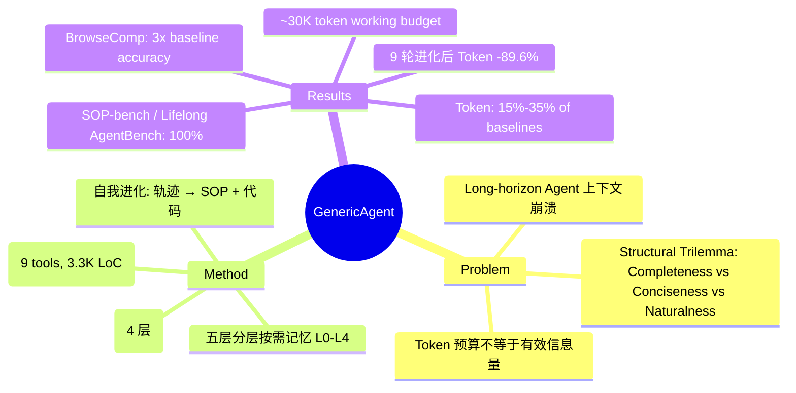

## Summary

GenericAgent 提出**上下文信息密度最大化 (Contextual Information Density Maximization)** 作为长周期 LLM Agent 的核心设计原则：性能瓶颈不在上下文长度，而在有限预算内能维持多少决策相关信息。基于此构建了四个耦合组件（最小原子工具集、分层按需记忆、自我进化机制、上下文截断压缩），仅 ~3,300 行代码和 ~30K token 工作预算，在 SOP-bench / Lifelong AgentBench 上达到 100% 完成率，且在 token 消耗仅为同类系统 15%-35% 的前提下全面超越。

## Problem & Motivation

作者识别出长周期 LLM Agent 的三种复合失败模式：(1) **位置偏差 (position bias)** 导致中间证据被淹没在长上下文尾部，(2) **无关内容** 主动稀释注意力并降低推理质量，(3) **有效上下文长度远小于标称窗口**——即使有 200K+ token 预算，实际可用的决策相关信息窗口远小于此。

现有长周期 Agent 框架（如 Claude Code, OpenClaw）倾向于将大量历史、工具输出、技能说明塞入上下文，通过扩大上下文窗口来"硬扛"，但这本质上是用更高的 API 成本换取脆弱的性能。作者的核心论点是：**这是一个结构性约束（structural constraint），不是预算问题**。即使在无限上下文窗口的假想设定下，completeness（信息完整）和 conciseness（信息精炼）的张力依然不可调和——每多塞入一条无关信息都在稀释 attention 密度。

提出 "structural trilemma"：completeness、conciseness、naturalness 三者无法同时满足，GenericAgent 的选择是牺牲 naturalness（接受结构化、非自然的记忆表示），在前两者之间建立新的均衡。

## Method

GenericAgent 的架构由四个紧密耦合的组件构成，所有设计决策都回溯到同一个原则——最大化上下文信息密度。

**1. 最小原子工具集 (Minimal Atomic Tool Set)**

仅 9 个原子工具：`code_run`、`file_read/write/patch`、`web_scan`、`web_execute_js`、`ask_user`、`update_working_checkpoint`、`start_long_term_update`。

设计哲学：工具只提供**环境访问能力**，复杂行为通过组合泛化 (compositional generalization) 实现。`code_run` 是万能扩展口——理论上图灵完备，任何新能力无需新增工具，只需写代码。这直接降低工具说明占用的上下文预算。

**2. 五层分级按需记忆 (Hierarchical On-Demand Memory)**

| 层级 | 名称 | 内容 | 上下文策略 |
|:-----|:-----|:-----|:-----------|
| L0 | 元规则 (Meta Rules) | 不可变的基础行为规则和安全边界 | 始终注入 |
| L1 | 记忆索引 (Insight Index) | 紧凑指针——不存内容，只存"存在性" | 默认展示 |
| L2 | 全局事实 (Global Facts) | 跨任务稳定知识（用户偏好、环境配置） | 按需加载 |
| L3 | 任务技能 / SOP | 已验证执行路径固化的可复用流程 | 按需加载 |
| L4 | 会话归档 (Session Archive) | 原始历史记录持久化存储 | 工具调用检索 |

关键设计：默认上下文中**仅注入 L0 + L1**。L1 是极简索引，不包含具体内容——Agent 看到的是"存在哪些知识"而非"知识的具体内容"，需要时通过工具调用路由到 L3/L4 的深层内容。这使得工作上下文始终紧凑。

**3. 自我进化机制 (Self-Evolution / Skill Crystallization)**

流水线：任务感知 → 自主探索 → 技能结晶 → 记忆召回。

当 Agent 成功完成一个任务后，系统自动将其执行轨迹（action sequence、依赖、中间决策）转化为可复用的 SOP 文件和可执行代码，存入 L3 层。下次遇到类似任务时直接调用 SOP，无需重新探索。

关键洞察：进化的是**策略**（如何组合工具完成特定子任务），而非工具本身。质量通过显式整合步骤控制——SOP 的生成需要经过验证步骤，确保结晶的 skill 是可靠的。

**4. 上下文截断与压缩层 (Context Truncation & Compression)**

四种粒度的压缩协同工作：
- **工具输出截断**：限制单次工具调用的返回长度
- **标签级压缩**：对 HTML/XML 等结构化输出做标签级裁剪
- **消息驱逐 (message eviction)**：当上下文逼近 ~30K budget 时，按信息密度分数驱逐低价值历史消息
- **工作记忆锚点 (working memory checkpoint)**：Agent 可主动调用 `update_working_checkpoint` 将当前关键状态写入持久化摘要，替换冗长的历史对话

## Key Results

**任务完成率**
- SOP-bench：**100%** 准确率
- Lifelong AgentBench：**100%** 准确率
- RealFinBench：**65%**（基线系统未报告具体数字，论文声称行业第一）

**Token 效率**
- Token 消耗仅为同类主流 Agent 系统的 **15%-35%**
- Lifelong AgentBench 上：GA 消耗 Claude Code 输入 token 的 **27.7%**，仅为 OpenClaw 的 **15.5%**，同时任务完成率更高 (100%)
- 活跃工作上下文控制在 **~30K tokens**，约为同类框架的 1/6

**自进化效率**
- 同一任务 9 轮重复执行后：Token 消耗减少 **89.6%**（22.2 万 → 2.3 万），模型调用次数减少 **84.4%**（32 次 → 5 次）
- 跨 8 个网页任务：后续执行 Token 平均下降 **79.3%**，最高节省 **92.4%**
- 同一任务重复 5 次：耗时从 102 秒降至 66 秒，Token 从 20 万腰斩至 10 万

**网页浏览 (BrowseComp-ZH 多跳推理)**
- GenericAgent：准确率 **0.60**，Token ~0.26M
- 基线主流 Agent 系统：准确率 0.20，Token ~0.76M
- 准确率为基线的 **3 倍**，Token 仅为基线的 **1/3**

**上下文膨胀抵抗**
- 安装 20 个技能并高强度使用后，仅 GA 有效防止了上下文膨胀
- 长期记忆评估 (LoCoMo)：基于分层记忆架构确保了记忆的高效召回，显著优于对比系统

## Strengths & Weaknesses

**Strengths**

1. **概念简洁且统一**：上下文信息密度最大化是一条可以回溯所有设计决策的第一性原理，不是 ad-hoc 的技巧堆砌。"simple, scalable, generalizable" 的典范。
2. **反直觉结论有实验支撑**：更低的 token 消耗 = 更好的任务性能。这个结论违反"更多上下文 = 更好理解"的直觉，但被多项实验一致验证，有 insight depth。
3. **极简代码量 (3.3K 行) 是真正的 engineering contribution**：不是"我们写得更少所以更 elegant"，而是代码量少到 LLM 可以在每轮读自己的完整源码——这使 **架构自更新 (architecture self-update)** 成为可能。这是最小化设计的深层理由。
4. **进化机制是"弱方法" (weak method)**：进化的是 SOP/策略而非模型参数——不需要梯度更新，不需要 RL training，只需在已验证的轨迹上模式提取。这是高 feasibility + high impact 的选择。
5. **记忆系统设计有认知科学根基**：L0-L4 的分层结构天然映射到 human memory 的 procedural→semantic→episodic 分层，L1 作为"存在性索引"而非内容存储，对应 meta-memory 概念。

**Weaknesses & Open Questions**

1. **仅基于 abstract 和二手来源，未读全文**：以下 weakness 分析基于公开信息推断，可能存在偏差。特别是 ablation 细节、failure case 分析、cross-model generalization 测试等需全文确认。
2. **RealFinBench 仅 65%**：相比 SOP-bench/Lifelong AgentBench 的 100% 有显著落差。这可能说明 GenericAgent 在处理真实世界中高度开放、需要深度领域知识的任务时，最小工具集 + SOP 记忆的组合存在边界。需要全文确认失败模式是工具不足、SOP 匹配失败，还是 LLM 推理瓶颈。
3. **SOP 质量退化风险 (SOP drift)**：自我进化声称"verified trajectory → reusable SOP"，但验证机制是否足够 robust？如果某次执行的 SOP 结晶包含了环境相关的偶然因素（例如特定的 CSS selector 恰好匹配），在新场景下可能会 silently fail。这是所有 self-improving system 共有的 distribution shift 问题。
4. **最小工具集的表达能力边界**：9 个工具声称图灵完备（via code_run），但 code_run 的 turing-completeness 是理论上的——实际是否受限于 LLM 生成代码的能力、执行环境的安全性限制、以及某些需要专用接口的任务（如复杂 GUI 操作、系统级权限操作）？
5. **比较基线的信息不完整**：论文称 GenericAgent 在多个 benchmark 上"显著优于领先系统"，但从公开材料看，比较对象的具体版本号和配置细节不明确。特别是 Claude Code 和 OpenClaw 的版本、使用的 LLM backbone 是否一致需要确认。

**与 Self-Improving Agent Reliability 方向的相关性**

GenericAgent 为 Self-Improving Agent Reliability 方向提供了重要的参考基线：
- 其自我进化机制 (trajectory → SOP) 是一种**不同范式**的 self-improvement，与我们 agenda 中关注的 RL-based self-improving + verification debiasing 形成互补视角
- L3 SOP 的"质量通过显式整合步骤控制"这个点直接触及了 Self-Improving Reliability 的核心 concern——如何确保自增强循环的产出是真正可靠的？GenericAgent 的方案是"验证步骤"，但细节需要在全文中确认
- 如果 GenericAgent 的 SOP 质量验证是可迁移的机制，可能为我们的 Adversarial Verification idea 提供替代方案或组件

## Mind Map

## Notes

- 与 HyMEM (Papers/2603-HybridSelfEvolvingStructured.md) 比较：两者都在做 memory + self-evolving，但 HyMEM 是 graph-structured memory for GUI agents，GenericAgent 是技能树 + 通用 agent。关系是 complementary 而非竞争——HyMEM 偏组织，GenericAgent 偏信息密度原则。
- 与 UI-Mem (Papers/2600-UiMemSelfEvolving.md) 比较：UI-Mem 的 self-evolving 是 online RL 中更新 memory 参数，GenericAgent 的 self-evolving 是 trajectory → SOP 的模式提取。前者是 continuous learning，后者是 one-shot crystallization。互补。
- 论文标注为 "V1.0"，暗示后续版本可能有扩展，值得跟踪。
- 代码开源（MIT），GitHub 已有 6,200+ stars（截至 2026.04），社区活跃度良好。3.3K 行代码值得实际阅读以验证论文 claims。
- Key open question: 如果 GenericAgent 的 SOP 进化机制确实可靠，是否能作为 Self-Improving Reliability 方向中对抗"偏差放大"的正面样本？
