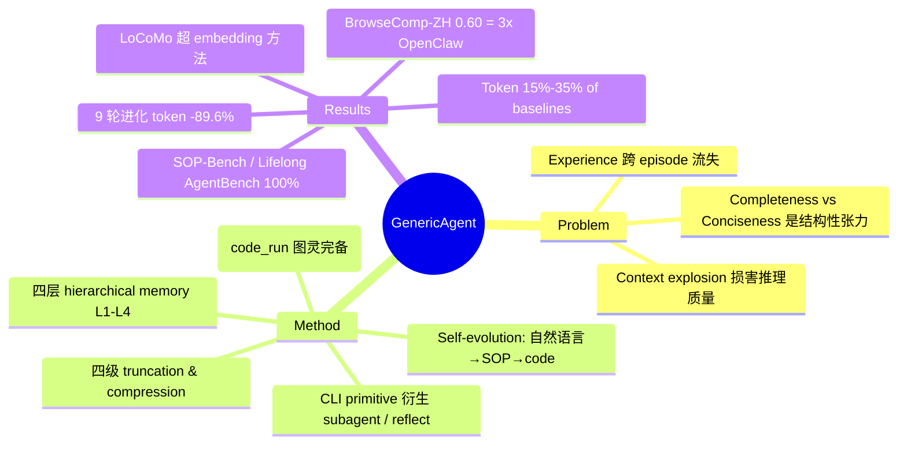

## Summary

GenericAgent (GA) 提出**上下文信息密度最大化 (context information density maximization)** 作为长周期 LLM Agent 的唯一设计原则：long-horizon 性能不由 context length 决定，而由有限预算内能维持多少 decision-relevant 信息决定。围绕该原则构建四个耦合组件（9 个原子工具、四层按需 hierarchical memory、reflection 驱动的 self-evolution、context truncation & compression），仅 ~3,300 行代码、<30K token 工作预算，在 SOP-Bench / Lifelong AgentBench 上达 100% 完成率，token 仅为同类系统的 15%-35%。

## Problem & Motivation

作者将长周期 Agent 的失败归因为两大根本挑战。**(1) Context explosion**：随交互延长，tool definitions、retrieved memories、原始观察不断累积，挤占 decision-relevant 信息的空间，这不仅是 token 成本问题，更直接损害推理质量——LLM 的 effective attention 有限，无关内容增多会让模型遗漏约束、混淆中间状态、产生并放大 hallucination。**(2) Experience accumulation & reuse**：长周期环境中 user preference、tool behavior、有效 action pattern 只能在 trial-and-error 中习得，但现有框架多把每个 episode 当作 stateless，即使引入 retrieval memory 也只存原始 log 而非蒸馏后的可复用知识，且缺乏 feedback 驱动的更新，导致 stale memory silently degrade。

核心论点提炼为 context engineering 的三个维度：**completeness**（决策所需信息必须显式在场）、**conciseness**（无关冗余必须剔除）、**naturalness**（表示需语义可读，是次要约束）。作者强调 completeness 与 conciseness 之间的张力是**结构性的 (structural)**，而非预算问题——即使 context window 无限，"多塞潜在相关信息提升 completeness 但削弱 conciseness""压缩提升 conciseness 但可能丢失 completeness"的矛盾依然存在。因此 context engineering 应被看作以 completeness/conciseness 为核心、naturalness 为约束的 constrained optimization，而非三方对等 trilemma。

## Method

GA 由统一 agent loop 驱动（核心循环仅 92 行）：每步将 global memory 与当前任务拼成 execution context，LLM 产出 output 或 tool call，结果以结构化信号回写系统状态；任务完成后将 execution trace 压缩成 long-term 表示存入共享 memory。四个核心组件：

**1. Minimal Atomic Toolset（9 个原子工具）**
分五类：File Operations（`file_read` / `file_patch` / `file_write`）、Code Execution（`code_run`，Python/Bash，每 turn 仅一次调用）、Web Interaction（`web_scan` / `web_execute_js`）、Memory Management（`update_working_checkpoint` / `start_long_term_update`）、Human-in-the-loop（`ask_user`）。理论上仅 `code_run` 即图灵完备、可复刻其余八个工具，因此其余工具非为扩展能力，而是降低决策成本的 shortcut——本质是 harness。工具最小化同时降低 prompt 开销与 policy 的 action-space 歧义。`web_scan` 内置 layout-analysis：clone live DOM、计算逐元素可见性、剔除被覆盖/隐藏元素后再序列化，比 raw DOM 降低约一个数量级 token。

**2. Hierarchical Memory（四层 + meta-memory）**
功能上分 working memory（每 turn 注入、仅最小任务状态）、always-on memory（持久可见、压到最轻量的导航索引）、long-term memory（默认在 context 外、经 post-task consolidation 写入）。实现层为四层：**L1 index**（紧凑指针，always-on）、**L2 fact**（验证过的稳定事实）、**L3 SOP**（可复用流程：workflow、precondition、失败案例、recovery 策略）、**L4 raw session archive**（持久化追溯）。默认仅注入 meta-memory + L1，沿 L1→L2/L3 路由按需检索。关键不变量：**L1 只记录知识类别的"存在性"而非内容**，其描述长度逼近知识类别结构的 Kolmogorov complexity——因为 LLM 本身充当 decoder，知道"某能力存在"即可再花 tool call 取深层内容。写入用 triggered commit + 验证阶段，遵循 "No Execution, No Memory"。

**3. Self-Evolution（演化策略而非工具）**
固定 tool 层与可演化 knowledge 层分离，所有 task-specific 能力存于 SOP 文件与可复用脚本。质量控制靠 selective consolidation：raw trace 只存 L4，仅在子目标完成/错误恢复等里程碑触发显式 consolidation 才提升为 L3，且只保留经成功 tool 执行验证的信息。失败处理用三级 escalation：先局部修正重试 → 失败则换策略/补信息 → 全部失败则请求人类介入。能力演化分三阶段：Stage 1 自然语言执行 → Stage 2 SOP 蒸馏 → Stage 3 代码化执行，阶段跃迁由 memory 机制自主触发。GA 还支持 autonomous exploration：curriculum planner 按 breadth/depth/utility/innovation 四维加权打分（初始权重 0.3/0.2/0.3/0.2）选探索任务，再用 reflection-based adaptation 根据实际 usage 反向调权（预测高分但 30 天内 usage<3 则降权 10%）。

**4. Context Truncation & Compression（四级）**
用字符域启发式 $B=\alpha W_{tokens},\ \alpha\approx 3$ 触发压缩。四级：(i) tool-output truncation（head-tail 截断，如 `code_run` 10K 字符上限）；(ii) tag-level compression（约每 5 turn 一次，重复 working-memory 块替换为 placeholder、reasoning/tool 标签内容截到 ~800 字符窗口，最近 10 条豁免，借此让 ~80% turn 命中 prompt cache）；(iii) message eviction（超预算时 FIFO 逐出至降到预算 60% 以下）；(iv) working-memory anchor（每次 tool 调用后注入最近 20 条 one-line 摘要 + turn 号 + `key_info` 块，evict 后成为长期记忆唯一来源）。

此外，CLI-as-primitive 的极简架构让 **Subagent Dispatch**（父 agent 跑 terminal 命令启动多个后台 GA 实例，天然 context 隔离 + map-reduce）与 **Reflect Mode**（外部脚本监测条件后向 CLI 派发任务，衍生 Watchdog 与 Scheduled Task）无需扩展核心架构即自然涌现。

## Key Results

**任务完成率与 token 效率（Table 2，Efficiency = Accuracy / Total Tokens(M)）**
- SOP-Bench：GA (Claude Sonnet 4.6) 100%，2.08M total token，efficiency 0.48；Claude Code 仅 85%。
- Lifelong AgentBench：GA 100%（241K total），efficiency 4.15；OpenClaw 70%（1.45M），Claude Code 75%（814K）。GA input token 仅 222K，是 Claude Code (800K) 的 27.7%、OpenClaw (1.43M) 的 15.5%。
- RealFin-Benchmark：GA 65% 为全场最高（Claude Code Opus 60% / Sonnet 55%，Codex 60%，OpenClaw 35%），且 efficiency 5.70 远超对手。

**Tool-use 效率（Table 4，5 个 long-horizon 任务）**
GA 100% success，匹配 Claude Code（OpenClaw 80%），但仅用 188,829 token（Claude Code 537,413 的 35.1%、OpenClaw 633,101 的 29.8%），requests 32.6→11.0、tool calls 22.6→12.8。Claude Code 源码级有 53 个工具、OpenClaw 18 个 tool factory，而 GA 仅 9 个。

**Memory 系统**
- 重复运行收敛：5 轮重复中 GA 运行时间 102s→~66s、token 200,439→100,000，而 CodeX/Claude Code/OpenClaw 基本持平。
- Condensed memory ablation（SOP-Bench dangerous_goods，Table 5）：No-Memory 13.87% → Full-Memory(575 tok) 52.44% → Condensed(仅 165 tok) 66.48%，以最少 token 达最高 TSR。
- LoCoMo 长期事实记忆（Table 6）：GA 在 Multi-Hop/Temporal/Open-Domain/Single-Hop 四类的 F1 与 BLEU-1 全面超过 Mem0、A-MEM、OpenClaw，且**无需 embedding model 或向量库**。
- Context explosion（Table 7）：装 20 个 skill 高强度使用后对 "Hello" 的 full prompt 长度，GA 仅 2,298 token，而 Claude Code 22,821、CodeX 23,932、OpenClaw 43,321。

**Self-evolution（LangChain GitHub 任务 9 轮，Table 8）**
Round #1→#9：运行时间 7m30s→1m38s（-78.2%）、LLM calls 32→5（-84.4%）、total token 222,203→23,010（-89.6%）。#6–#9 进入 23K±1K 的稳定 codified 区间。跨 8 个 web 任务平均 token 下降 79.3%（61.0%-92.4%），高复杂度任务收益更大（OC 均值 >1M 的任务平均省 83.5%）。

**Web Browsing（Table 9，均用 Claude Opus 4.6）**
WebCanvas：GA 0.834 (0.18M) vs OpenClaw 0.722 (0.71M)；BrowseComp-ZH：GA 0.60 vs OpenClaw 0.20（3 倍），token 0.47M vs 1.31M；Custom Tasks：GA 0.577 (0.26M) vs OpenClaw 0.500 (0.76M)。整体 2.9x-3.9x token 节省。

## Strengths & Weaknesses

**Strengths**

1. **概念简洁且统一**：context information density maximization 是可回溯所有设计决策的第一性原理，论文进一步提炼出 agent 的 "minimal complete capability set"——tool interfacing / context management / memory formation 三者，对应任务流水线中信息密度被系统性削弱的三个环节。这是 "simple, scalable, generalizable" 的典范。
2. **反直觉结论有扎实实验支撑**："在 long-horizon 设定下更低 token 消耗 = 更好任务性能"被多 benchmark 一致验证。作者的解释 insight 深刻：超过某点后多出的 token 不带来信息而是通过 positional bias / attention dilution / effective-window 收缩损害推理，token 消耗是 context management 质量的症状而非推理充分性的标志。
3. **极简代码量是真正的 engineering contribution**：~3,300 行（核心 loop 92 行）对比 OpenClaw 约 53 万行（160 倍）。论文明确提出最小化的深层理由——足够小的代码库 LLM 可读可改，使 **architectural self-update** 成为 evolution 的第三维（继 skill consolidation、autonomous exploration 之后）。
4. **memory 即验证/选择问题**：与 MemGPT、A-MEM 等以存储/检索为中心的工作不同，GA 把 memory 质量当作 verification + selection 问题，只把 behavior-changing 且验证过的信息提升为长期表示；LoCoMo 上无需向量库即超过 embedding 方法，是有说服力的反例。

**Weaknesses & Open Questions**

1. **RealFin 仅 65%、SOP-Bench 在 Minimax M2.7 下降到 90%**：相比 Claude 配置的 100% 有落差，说明在真实世界高度开放、需深度领域知识的金融任务及较弱 backbone 上，最小工具集 + SOP 记忆的组合存在边界。论文未给出 RealFin 的 failure-mode 细分。
2. **自评估机制的成熟度有限**：作者在 §3.3 Limitations 自承——reflection-based 权重调整是 preliminary、尚无长期数据证明跨真实工作流有效；self-improvement log 仍靠手工 curation；skill tree 的合并/弃用/重构仍全手工；30-round 执行上限使复杂研究任务需跨 session，session 间仅靠报告与 task-list 注释保持连续。这些都是 self-improving system 共有的 distribution-shift / 维护性隐患。
3. **比较基线配置的可比性**：Table 2 中不同 benchmark 用不同 backbone（Claude Sonnet/Opus 4.6、Minimax M2.7、GPT-5.4），efficiency 比值仅在同 block 内可比；部分对照（如 Codex/CodeX）只在个别 benchmark 出现，跨系统的严格 apple-to-apple 仍有限。
4. **char-budget 启发式对 CJK 不友好**：$\alpha\approx3$ 在 CJK 内容下严重低估实际 token，存在延迟 eviction 与 context overflow 风险，作者自己也指出这一点。

**与 Self-Improving Agent Reliability 方向的相关性**

GA 的 trajectory→SOP→code self-evolution 是一种**非 RL、非梯度**范式的 self-improvement，与 agenda 中 RL-based self-improving + verification debiasing 形成互补。其 "No Execution, No Memory" + triggered commit + 三级 failure escalation 直接回应了"如何确保自增强循环产出可靠"的核心 concern——质量靠"成功执行验证"而非对抗式校验，可作为 Adversarial Verification idea 的替代组件或对照基线。

## Mind Map

```mermaid
mindmap
  root((GenericAgent))
    Problem
      Context explosion 损害推理质量
      Experience 跨 episode 流失
      Completeness vs Conciseness 是结构性张力
    Method
      9 个原子工具 (code_run 图灵完备)
      四层 hierarchical memory L1-L4
      Self-evolution: 自然语言→SOP→code
      四级 truncation & compression
      CLI primitive 衍生 subagent / reflect
    Results
      SOP-Bench / Lifelong AgentBench 100%
      Token 15%-35% of baselines
      9 轮进化 token -89.6%
      LoCoMo 超 embedding 方法
      BrowseComp-ZH 0.60 = 3x OpenClaw
```

## Notes

- 与 HyMEM (Papers/2603-HybridSelfEvolvingStructured.md)：两者都做 memory + self-evolving，但 HyMEM 是 graph-structured memory for GUI agents，GA 是技能树 + 通用 agent。complementary：HyMEM 偏组织，GA 偏信息密度原则。
- 与 UI-Mem (Papers/2600-UiMemSelfEvolving.md)：UI-Mem 的 self-evolving 是 online RL 更新 memory 参数，GA 是 trajectory→SOP 的模式提取。前者 continuous learning，后者 one-shot crystallization。互补。
- 论文标注 "V1.0"，作者明确把 architectural self-update 列为未来工作，值得跟踪后续版本。
- 实测要点：GA 的 `web_scan` DOM 剪枝（clone DOM + 可见性分析）是 web agent token 控制的可借鉴工程点；"L1 只存存在性、LLM 当 decoder" 的 meta-memory 设计是最值得迁移到 GUI agent 的 idea。
- Key open question：GA 的 SOP 进化是否能作为 Self-Improving Reliability 方向中对抗"偏差放大"的正面样本？其 "No Execution, No Memory" 过滤是否足以防止 SOP 把环境偶然因素（如某 CSS selector）错误固化？
