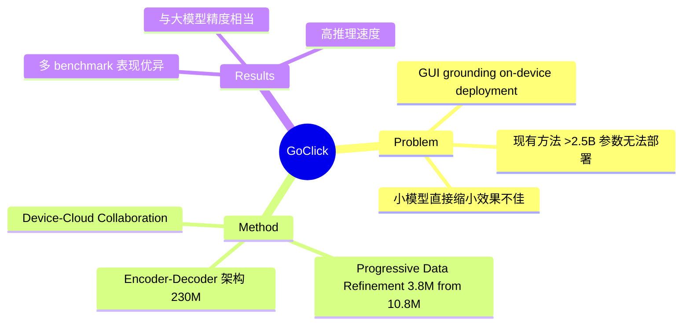

## Summary
GoClick 提出一个仅 230M 参数的轻量级 GUI element grounding VLM，针对 on-device 部署场景优化。通过 encoder-decoder 架构和 Progressive Data Refinement pipeline（从 10.8M 原始数据提炼 3.8M 核心集），实现了与大模型相当的 grounding 精度，并可集成到 device-cloud collaboration 框架中辅助云端 task planner。

## Problem & Motivation
> [未获取全文，仅基于 abstract]

这篇论文研究的是 GUI element grounding 的轻量化问题，即如何在资源受限设备（如手机）上部署高精度的界面元素定位能力。核心挑战在于：现有 visual grounding 方法通常依赖 2.5B+ 参数的大 VLM，对于 on-device 执行而言，memory 和 computational constraints 使其不切实际。

问题的重要性很直接：GUI agent 若要在真实设备上运行，低延迟是关键需求；而 grounding 是 agent 与界面交互的基础能力，如果这一能力无法本地部署，agent 就必须依赖云端调用，增加延迟和隐私风险。作者指出简单缩小 decoder-only VLM 效果不佳，需要在架构和数据层面做针对性设计。

## Method
> [未获取全文，仅基于 abstract]

GoClick 的核心设计包括两个层面：

1. **Encoder-Decoder 架构选择**
   - 作者实验发现，直接缩小 decoder-only VLM 在 GUI grounding 任务上效果不佳
   - 选择 encoder-decoder 架构，在小参数规模下优于 decoder-only 替代方案
   - 最终模型仅 230M 参数，相比主流 grounding VLM（>2.5B）大幅压缩

2. **Progressive Data Refinement Pipeline**
   - 小 VLM capacity 有限，需要更高质量的数据
   - 从 10.8M 原始数据集中，通过 task type filtering 和 data ratio adjustment 提炼出 3.8M 高质量核心集
   - 使用核心集训练带来显著的 grounding accuracy 提升

3. **Device-Cloud Collaboration 应用**
   - GoClick 可集成到 device-cloud 协作框架中
   - 本地 GoClick 负责精确元素定位，辅助云端 task planner 执行任务
   - 提高整体 GUI agent success rate

## Key Results
> [未获取全文，仅基于 abstract]

Abstract 提到的主要结果：
- GoClick 在多个 GUI element grounding benchmarks 上表现优异
- grounding accuracy 可与大模型（显著更大的 VLM）相当
- 推理速度高、模型尺寸小（230M），适合 on-device 部署
- 在 device-cloud collaboration 框架中集成后，帮助云端 task planner 提高成功率

但 abstract 缺少具体 benchmark 名称、数值对比、与 SOTA（如 SeeClick、UGround）的性能差距等细节。

## Strengths & Weaknesses
> [未获取全文，仅基于 abstract]

**亮点**：
- 轻量化方向正确：on-device 部署是 GUI Agent 的关键需求，现有大 VLM 无法满足
- 架构洞察有价值：encoder-decoder 在小规模优于 decoder-only，这一发现对后续 lightweight grounding 模型设计有参考意义
- 数据提炼思路合理：小模型需要更精数据，Progressive Data Refinement 的设计思路符合直觉

**局限**：
- Abstract 缺少与现有 SOTA（如 SeeClick、UGround）的定量对比，无法判断"与大模型相当"的具体差距
- 模型架构细节未知：encoder-decoder 的具体设计、视觉编码器选择、训练配置等未披露
- Device-cloud collaboration 的实验设计未详细说明
- 230M 参数是否足以处理复杂界面（小元素、遮挡、跨主题）未知

**潜在影响**：
若 GoClick 真能在 230M 参数下达到接近大模型的 grounding 精度，将推动 GUI agent 向本地化部署迈进，降低延迟和隐私风险，可能成为 lightweight grounding 的参考基线。

已知：GoClick 提出 230M 参数的轻量 GUI grounding VLM，采用 encoder-decoder 架构和 Progressive Data Refinement，声称达到与大模型相当的精度。推测：encoder-decoder 在小规模的优势可能来自更高效的 encoder 表示和更专注的 decoder 定位。不知道：具体 benchmark 数字、与 SOTA 的对比、消融实验结果、failure case 分析。

## Mind Map

## Notes
- 与 [[2400-SeeclickHarnessingGuiGrounding]] 相关：SeeClick 是早期 GUI grounding 代表工作，GoClick 的轻量化路线是否能在 ScreenSpot 等 benchmark 上接近 SeeClick 效果？
- 与 [[2500-UiR1EnhancingEfficient]] 相关：UI-R1 用 RL 高效训练 GUI agent，GoClick 用轻量化架构；两条路线（高效训练 vs 高效架构）是否可结合？
- 关键问题待验证：230M encoder-decoder vs 3B decoder-only 的具体对比数字是什么？