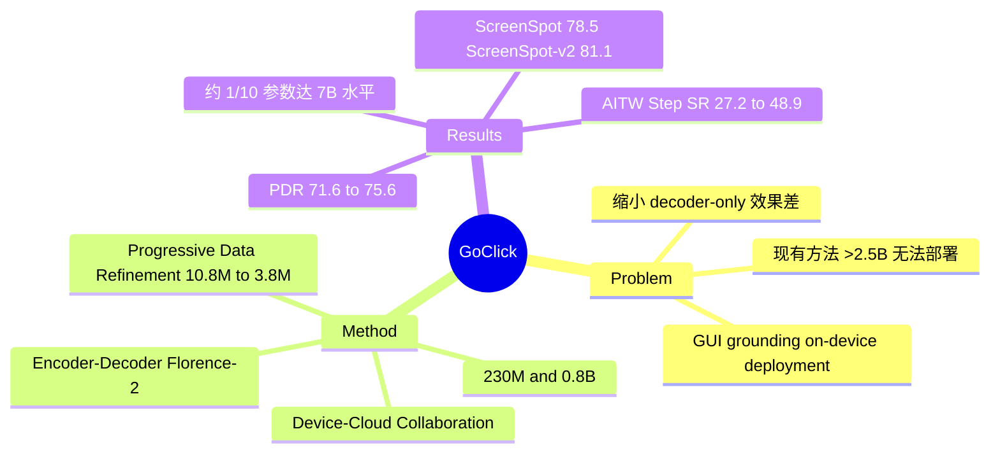

## Summary
GoClick 用一个仅 230M 参数的 encoder-decoder VLM 做 GUI element grounding，通过选择 Florence-2 式 encoder-decoder 架构（而非简单缩小 decoder-only VLM）和 Progressive Data Refinement pipeline（10.8M → 3.8M 核心集），在 ScreenSpot 等 benchmark 上以约 1/10 参数达到 7B 模型水平，并在 device-cloud collaboration 中显著提升云端 planner 的执行成功率。

## Problem & Motivation

GUI element grounding（根据自然语言指令在 screenshot 上精确定位元素）是 GUI agent 与界面交互的基础能力。把这一能力直接部署到手机等资源受限设备上对低延迟 agent 越来越关键，但现有 visual grounding 方法通常依赖 ≥2.5B 参数的大 VLM，受 memory 和 computational constraints 限制，无法实际 on-device 运行。

作者的关键观察是：简单地缩小 decoder-only VLM（如 Qwen2-VL、InternVL2）虽然直观，但效果很差——在 FuncPred 上 InternVL-2-1B 仅 2.0%、Qwen2-VL-2B 仅 51.1%，说明小参数规模下 decoder-only 架构对 grounding 任务并不友好。因此需要从架构和数据两个层面做针对性设计，而非单纯压缩。

## Method

GoClick 的设计围绕"小模型如何做好 grounding"展开，两个核心支柱是架构选择和数据提炼。

1. **Encoder-Decoder 架构（Florence-2 式）**
   - 放弃 decoder-only，采用 Florence-2 的 encoder-decoder 结构。实验证明该架构在小参数规模下对 GUI grounding 显著优于 decoder-only。
   - 提供两个尺寸：GoClick-B（230M）和 GoClick-L（0.8B）。即便是 0.8B 版本也远小于主流 grounding VLM（>2.5B）。

2. **Progressive Data Refinement (PDR) Pipeline**
   - 小 VLM capacity 有限，对数据质量更敏感，因此把 10.8M 原始数据提炼为 3.8M 核心集（减少 64.8%）。
   - **Coarse refinement**：剔除过时 GUI 模式（如 Android 4.0 老界面）和 REG 任务。
   - **Fine refinement**：对六大 metadata 来源做 task ratio adjustment。
   - 最终 3.8M 核心集的任务构成：Intent Grounding 1,686k、Brief Description Grounding 1,450k、Functionality Grounding 399k、Widget Listing 172k、Text Grounding 107k。

3. **Device-Cloud Collaboration 应用**
   - 本地 GoClick 负责精确元素定位，云端大模型（GPT-4o / Gemini）负责 task planning。
   - planner 输出意图描述，GoClick 把意图 ground 到具体坐标，替代传统 Set-of-Marks (SoM) prompting。

## Key Results

- **Grounding benchmarks（GoClick-L 0.8B）**：ScreenSpot 78.5%、ScreenSpot-v2 81.1%、FuncPred 69.5%、MOTIF 80.4%、RefExp 78.2%、VWB EG 90.3%、VWB AG 68.0%。以约 1/10 参数达到 Qwen2-VL-7B、UGround 等 7B 模型的水平，并在多项指标上超过 SeeClick、Ferret-UI。
- **推理速度**：GoClick-L TTFT 91.1ms、TPOT 8.3ms/token；GoClick-B（230M）TTFT 37.7ms、TPOT 4.1ms/token，适合 on-device。
- **数据消融（Table 7）**：raw 数据 71.6% → coarse filtering 74.0%（+2.4）→ fine filtering 75.6%（+4.0），验证 PDR 的价值。
- **架构消融（Table 4）**：Florence2-L 在 FuncPred 上 69.5%，而同尺寸 decoder-only 的 InternVL-2-1B 仅 2.0%、Qwen2-VL-2B 51.1%，差距巨大。
- **Device-cloud（AITW，Table 8）**：GPT-4o + GoClick Intent Grounding 达 48.9% Step SR、59.7% Click Accuracy，远超 GPT-4o baseline（27.2% / 29.9%）和 GPT-4o + SoM（42.1%）。
- **Device-cloud（AndroidControl，Table 9）**：Gemini-2-Flash-Exp + GoClick 达 42.9% Step SR，明显高于 SoM prompting。

## Strengths & Weaknesses

**Strengths**：
- **架构洞察有迁移价值**：encoder-decoder 在小规模显著优于 decoder-only 这一发现（FuncPred 69.5% vs 2.0%）很有说服力，对 lightweight grounding 模型设计是重要参考。
- **device-cloud 数字扎实**：从 27.2% 到 48.9% Step SR 不是边际提升，证明"轻量本地 grounding + 云端 planner"是可行且有效的分工。
- **数据工程方法论清晰**：PDR 的 coarse/fine 两阶段提炼有可复现的任务比例配置，且消融显示每阶段都有正贡献。

**Weaknesses**：
- **架构对比可能不完全公平**：InternVL-2-1B 在 FuncPred 上 2.0% 异常低，可能是该 decoder-only baseline 未充分微调或评测协议差异，而非架构本质劣势，作者需要更多控制变量。
- **230M 对复杂界面的上限未知**：ScreenSpot-Pro 等高分辨率/小元素 benchmark 未见报告，无法判断小模型在极端 case 下的鲁棒性。
- **核心仍是 grounding 而非 planning**：device-cloud 框架把"难"的规划留给云端大模型，GoClick 本身不解决 agent 的推理与长程任务能力。

**Impact**：若 230M 能稳定接近 7B grounding 精度，GoClick 为本地化部署提供了一个实用基线，降低延迟与隐私风险，并强化"小专用 grounding 模型 + 大通用 planner"的 device-cloud 分工范式。

## Mind Map

```mermaid
mindmap
  root((GoClick))
    Problem
      GUI grounding on-device deployment
      现有方法 >2.5B 无法部署
      缩小 decoder-only 效果差
    Method
      Encoder-Decoder Florence-2
      230M and 0.8B
      Progressive Data Refinement 10.8M to 3.8M
      Device-Cloud Collaboration
    Results
      ScreenSpot 78.5 ScreenSpot-v2 81.1
      约 1/10 参数达 7B 水平
      AITW Step SR 27.2 to 48.9
      PDR 71.6 to 75.6
```

## Notes
- 与 [[2400-SeeclickHarnessingGuiGrounding]] 相关：GoClick 在多项指标上超过 SeeClick，且把"轻量化"路线推到 230M，验证 grounding 不必依赖大 VLM。
- 与 [[2500-UiR1EnhancingEfficient]] 相关：UI-R1 走 RL 高效训练，GoClick 走高效架构 + 数据提炼；两条路线（高效训练 vs 高效架构）正交，理论上可叠加。
- 关键待验证：核心增益究竟来自 encoder-decoder 归纳偏置，还是来自 Florence-2 预训练表示？若是后者，结论的可迁移性会打折扣。
- device-cloud 的分工值得对照 [[Ideas/HybridVerifier-GUIRuntime]]：本地 grounding model 也可以充当 runtime 中的 cheap verifier。
