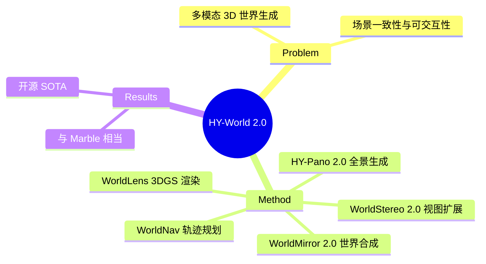

## Summary
> [未获取全文，仅基于 abstract]

HY-World 2.0 是一个多模态世界模型框架，支持从文本、单视图图像、多视图图像或视频生成可导航的 3D 高斯泼洒（3DGS）场景。通过四阶段流水线（全景生成、轨迹规划、世界扩展、世界合成）实现从单视图到完整 3D 世界的重建，并声称在开源方案中达到 SOTA，与闭源模型 Marble 相当。

## Problem & Motivation
> [未获取全文，仅基于 abstract]

现有 3D 场景生成方法在多模态输入支持、场景一致性和可交互性方面存在局限。HY-World 1.0 的升级版旨在：1) 支持多种输入模态（文本/图像/视频）；2) 生成高质量可导航的 3DGS 场景；3) 提供 3D 场景理解与规划能力；4) 实现实时交互式渲染。

## Method
> [未获取全文，仅基于 abstract]

四阶段流水线架构：

1. **HY-Pano 2.0**: 全景图生成，从文本或单视图图像生成高质量全景
2. **WorldNav**: 轨迹规划模块，实现 3D 场景理解与路径规划
3. **WorldStereo 2.0**: 世界扩展，基于关键帧的视图生成，引入一致性记忆机制
4. **WorldMirror 2.0**: 世界合成，前馈模型实现多视图/视频到 3D 的重建

配套工具：
- **WorldLens**: 高性能 3DGS 渲染平台，支持引擎无关架构、自动 IBL 光照、碰撞检测、角色支持

## Key Results
> [未获取全文，仅基于 abstract]

- 在多个 benchmark 上达到开源方案 SOTA
- 性能与闭源模型 Marble 相当
- 开源全部模型权重和代码

## Strengths & Weaknesses
> [未获取全文，仅基于 abstract]

**Strengths**:
- 端到端的多模态到 3D 世界流水线，架构清晰
- 引入 WorldNav 做 3D 场景理解和规划，比纯生成方法更有 agent 应用潜力
- 开源完整，包括模型权重、代码和技术细节
- WorldLens 渲染平台提供实用工具链

**Weaknesses**:
- 作者列表极长（40+ 人），"Team HY-World" 标注模糊，机构信息缺失，难以判断研究背景
- 四阶段流水线可能存在误差累积问题，各模块间的 failure propagation 需要验证
- 与 Marble 的比较维度不明确（速度？质量？泛化性？）
- 缺少对失败 case 的分析，特别是复杂场景下的表现
- 3DGS 场景的可编辑性和动态物体处理能力未说明

**未知**（需阅读全文）:
- 各模块的具体实现细节和训练数据
- 与其他 3D 生成方法（如 GaussianDreamer、LucidDreamer）的定量比较
- 推理速度和资源消耗
- 动态场景和复杂几何结构（如透明、反射）的处理能力

## Mind Map

## Notes
- 与 MobileDreamer 的 world-model 思路有交集：都用生成式方法构建环境表征
- 关键问题：世界模型用于什么？是纯视觉生成，还是为 downstream agent 任务服务？
- WorldNav 组件值得深挖——如果真能做 3D 场景理解+规划，这是 GUI/embodied agent 的重要能力
- HF Trending 115 upvotes 说明热度高，但需警惕"工程量大但 insight 不足"的可能性