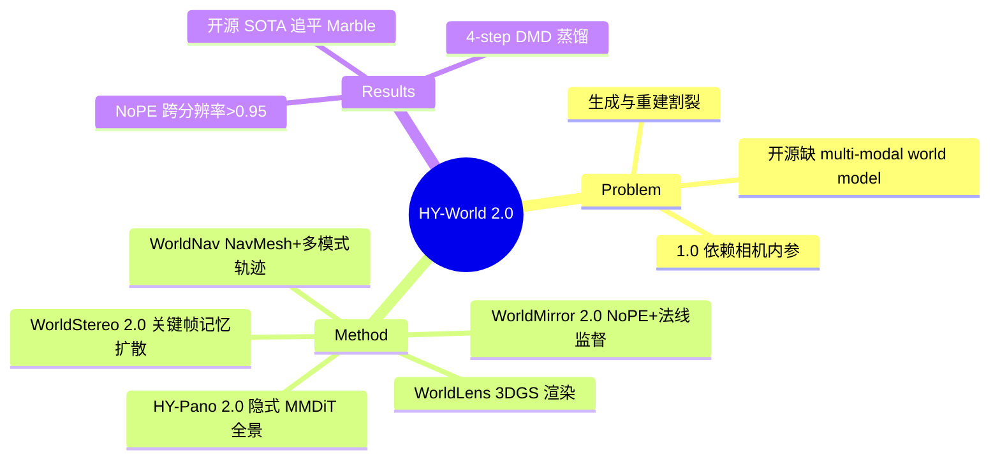

## Summary

HY-World 2.0 是腾讯混元的多模态世界模型框架，接受文本 / 单视图图像 / 多视图图像 / 视频四类输入，通过"全景生成 → 轨迹规划 → 世界扩展 → 世界合成"四阶段流水线，端到端产出可导航、可交互的 3DGS 场景。核心贡献是用**隐式映射**和**记忆驱动的关键帧视频扩散**取代 HY-World 1.0 依赖精确相机内参的显式几何 warping，从而打通"想象式生成"与"精确物理重建"两条此前割裂的技术路线。

## Problem & Motivation

作者把现有 3D 场景方法归结为一道**割裂**：generative 方法能从文本/单图等稀疏输入合成出令人惊艳、可探索的场景，但难以保证严格的重建精度；reconstruction 方法精确但不具备生成能力。开源社区缺少一个能同时桥接两者的 multi-modal foundational world model。

更具体的痛点来自前作 HY-World 1.0：它用**显式几何 warping** 把透视图投影到全景，这要求精确的相机 metadata（内参/外参），而真实世界图像往往没有可靠 metadata，限制了实用性。HY-World 2.0 的目标是去掉这个硬约束，并在开源方案中达到 SOTA、追平闭源的 Marble。

## Method

四阶段流水线，每阶段是一个独立可训练模块：

**Stage I — HY-Pano 2.0（全景生成）**：用 Multi-Modal Diffusion Transformer (MMDiT) 取代显式 warping，把条件输入和全景目标放进统一 latent space，让网络通过 self-attention **自主学习** perspective→equirectangular (ERP) 变换，无需相机内参。针对 360° wrap-around 不连续，在 latent 层做 circular padding、在像素层做 linear blending。数据是真实高分辨率全景 + Unreal Engine 合成资产的混合，并严格过滤拼接伪影和拍摄设备曝光。

**Stage II — WorldNav（轨迹规划）**：先做场景解析——用增强版 MoGe2（视角从 12 增至 42，GPU 加速 LSMR 求解器）出点云，用 Qwen3-VL 识别地标 + SAM3 出 2D 语义 mask，用 Recast Navigation 构建 NavMesh。再用五种轨迹模式（Regular / Surrounding / Reconstruct-Aware / Wandering / Aerial）每场景最多生成 35 条轨迹，兼顾几何覆盖与语义感知，其中 Reconstruct-Aware 专门追踪欠观测区域。

**Stage III — WorldStereo 2.0（世界扩展）**：核心是在**关键帧 latent space**（而非完整 video latent space）做 memory-driven video diffusion，生成一致的多视图关键帧。分三阶段训练：(1) Domain Adaptation——用只做空间压缩的 **Keyframe-VAE** 替代视频 VAE 的时空压缩（因为快速相机运动在时空压缩空间下会严重掉质量），并用 Plücker rays + 点云做轻量相机控制 adapter；(2) Middle Training——引入 **Global-Geometric Memory (GGM)**（把点云扩展 Tg=2 个目标视图作为全局 3D 先验，并用降采样/模糊/噪声深度增强模拟推理误差）和 **Spatial-Stereo Memory (SSM++)**（检索并横向拼接参考关键帧，配合改造的 RoPE 与隐式相机嵌入做全局上下文学习）；(3) Post-Train——用改造的 Distribution Matching Distillation (DMD) 蒸馏到 4-step DiT，省掉 GAN loss。

**Stage IV — 世界合成（WorldMirror 2.0 + 3DGS）**：WorldMirror 2.0 是统一前馈重建模型，共享 Transformer backbone + 任务专属 DPT decoder head，输入多视图图像（可选几何先验），输出点云/深度/法线/相机参数/3DGS 属性。三项关键改进：(1) **Normalized Position Encoding (NoPE)**——把 patch 坐标归一化到 [-1,1]，将分辨率外推转为插值，跨分辨率 cosine similarity 保持 >0.95；(2) **Depth-to-Normal Loss**——显式法线监督，缓解真实深度噪声和多视图不一致；(3) **Depth Mask Prediction Head**——显式预测逐像素有效性，取代启发式阈值。训练用 token-budget 动态采样 + 三阶段课程，分辨率采样范围扩到 50K–500K 像素。最后从点云初始化 3DGS，用 MaskGaussian 生长策略合成最终资产。

**WorldLens**：高性能 3DGS 渲染平台，引擎无关架构、自动 IBL 光照、碰撞检测、训练-渲染协同设计、角色支持。

## Key Results

- **整体生成对比**：在多个 benchmark 上达到开源方案 SOTA，结果与闭源 Marble 相当，产出可探索、可交互、高视觉保真的 3D 世界。
- **NoPE（Fig. 13a）**：标准 RoPE 在测试分辨率偏离训练分辨率时会退化，NoPE 维持跨分辨率 cosine similarity >0.95，且支持 50K–500K 像素灵活推理。
- **WorldStereo 2.0 消融（Table 7）**：Domain Adaptation 阶段冻结 cross-attention + feed-forward 层在性能与泛化间取得最佳 trade-off；Keyframe-VAE vs Video-VAE（Fig. 8）证明大视角变化下前者保真度显著更高；DMD 蒸馏实现 4-step 生成。
- **WorldNav**：每场景最多 35 条轨迹，由 Regular(≤9)/Surrounding(≤5)/Reconstruct-Aware(≤10)/Wandering(≤3)/Aerial(≤8) 组成。
- 推理用 token/frame 空间并行 + BFloat16 + FSDP 优化大规模多视图处理。
- 全部模型权重、代码、技术细节开源。

## Strengths & Weaknesses

**Strengths**：
- 真正打通生成与重建两条路线，且核心创新（去掉显式 warping 的隐式 MMDiT、关键帧 VAE、NoPE）都对应明确的失败模式，不是堆模块——这是 first-principles 的设计。
- WorldNav 引入 NavMesh + 语义 grounding + 多模式轨迹规划，比纯生成方法更有 embodied/GUI agent 的下游潜力。
- 消融充分（Table 7、Fig. 8、Fig. 13a），每个组件都有对照。
- 开源完整。

**Weaknesses / 待验证**：
- 论文（HTML 全文抓取）大量定性叙述，但**关键定量对比缺具体数字**——"comparable to Marble""open-source SOTA"没有给出 PSNR/SSIM/LPIPS 的精确 baseline 数值，与 GaussianDreamer / LucidDreamer 等也无定量比较。
- 四阶段流水线的 failure propagation（误差累积）只是间接缓解（memory 增强、normal 监督），未给出端到端的 failure case 分析。
- 推理速度/资源消耗、动态物体、透明/反射等复杂几何处理能力未充分说明。
- 作者列表 40+ 人 + "Team HY-World" 标注，工程驱动色彩浓，需警惕"工程量大但单点 insight 稀释"的风险。

## Mind Map

```mermaid
mindmap
  root((HY-World 2.0))
    Problem
      生成与重建割裂
      1.0 依赖相机内参
      开源缺 multi-modal world model
    Method
      HY-Pano 2.0 隐式 MMDiT 全景
      WorldNav NavMesh+多模式轨迹
      WorldStereo 2.0 关键帧记忆扩散
      WorldMirror 2.0 NoPE+法线监督
      WorldLens 3DGS 渲染
    Results
      开源 SOTA 追平 Marble
      NoPE 跨分辨率>0.95
      4-step DMD 蒸馏
```

## Notes
- 与 MultiWorld 形成对照：HY-World 2.0 是"静态 3DGS 世界 + 可导航"，MultiWorld 是"动态视频 + 多 agent 可控"——两条 world-model 路线（显式 3D vs 隐式 video）的代表。
- WorldNav 是最值得深挖的组件：NavMesh + 语义 grounding + 轨迹规划本质上是 3D 场景理解 + planning，这正是 embodied/spatial agent 的核心能力，且它服务于"生成质量"（覆盖欠观测区），把 agent 能力嵌进了生成 pipeline。
- 隐式 MMDiT 取代显式 warping 是一个可迁移的 pattern：当显式几何变换需要难以获取的 metadata 时，让 transformer 在统一 latent 里自学变换。
- HF Trending 高热度（115 upvotes），但论文对外宣称的 SOTA 缺定量支撑，作为读者应索取/等待补充实验数据再下定论。
