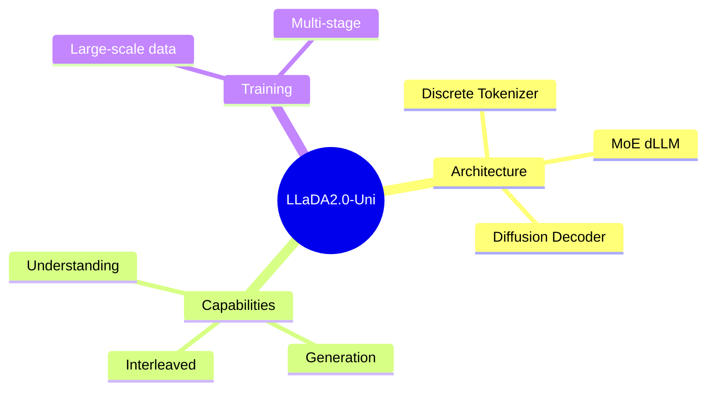

## Summary

LLaDA2.0-Uni 是一个统一的离散 diffusion LLM（dLLM），原生支持多模态理解和生成。架构：语义离散 tokenizer + MoE dLLM backbone + diffusion decoder。

## Problem & Motivation

多模态模型通常依赖预训练 vision encoder，理解和生成用分离的 visual representation：
- 理解和生成任务之间存在 misalignment
- 无法从 raw pixels 进行端到端优化

目标是构建一个**原生统一**的多模态模型，理解+生成在一个框架内。

## Method

**架构三部分**：
1. **Discrete Tokenizer**：SigLIP-VQ，将连续视觉输入离散化
2. **MoE dLLM Backbone**：block-level masked diffusion 处理 text 和 vision
3. **Diffusion Decoder**：重建 visual tokens 为高保真图像

**推理优化**：
- Backbone 的 prefix-aware optimization
- Decoder 的 few-step distillation

**训练**：
- Large-scale curated data
- Multi-stage training pipeline

## Key Results

- 多模态理解上匹配 specialized VLMs
- 图像生成和编辑上表现强
- 原生支持 interleaved generation + reasoning
- 232 HF upvotes，热度极高

## Strengths & Weaknesses

**亮点**：
- 真正的 unified model：理解+生成在同一个框架，而非两个模块拼接
- Discrete diffusion 的思路不同于主流 continuous diffusion
- 开源（code + model）
- 高社区热度（232 upvotes）

**局限**：
- MoE + diffusion 的组合，显存和推理速度可能有问题
- Abstract 缺少具体 benchmark 数字
- 和主流 VLM（如 GPT-4V、Gemini）的对比？

## Mind Map

## Notes

> [未获取全文，仅基于 abstract]

关键问题：
- Discrete vs continuous diffusion 的 trade-off？
- 和 Chameleon、EMU 等 unified model 的区别？
- 推理效率如何？