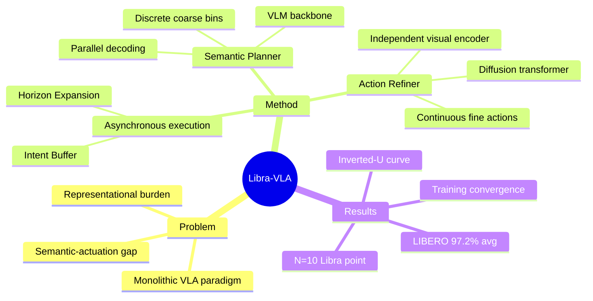

## Summary
提出 Coarse-to-Fine Dual-System VLA 架构，通过 Hybrid Action Space 将 action 分解为离散 coarse intent（Semantic Planner）和连续 fine alignment（Action Refiner），实现异步执行。核心发现是性能随 coarse bin 数量呈倒 U 型曲线，在 N=10 达到 "Libra point"——学习复杂度平衡点。

## Problem & Motivation
现有 VLA 方法采用 monolithic generation paradigm，直接将视觉-语言特征映射到高频 motor commands，忽视了 manipulation 的内在层次结构。这导致 semantic-actuation gap 过大，representational burden 过重。作者提出将 action space 分解为 discrete macro-directional reaching + continuous micro-pose alignment，通过 coarse-to-fine hierarchy 实现 learning equilibrium。

## Method
**架构设计**：
1. **Semantic Planner (System 2)**：VLM backbone（InternVL2.5-2B）+ Parallel Coarse-Action Head，预测离散 coarse action tokens（N bins）。使用 bidirectional transformer 实现 parallel decoding，避免 autoregressive bottleneck。
2. **Action Refiner (System 1)**：Diffusion transformer + 独立 SigLIP visual encoder，以 coarse intent 为条件生成连续 fine actions。独立视觉编码器实现 structural decoupling，避免 feature-squeezing bottleneck。
3. **Asynchronous Execution**：Intent Buffer (FIFO queue) 桥接两系统，Horizon Expansion Factor M=2 使 Planner 以低频率运行，Refiner 高频率执行。

**关键设计**：
- Hybrid Action Space：P(a_t|o_t,L) ≈ P(a_t^f|a_t^c,o_t) × P(a_t^c|o_t,L)
- Dynamic Curriculum Strategy：早期 teacher forcing，后期逐步切换到 predicted anchors
- N=10 bins 是最优 "Libra point"

## Key Results
**LIBERO Benchmark**（Simulation）：
- Average success rate: **97.2%**（SOTA）
- Object task: **99.4%**（precision-critical）
- Long-horizon task: **92.8%**
- Spatial task: 98.3%, Goal task: 96.1%

**LIBERO-Plus Generalization**：
- Zero-Shot Transfer: **79.5%**
- Supervised Fine-Tuning: **82.3%**

**Ablation Key Findings**：
- N=2: 性能退化（coarse guidance 无信息）
- N>=50: 性能退化（coarse task 变成 fine-grained classification）
- N=10: 倒 U 型曲线峰值（learning equilibrium）
- Dynamic Curriculum > Pure Teacher Forcing > No Teacher Forcing
- Training convergence: Libra-VLA MSE 0.01 vs Libra-Base 0.07 at 10k steps

**Inference Latency**：
- Asynchronous execution amortizes VLM forward pass
- Faster than monolithic diffusion baseline

## Strengths & Weaknesses
**Strengths**：
- Hybrid Action Space 设计符合 manipulation hierarchy，有认知科学支撑（Kahneman dual-process theory）
- Inverted-U curve discovery + Libra point 概念有理论洞察，不是单纯 engineering
- Structural decoupling（独立 visual encoder）避免 feature-squeezing，比 FiS-VLA 更彻底
- Explicit coarse actions 比 latent vectors 更 interpretable
- Ablation 充分，训练 convergence 分析深入

**Weaknesses**：
- N=10 的最优性是 empirical finding，缺乏 theoretical justification（为什么是 10 不是 8 或 12？）
- LIBERO benchmark 相对简单，未见 real-world 复杂场景（如双臂协作、动态障碍物）的验证
- 与 HybridVLA 的对比基于 30k steps，但 HybridVLA 本身是未充分训练的 baseline
- AgiBot 机构背景可能影响论文定位（工业导向 vs 学术导向）

## Mind Map

## Notes
- 论文被 ACL 2026 Main Conference 接收，但主题是 robotics manipulation，跨学科定位值得关注
- "Learning equilibrium" 概念借鉴 physics/mechanics，但实际是 workload balance 的 intuition
- 与 OpenHelix、FiS-VLA、GR00T N1 的对比点明确：explicit actions vs latent vectors，independent encoder vs shared backbone
- Future work: 理论化 N 的最优选择，real-world complex scenarios 验证