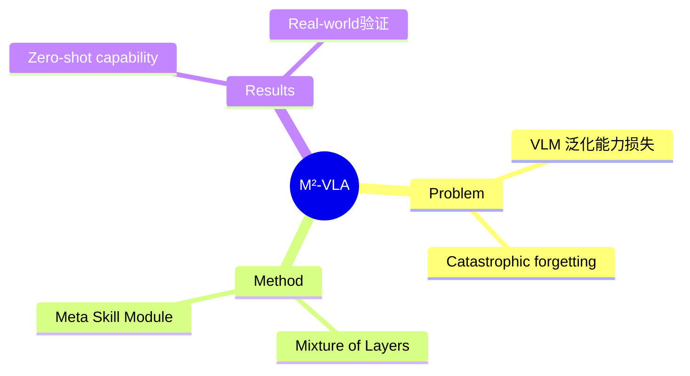

## Summary

M²-VLA 证明通用 VLM 可直接作为 robotic manipulation backbone。提出 Mixture of Layers (MoL) 从密集语义特征选择性提取任务关键信息，Meta Skill Module (MSM) 集成强归纳偏置支持轨迹学习。

## Problem & Motivation

现有 VLA 问题：
- End-to-end fine-tuning 损害 VLM 泛化能力
- Catastrophic forgetting
- VLM 高层语义理解与 robot 控制精确需求之间的 gap

## Method

**核心设计**：
1. **Mixture of Layers (MoL)**: 选择性提取任务关键信息
2. **Meta Skill Module (MSM)**: 强归纳偏置，高效轨迹学习

**优势**: 不损害 VLM 泛化能力

## Key Results

- Simulated 和 real-world 环境验证
- Zero-shot capabilities
- Score 11（热度中等）

## Strengths & Weaknesses

**亮点**：
- MoL + MSM 设计合理
- 保留 VLM 泛化能力

**局限**：
- 具体 benchmark 数字未在 abstract 中给出
- 与 World Model 关联：这是 VLA architecture，而非环境建模本身

## Mind Map

## Notes

> [基于 arXiv abstract]

VLA architecture 优化，与 World Model 的关联在 Embodied AI 方向——VLA 作为 action-conditioned world model 的一部分。