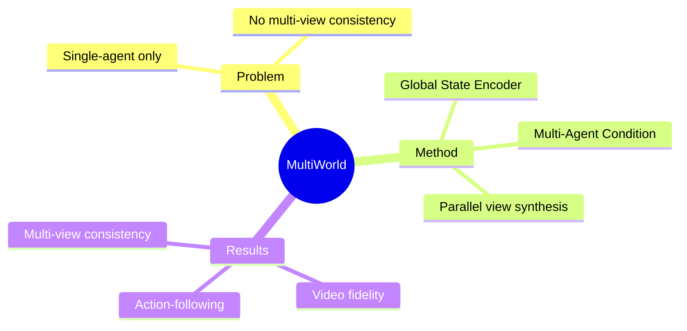

## Summary

MultiWorld 是一个多 Agent 多视角视频 world model 框架，支持精确多 Agent 控制 + 多视角一致性。引入 Multi-Agent Condition Module 和 Global State Encoder。

## Problem & Motivation

现有 video world model 局限：
- 大多是 single-agent scenario
- 无法捕捉真实 multi-agent 系统的复杂交互
- 多视角一致性难以保证

真实世界是多 Agent 的（multi-player game、multi-robot manipulation）。

## Method

**架构设计**：

1. **Multi-Agent Condition Module**：
   - 实现精确多 Agent 可控性

2. **Global State Encoder**：
   - 确保不同 view 的观察一致

**特性**：
- Agent 和 view 数量灵活 scaling
- 不同 view 并行合成，效率高

## Key Results

在 multi-player game environments 和 multi-robot manipulation tasks 上：
- Video fidelity 超过 baseline
- Action-following ability 更强
- Multi-view consistency 更好

## Strengths & Weaknesses

**亮点**：
- 问题定义清晰：multi-agent + multi-view 是真实场景需求
- 架构设计合理：Multi-Agent Condition + Global State Encoder
- 43 HF upvotes

**局限**：
- Abstract 缺少具体数字（"超过 baseline" 无量化）
- 作者数量少（4 人），可能工程量有限

## Mind Map

## Notes

> [未获取全文，仅基于 abstract]

Project page: https://multi-world.github.io/

关键问题：
- 多 Agent action 如何编码？
- Global State 的 representation？
- 和单 Agent world model 的 trade-off？