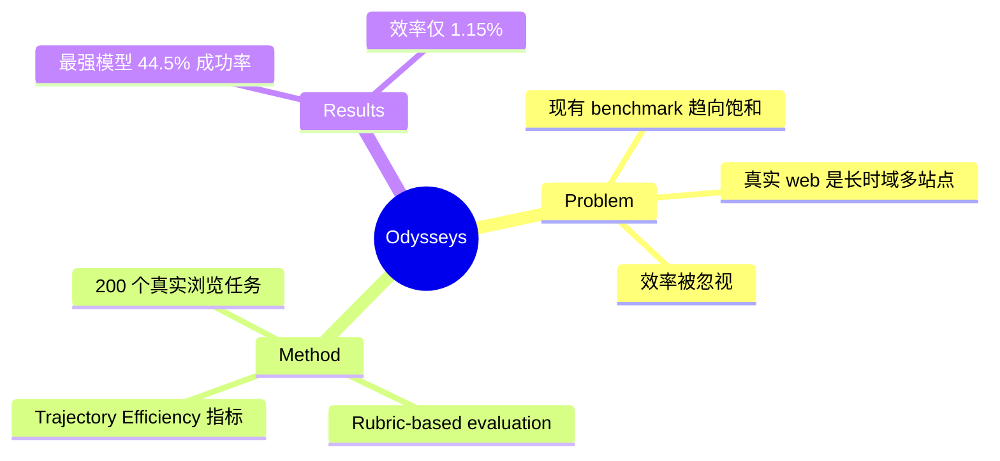

## Summary
提出 Odysseys benchmark，包含 200 个真实长时域 web 任务，首次系统性地评估 agent 在开放互联网上的长时域、多站点工作流能力。

> [未获取全文，仅基于 abstract]

## Problem & Motivation
现有 web agent benchmark 聚焦于短时、单站点任务，frontier models 已接近饱和。但真实 web 使用场景是长时域、多站点的工作流——跨站比价、多服务行程规划、多查询信息汇总等，需要持续上下文维护和跨站点推理。现有 benchmark 严重低估了这一挑战。

## Method
> [未获取全文，仅基于 abstract]

1. **任务构建**：从真实浏览会话中提取 200 个长时域任务，在开放互联网上评估
2. **评估方式**：提出 rubric-based evaluation，每个任务平均标注 6.1 个 graded rubrics，避免 binary pass/fail 的粗糙评判
3. **效率指标**：引入 Trajectory Efficiency（rubric score per step），衡量 agent 是否能高效完成任务而非"慢慢磨"

## Key Results
- 最强 frontier model 成功率仅 **44.5%**，存在巨大提升空间
- Trajectory Efficiency 仅 **1.15%**，说明现有 agent 即使成功也极其低效
- Rubric-based evaluation 与人类判断一致性更高，比 trajectory-level LLM-as-a-judge 更细粒度

## Strengths & Weaknesses
**Strengths:**
- 问题定义精准：long-horizon + live Internet + efficiency 三维一体，直击真实场景痛点
- 评估设计合理：rubric-based 优于 binary，效率指标是 first-class concern 的正确回应
- 任务来源真实：从实际 browsing sessions 提取，而非 synthetic

**Weaknesses:**
- 依赖 live Internet，评估可复现性存疑（网站更新、内容变化）
- 200 个任务的覆盖度是否足够？
- abstract 未提及 baseline 选择、模型版本、置信区间等关键实验细节

## Mind Map

## Notes
- 与 WebVoyager、WebArena 等现有 benchmark 的核心区别：**live Internet** vs **static snapshot**，以及 **rubric-based** vs **binary** 评估
- 效率指标的设计值得借鉴：不只要做成，还要做得高效
- 可考虑与 GUI Agent benchmark 对比，思考 cross-platform long-horizon evaluation