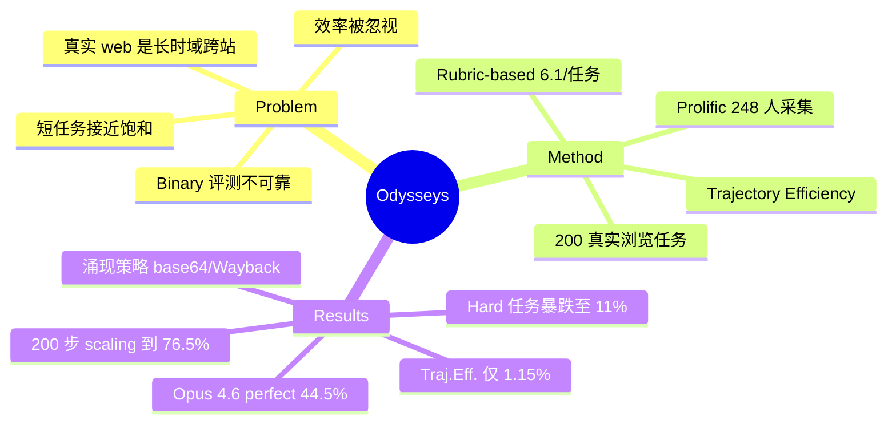

## Summary

提出 Odysseys benchmark：200 个从真实浏览行为提取的 long-horizon、跨多站点 web 任务，配 rubric-based 评估（平均 6.1 条 graded rubric/任务）和 Trajectory Efficiency 指标。最强 frontier model（Opus 4.6）perfect success 仅 44.5%，且 hard 任务上崩到 11%，证明长时域 web 交互远未解决。

## Problem & Motivation

现有 web agent benchmark 收敛到 short、single-site 任务，frontier model 已接近饱和。但真实 web 使用是 extended、multi-domain 的 workflow——跨零售商比价、跨服务规划行程、跨多次搜索汇总信息，可能耗时数小时。现有评测用 trajectory-level LLM-as-a-judge + binary 结果，在这类复杂任务上"随任务变复杂而越来越不可靠"。

作者要回答的真问题是：当任务真正变长、跨站、需要持续 context 维护时，agent 到底能做到什么程度，以及怎样**可靠地**评测它。

## Method

### Benchmark 构建

- **数据采集**：Prolific 招 248 名被试，用桌面 app 标注自己的 Chrome 浏览历史，经 Chrome 的 Journey 算法得到 2,380 条初始 journey。
- **精炼**：LLM 筛除标签错误和不可行任务，作者人工 review 保留 696 条（占原始 29.2%），并过滤需登录、不可行、低质任务。
- **任务合成**：用 text-embedding-3-small embedding + UMAP 降维 + HDBSCAN 聚类把相关 journey 成簇，用 GPT-5.4 把簇合成连贯的多步 workflow（带 NL prompt、step plan、rubric、coherence score）。最终 = 90 合成 + 30 作者手写 + 80 LLM 生成 hard 任务 = **200**。
- **终审**：所有 prompt "CUAfied" 成对话式 agent 请求；两轮质检验证 coherence、feasibility、PII 移除。

### 任务构成

200 任务，难度 easy(45) / medium(46) / hard(109)；平均任务长度 272.3 词；覆盖 22 个 top-level domain、88 个 SimilarWeb category。主要 domain：ecommerce/shopping(43)、travel/tourism(38)、science/education(37)、computers/tech(34)。难度定义：easy（≤5 步、≤3 domain）、medium（6-8 步或 4+ domain）、hard（两者都超）。

### 评估方法

- **Rubric-based**：每任务平均 6.1 条 graded rubric（范围 3-12，共 1,225 条），每条含可验证要求、验证流程、权重。指出 trajectory-level binary judgment 随任务复杂度上升越发不可靠。
- **指标**：(1) Rubric Score 两种——Averaged（所有 rubric 均值）、Perfect（全部满足才记 1）；(2) **Trajectory Efficiency**：`(1/N) Σ(sᵢ/nᵢ)`，sᵢ 为 averaged rubric score、nᵢ 为 agent 步数——同样 rubric score，30 步完成的用户体验远好于 100 步。
- **人类一致性验证**：120 条 Opus 4.6 轨迹人工标注，rubric(averaged) Cohen's κ=0.788 / F1=0.949，rubric(perfect) κ=0.849 / F1=0.934，远超 Online-M2W trajectory judge（κ=0.508 / F1=0.762）。

## Key Results

测试模型：Opus 4.6、GPT-5.4、Sonnet 4.6、GPT-5.4-mini；open-weight：Qwen-3.5(9B/4B/35B-A3B)、UI-TARS-1.5-7B。标准设置：max 100 步，起始 google.com，完整 Ubuntu 虚拟环境。

**主表（100 步预算，Rubric Avg / Perfect / 步数 / Traj.Eff.）**：
- Opus 4.6：68.9 / **44.5** / 81.3 / 1.06
- GPT-5.4：55.4 / 33.5 / 64.4 / **1.15**
- Sonnet 4.6：49.8 / 31.0 / 80.4 / 0.79
- GPT-5.4-mini：38.4 / 10.5 / 41.7 / 1.12
- Qwen-3.5-9B：42.6 / 13.5 / 78.3 / 0.75
- UI-TARS-1.5-7B：10.0 / 1.0 / 76.6 / 0.23

**按难度（Perfect）**：Opus 4.6 easy 97.8% → medium 71.7% → **hard 11.0%**；所有模型从 medium 到 hard 都断崖式下降。

**Step budget scaling（200 步）**：Opus 4.6 从 44.5% 升到 76.5%（120 步 50.5%、150 步 59.5%、180 步 67.0%，单调上升），仍有 14.5% 任务耗尽预算，乐观上限约 86%；而 Qwen-3.5-9B 即便 200 步仍只 ~1%（仅 10.5% 触顶），乐观上限 11.8%——说明小模型是**能力 gap 而非步数不足**。

**Trajectory Efficiency**：即便 frontier agent 也只有 ~1.15%；Opus 4.6 平均 wall-clock ~30 分钟/任务，效率使其难以实际部署。

**失败模式**：Opus 4.6 过度 research 而不产出 deliverable（12 个零分案例中 6 个），39% 任务触 100 步上限；GPT-5.4 有正确推理却不行动（7 个零分中 4 个，生成详细 plan 后无浏览器交互即终止）；两者都在 high-fanout（10-30 个 venue 并行）任务上卡死。

**涌现策略**：GPT-5.4 用 base64 编码整张数据表（8 次）、view-source: + ctrl+f 提取 JSON-LD（23 次）、平均 2.03 actions/call；Opus 4.6 用 Wayback Machine 兜底、middle-click 后台开 tab（131 次 vs GPT-5.4 的 7 次）、ctrl+f 证伪。

## Strengths & Weaknesses

**Strengths**：
- 问题定义精准：long-horizon + live Internet + efficiency 三维一体，直击短任务饱和的痛点。任务源自真实 browsing session 而非 synthetic。
- 评估设计扎实：rubric-based 的人类一致性（κ=0.788/0.849）显著优于 trajectory judge（κ=0.508），Trajectory Efficiency 把"做得高效"提升为 first-class concern。
- step budget scaling 分析有洞察：清晰区分"frontier 模型缺步数"与"小模型缺能力"两种 ceiling，并用乐观上限量化。
- 失败模式与涌现策略的细粒度分析（base64 编码、Wayback、middle-click 计数）信息量很高，指向 subagent / step-aware planning 的改进方向。

**Weaknesses**：
- 依赖 live Internet，可复现性存疑——网站更新、内容变化会让历史结果难以复跑，作者未充分讨论缓解方案。
- rubric 由 LLM（GPT-5.4）合成、作者 review，rubric 质量与覆盖度本身可能引入偏差；hard 任务 80 条为 LLM 生成，realism 与人工任务略有差别。
- Trajectory Efficiency 用步数作分母，但不同模型每 call 的 action 数差异巨大（GPT-5.4 2.03 vs Opus 1.0），步数与 wall-clock 的对应关系并不统一，指标可比性需谨慎。

## Mind Map

```mermaid
mindmap
  root((Odysseys))
    Problem
      短任务接近饱和
      真实 web 是长时域跨站
      效率被忽视
      Binary 评测不可靠
    Method
      200 真实浏览任务
      Prolific 248 人采集
      Rubric-based 6.1/任务
      Trajectory Efficiency
    Results
      Opus 4.6 perfect 44.5%
      Hard 任务暴跌至 11%
      200 步 scaling 到 76.5%
      Traj.Eff. 仅 1.15%
      涌现策略 base64/Wayback
```

## Notes

- 与 WebVoyager / WebArena 的核心区别：**live Internet** vs static snapshot、**rubric-based** vs binary、**long-horizon multi-site** vs single-site short。
- 最有价值的 insight 不是"模型分数低"，而是 step budget scaling 区分出的两种 ceiling：frontier 模型给够步数能爬到 ~86%（缺的是 budget / 效率），小模型给 200 步也只 ~12%（缺的是 capability）。这对"该投 RL 提能力还是投 scaffold 提效率"的判断很有指导意义。
- High-fanout 任务的普遍卡死，强烈暗示单 agent 的 sequential 范式不适合并行子任务，subagent / explicit step-aware planning 是下一步。
- Trajectory Efficiency 的设计值得借鉴到 GUI / computer-use benchmark：不只要"做成"，还要量化"做得多省"。可考虑 cross-platform long-horizon evaluation。
