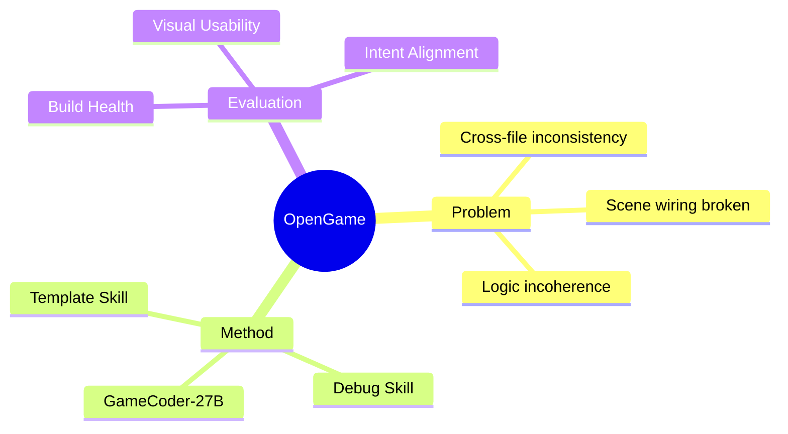

## Summary

OpenGame 是首个开源的端到端游戏生成 agent 框架。核心是 Game Skill（Template Skill + Debug Skill），配合 GameCoder-27B 和 OpenGame-Bench 评测管道。

## Problem & Motivation

LLM code agent 能解决孤立编程任务，但生成完整可玩游戏时失败：
- 跨文件不一致
- Scene wiring broken
- 逻辑不连贯

游戏开发是 creative design + intricate software engineering 的交叉点，需要 orchestration of game engines、real-time loops、tightly coupled state。

## Method

**Game Skill**：
- **Template Skill**：从经验生长 project skeleton 库
- **Debug Skill**：维护 verified fixes 协议

关键设计：scaffold stable architectures + systematically repair integration errors，而非 patch isolated syntax bugs。

**GameCoder-27B**：
- 三阶段训练：continual pre-training → SFT → execution-grounded RL
- 专注 game engine mastery

**OpenGame-Bench**：
- Build Health、Visual Usability、Intent Alignment 三个维度
- Headless browser execution + VLM judging

## Key Results

- 150 diverse game prompts 上 SOTA
- 框架将 fully open-sourced

## Strengths & Weaknesses

**亮点**：
- 端到端游戏生成，比孤立代码任务更难
- Template + Debug Skill 的设计有 insight：从经验积累架构模板和修复协议
- OpenGame-Bench 的 VLM judging 有创意

**局限**：
- Abstract 无具体数字（"SOTA" 无量化）
- 74 HF upvotes，关注度中等
- 游戏生成和 GUI Agent 的关联度需要进一步判断

## Mind Map

## Notes

> [未获取全文，仅基于 abstract]

与 GUI Agent 的关联：游戏 UI 也是 GUI，但核心是 game logic 而非 UI interaction。需要看全文判断相关性。