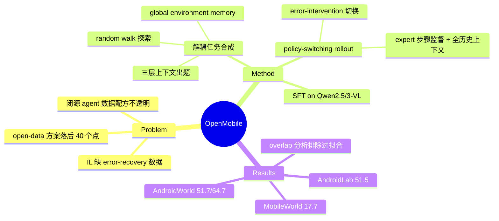

## Summary
针对闭源 mobile agent 训练数据与合成配方不透明的问题，提出开源框架 OpenMobile：用探索构建的 global environment memory 做解耦式任务合成 + error-intervention 的 learner/expert policy-switching 轨迹采集，仅 2.8K 指令 / 34K steps 的 SFT 数据就把 Qwen2.5-VL-7B / Qwen3-VL-8B 在 AndroidWorld 推到 51.7% / 64.7%，大幅超越现有 open-data 方案。

## Problem & Motivation
近期领先的 mobile agent（UI-Venus-1.5、MAI-UI、Step-GUI 等）在 AndroidWorld 上已接近 70%+，但训练数据全部闭源，task/trajectory 合成配方不公开，社区无法复现也无法研究"数据里到底什么在起作用"。现有开数据方案（ScaleCUA 27.2%、UI-S1 34.0%）差距巨大。两个具体缺口：(1) 任务合成多是 coupled 式（边探索边出题），指令局限于当前屏幕上下文，复杂度和多样性不足；(2) 标准 imitation learning 只蒸馏 expert 成功轨迹，缺失 error-recovery 数据——而纠错恰是动态环境中 agent 最需要的能力。

## Method
**1. 解耦式任务合成（exploration → memory → instruction）**
- **探索**：random walk（每 session 10 步，随机点击/输入可交互元素），用 pHash（阈值 0.95）做 screen deduplication，构建 global environment memory ℳ=(𝒮, 𝒩, ℱ)：唯一屏幕集合、屏幕邻接关系、每屏幕的功能描述（VLM 提取的自然语言）。
- **指令生成**：对每个屏幕构建三层上下文——当前屏幕+功能标注（焦点）、邻域屏幕功能（短期记忆：1 前驱 + ≤3 后继）、embedding 检索的 30 条语义相关功能（长期记忆，cosine <0.8 保多样性），交给 Gemini-3.1-Pro-Preview 生成跨屏、组合式指令。三阶段过滤：LLM 打分（clarity/reasonableness ≥4）、embedding 去重（0.8）、按 app 平衡。
- **规模**：2,800 条指令，20 个 Android app，34K action steps，平均轨迹 12.2 步，每步约 129 词 CoT。

**2. Error-intervention policy-switching rollout**
- 由 learner（早期 SFT checkpoint）执行任务，Monitor（Gemini-3.1-Pro-Preview）观察最近两屏 + 动作历史，检测到偏离目标才切换到 expert 纠正（≤2 次干预，每次 expert 至少走 3 步再交还）。关键洞察：mobile 任务多解，learner/expert 单纯 disagreement 不等于错误，所以不用 disagreement-based switching。
- 训练时只保留 expert 步骤作监督信号，但把包含 learner 错误在内的完整交互历史留作上下文——模型因此学到"看见自己犯错后如何纠正"。

**3. 训练**：标准 SFT（LLaMA-Factory，bs 32、lr 1e-5、3 epochs），基座 Qwen2.5-VL-7B 与 Qwen3-VL-8B。附录尝试 step-level 与 trajectory-level RL，在动态 benchmark 上无显著增益。

## Key Results
- **AndroidWorld**：Qwen2.5-VL-7B 51.7%、Qwen3-VL-8B 64.7%（Pass@1），远超 open-data 基线 ScaleCUA-7B 27.2% / UI-S1-7B 34.0%，逼近闭数据系统（Step-GUI-8B 67.7%、MAI-UI-8B 70.7%、UI-Venus-1.5-8B 73.7%）。
- **泛化**：数据只在 AndroidWorld 环境合成，但 AndroidLab（新 app）51.5%（Qwen3-VL）、MobileWorld（长程跨 app）17.7%，后者相对基线提升约 85%（仍明显落后 MobileAgent-v3.5 的 33.3%）。
- **任务合成 ablation**（1.5K 轨迹同预算）：OpenMobile 48.3% > coupled pipeline 45.3% > OS-Genesis 34.1%；人评显示指令复杂度对 OS-Genesis 68/22/10 占优。
- **rollout 策略 ablation**：error-intervention 每轨迹平均 1.56 个 error-recovery 实例、48.3%，优于 random switch（0.64 / 45.1%）、expert distillation（0.42 / 44.8%）、self-evolution（0.10 / 33.8%）。
- **数据污染分析**：合成指令与 AndroidWorld 测试集语义相似度 >0.7 的仅 3.5%；删除 top-10% 最相似指令性能几乎不掉，删除 top-40% 才显著下降——增益来自功能覆盖广度而非 benchmark 过拟合，并给出功能覆盖率 × 任务复杂度与成功率的交叉验证。

## Strengths & Weaknesses
**亮点**
- 把闭源系统含糊其辞的"数据配方"做成了透明可复现的开源 pipeline，且用 2.8K 指令这种小数据量拿到大增益，说明数据质量/结构（跨屏组合任务 + error-recovery 信号）比堆量重要——simple & scalable。
- Error-intervention switching 是对 DAgger 式思路在 GUI 场景的关键修正：意识到"多解任务中 disagreement ≠ error"，改用结果导向的偏离检测，ablation 中 error-recovery 密度差异（1.56 vs 0.42）直接对应性能差异，因果链清楚。
- 主动做 train-test overlap 分析并公开，是数据合成类论文里少见的诚实做法，"删除最相似 10% 不掉点"的反事实实验比单纯报相似度分布更有说服力。

**局限**
- 全流程重度依赖 Gemini-3.1-Pro-Preview（出题、Monitor、expert），本质是把闭源模型能力蒸馏进开源 pipeline，成本与上限都与该模型耦合；"open data"但 teacher 并不 open。
- 探索用 random walk，深层功能（多级菜单、需要状态前置的功能）覆盖存疑；仅在 AndroidWorld 的 20 个离线 app 上合成，MobileWorld 长程任务 17.7% vs 33.3% 说明该 recipe 对长程/跨 app 泛化仍是短板（MobileForge 后续也以此为 baseline 大幅超越）。
- RL 未能在 SFT 之上带来增益但原因分析不足；干预次数 ≤2、expert 最少 3 步等阈值未做敏感性验证。

## Mind Map

## Notes
- 与 [[2601-Learning with Challenges- Adaptive Difficulty-Aware Data Generation for Mobile GUI Agent Training]] 同属"任务合成质量决定 agent 上限"一脉；与 [[2606-MobileForge]]（41.0% MobileWorld，把 OpenMobile 17.7% 当次优 baseline）直接构成演进链，可对比二者在长程任务上的差异来源。
- "只保留 expert 步骤为监督、保留含错历史为上下文"这个设计值得单独记：它把 error-recovery 从"额外数据类型"变成了"上下文分布偏移"，对其他 agent 数据合成工作可迁移。
