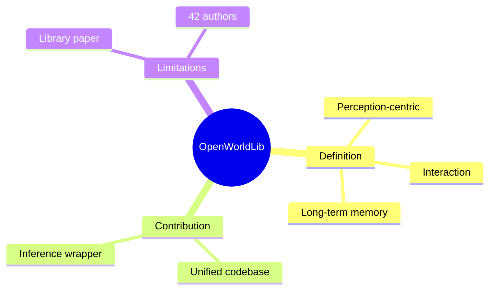

## Summary

给 world model 下了个定义——"以 perception 为中心，带 interaction 和 long-term memory"，然后做一个统一推理框架，把各种 world model 模型集成到一起。42 位作者，28 页。

## Problem & Motivation

World model 研究领域碎片化：
- 不同实现分散
- 缺少统一推理框架

## Method

**定义**：
- World model = perception 为中心 + interaction + long-term memory

**Codebase**：
- 统一推理框架
- 集成各种 world model 模型

## Key Results

作为 Library Paper：
- 提供了统一代码库
- 给出了 clear definition

## Strengths & Weaknesses

**亮点**：
- 代码写得不错
- 有参考价值作为 entry-level reading guide

**局限**：
- 这就是一篇标准的 "library paper"——代码写得不错值得发篇 arxiv，但离学术贡献差得远
- 那个所谓的 "clear definition" 本质上是 "perception + interaction + memory" 三个词的排列组合
- 42 个作者做一个 inference wrapper，人均工作量约等于写一个 import 语句

## Mind Map

## Notes

> [基于月度总结的点评，未获取全文]

代码库可以 star，论文不必 cite。本质是 inference wrapper。