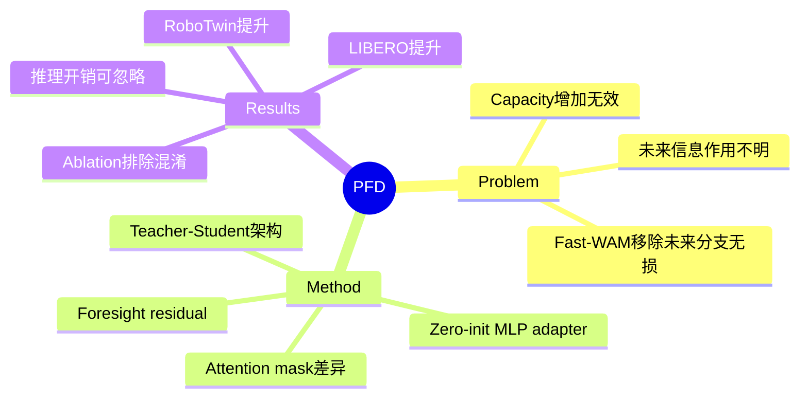

## Summary
针对 World Action Models 中"未来信息在训练中的作用"这一开放问题，提出 future-as-correction 视角：未来视频不是预测目标或正则化器，而是对 action denoising 的可压缩校正信号。通过 teacher-student 架构将此 residual 蒸馏到小 adapter，保持 current-only 推理接口，在 LIBERO 和 RoboTwin 上取得稳定提升。

## Problem & Motivation

World Action Models 训练时联合预测未来视频和动作，但 Fast-WAM 发现推理时移除未来预测分支几乎不影响性能。这引发核心问题：**未来信息在训练中到底扮演什么角色？**

两种解读：
1. **Regularizer 视角**：未来视频仅塑造共享 visual backbone，对 action 无直接贡献，current-only policy 已捕获全部有用信息
2. **Privileged-foresight 视角**（本文主张）：未来视频诱导了对 action denoising 方向的结构化校正，joint training 只部分传递到 current-only path

关键发现：单纯增加 backbone fine-tuning capacity 无法提升性能，说明 gap 不是 capacity gap，而是存在一个纯 action supervision 无法触及的方向。

## Method

### 核心架构：Teacher-Student + Residual Adapter

1. **同一 backbone，不同 attention mask**
   - **Student path**：action tokens 只 attend 当前帧 video tokens（匹配 Fast-WAM 推理接口）
   - **Teacher path**：action tokens attend 全部 video tokens，包括训练时可用的真实未来帧

2. **Foresight Residual 定义**
   $$r = v_{\mathrm{teacher}} - v_{\mathrm{base}}$$
   即 teacher 的 action-velocity prediction 与 student 的差值，代表"知道未来后会对 denoising 方向做的校正"

3. **Residual Adapter**
   - 小型 3-layer SiLU MLP（width 512）
   - 输入：$v_{\mathrm{base}}$（student prediction）和 denoising timestep $\tau_a$
   - 输出：预测的 residual $\hat{\delta}$
   - 最终 prediction：$v_{\mathrm{final}} = v_{\mathrm{base}} + \hat{\delta}$
   - **Zero-initialized**：初始化时 $\hat{\delta}=0$，保证与 Fast-WAM 完全一致

4. **训练目标**
   - Residual loss：$\|g_\varphi(v_{\mathrm{base}}, \tau_a) - r\|^2$（只有 residual target 被 detach）
   - Teacher loss（可选）：对 teacher prediction 的监督
   - **关键设计**：adapter 输入不 detach $v_{\mathrm{base}}$，使得 residual supervision 可以影响 backbone 的 fine-tuning 部分

5. **推理时**
   - Teacher path 和未来帧完全丢弃
   - 仅运行 student forward + adapter correction
   - 保持 current-only Fast-WAM 接口，无未来生成开销

### Partial Fine-tuning Regime
- Backbone 参数 $\theta'$ 包含 last $K_a$ action-expert blocks 和 $K_v$ video-expert blocks
- 实验设置：$(K_a, K_v)=(12,12)$，约 40% blocks per expert
- Adapter 参数 $\varphi$ 与 backbone 一起训练

## Key Results

### LIBERO Benchmark
- 四个 suite：Spatial, Object, Goal, Long
- 每个 suite：500 demos, 10 tasks, 500 trials evaluation
- PFD 在所有 suite 上稳定超过 Fast-WAM baseline

### RoboTwin 2.0 Benchmark
- Bimanual dual-arm benchmark
- Multi-task：2,500 clean-scene + 25,000 randomized-scene demos，>50 tasks
- 100 trials per task evaluation
- PFD 取得稳定提升

### Inference Overhead
- Adapter-only compute cost 可忽略
- 保持 current-only Fast-WAM 接口，无 test-time future generation

### Controlled Experiments（Section 4.3）
验证 PFD gain 来自 genuine future-conditioned correction，而非：
- Capacity 增加：同等参数的 naive fine-tuning 无效
- Auxiliary regularization：对照实验排除
- Budget reallocation：同等 budget 下 matched direct fine-tuning 无法复现效果

## Strengths & Weaknesses

### Strengths
1. **洞察深刻**：对"未来信息作用"的重新解读（future-as-correction）比 regularizer 视角更精细，且有实验支撑
2. **方法简洁**：仅改变 attention mask + 加一个 MLP adapter，不增加推理负担
3. **设计合理**：zero-init adapter、detach residual target 等细节有深思熟虑
4. **Controlled ablation扎实**：系统排除 capacity/regularization/budget 等混淆因素

### Weaknesses
1. **增益绝对值未明确**：文中未给出具体数字（如 +5% success rate），只有定性描述"consistent improvements"
2. **依赖真实未来帧**：训练需要 future frames，对数据采集有额外要求（需 video demo而非单帧）
3. **仅在 manipulation benchmark**：未验证是否适用于 navigation 或其他 embodied task
4. **Teacher path开销**：训练时需要额外 forward pass（虽有参数共享但计算增加）

### 潜在影响
- 为 World Action Models 的未来信息利用提供新范式
- 可能启发其他 privileged information distillation 方法
- 对"为何 joint training 有效"的理论理解有贡献

## Mind Map

## Notes

- 与 **Fast-WAM** 的核心区别：Fast-WAM 移除未来分支后无损失，本文主张的是"未来信息作为 correction 而非 prediction 或 regularizer"，两者互补而非矛盾
- **Future-as-correction** 视角可能推广到其他 privileged distillation 场景（如 depth map、GT segmentation 等）
- **局限性思考**：如果 residual 本身高度 action-conditioned，那 adapter 能否真正学到？文中 ablation 证明有效，但具体 residual 的可学习性值得深入分析