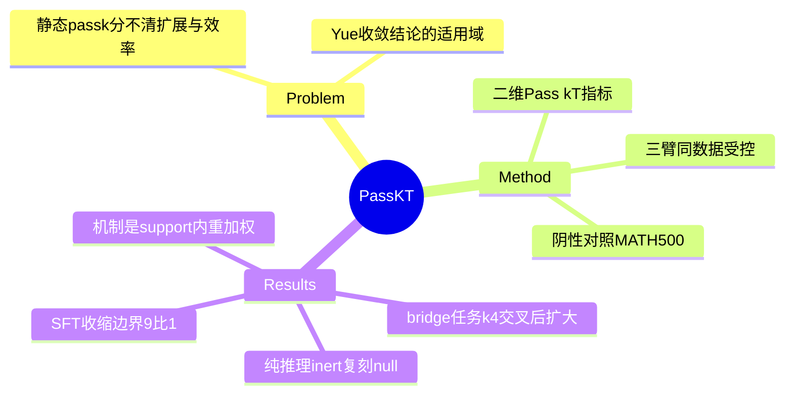

## Summary

用二维指标 Pass@(k,T)（k 条独立轨迹 × 每条最多 T 轮环境交互）裁决"RL 是否扩展能力边界"之争：纯推理（MATH-500）上复刻 Yue et al. 的收敛 null（边界完全不变），但**组合式 bridge 检索任务上 RL 真扩展边界**——pass 曲线在 k≈4 处反超 base 且差距随 k 扩大（k=64：0.81 vs 0.77，边界差集 5:1）；同数据 SFT 反而收缩边界（净 −4，RL:SFT 差集 9:1）。机制：RL 是对 base 既有策略分布的重加权——**重分布能扩大能力集，当且仅当 base 分布已稀疏包含任务所奖励的策略**。

## Problem & Motivation

Yue et al.（2025）的"RLVR 不扩展能力、只重分配概率质量"结论基于静态推理的 pass@k。agentic 设置多了交互深度维度：组合式问题需要链式检索，T=1 时再多重采样也无解——静态 pass@k 无法区分"能力扩展"与"效率提升"。本文把两者形式化分开：capability boundary B_T(π) = k→∞ 时可解问题集合；expansion = 差集非空；efficiency = 共同可解问题上 Pass@(1,T) 更高。

## Method

- **指标**：Pass@(k,T) 无偏估计（n=64 rollouts；k∈{1,2,4,...,64} 二进网格；T∈{0,1,2,3,5}）。
- **受控三臂**：base = Qwen2.5-7B-Instruct；SFT = LoRA 于 200 条 HotPotQA gold 专家轨迹；RL = GRPO 于同 200 题（binary EM reward，G=8，T_train=5，10 epochs）——SFT/RL 训练数据严格相同，隔离学习信号。
- **三类任务**（各 100 题）：A = MATH-500 无工具（阴性对照，仅 T=0）；B = HotPotQA comparison（两次独立检索）；C = HotPotQA bridge（顺序组合检索）。工具为确定性 BM25（10 段落：2 gold + 8 distractor）。

## Key Results

- **Cat A（纯推理）**：|B_RL|=|B_base|=84，双向差集各 3——RL inert，复刻 Yue et al.。
- **Cat B（可并行两跳）**：净 +4 但 Pass@(64,5) RL 0.86 vs SFT 0.85 vs base 0.82——浅组合下三者趋同，T*=2 饱和。
- **Cat C（bridge，主结果）**：|B_RL|=81 vs |B_base|=77（差集 5:1）；k=1 时 base 反而略优（0.363 vs 0.335），**k≈4 交叉后差距扩大**至 k=64 的 +4pp——与静态设置的收敛相反。
- **SFT 收缩边界**：|B_SFT|=73（丢 7 得 3）；RL:SFT 差集 9:1——同数据下学习信号是因，专家轨迹模仿伤害组合能力。
- **机制三则**：(a) base 对 RL 成功轨迹的困惑度——推理段 PPL 3.08 vs 查询段 2.07（1.49×）：新颖性在**整合推理**不在搜索内容；(b) 唯一查询序列 base 40.1 / RL 45.5 / SFT 14.7（2.7× 塌缩；SFT 97.7% 替换 base 分布，RL 保留 83.9% 重叠）；(c) 跨策略交换：检索计划与推理各贡献约一半。
- **Exploration bonus 消融**：+explore 0.78 < 纯 RL 0.81（净扩展 +1 vs +4）——扩展不靠显式探索奖励。

## Evidence Ledger

| Claim ID | Claim | Type | Source locator | Evidence excerpt | Status |
|:--|:--|:--|:--|:--|:--|
| C1 | Pass@(k,T) 定义 + B_T(π) 极限集合 + expansion/efficiency 区分 | benchmark-setting | §2 | "ℬ_T(π)={q:lim Pass@(k,T)>0}" | source-verified |
| C2 | 三臂受控（同 200 题）；BM25 工具；n=64，k 二进网格，T∈{0..5}；三类各 100 题 | benchmark-setting | §3 | "identical 200-problem training data" | source-verified（k 为 {1,2,4,...,64} 非逐整数） |
| C3 | Cat A：\|B\| 均 84、差集对称 3/3——复刻 Yue null | number | §4 | "replicating Yue et al.'s null" | source-verified |
| C4 | Cat C：81 vs 77（5:1）；k=1 base 0.363>0.335；k≈4 交叉；k=64 0.81 vs 0.77 | number | §4 Fig 2 | "the ordering flips near k=4 and the gap widens" | source-verified |
| C5 | SFT：\|B\|=73（丢 7 得 3）；RL:SFT 9:1 | number | §4 | "SFT contracts the boundary" | source-verified |
| C6 | PPL：查询 2.07 vs 推理 3.08（1.49×；surprisal 0.73 vs 1.12 nats） | number | §5 Fig 4a | "concentrated on how the agent reasons" | source-verified |
| C7 | 多样性：40.1/45.5/14.7（2.7×，论文称 3×）；novelty 97.7% vs 83.9% | number | §5 Fig 4b | "almost completely replaced the base query distribution" | source-verified |
| C8 | 调和：重分布扩大能力集 iff base 分布稀疏包含被奖励策略 | causal-mechanism | §6 | "only if the base distribution already sparsely contains strategies the task rewards" | source-verified |
| C9 | 边界：单 7B/单工具/10 段落 BM25/200 题；explore 消融 0.78<0.81（净 +1 vs +4） | number | §6; App I | "does not appear necessary" | source-verified |

## Strengths & Weaknesses

**Strengths**：
- 对"RL 扩展 vs 只重分布"之争给出**两边都对、条件不同**的干净调和，且条件被机制化（base 分布是否稀疏含被奖励策略）——与 [[Papers/2607-GRPONullWebAgent]] 的 headroom 判据（sampled-policy support 内才有效）是**同一结论的第三个独立表述**：那篇从训练收益侧、本篇从能力边界侧、[[Papers/2607-MAG]] 从补救侧。
- 三臂同数据受控 + 阴性对照（Cat A）+ 交叉验证机制（困惑度/多样性/策略交换三角互证），实验设计教科书级。
- "SFT 收缩组合能力边界"（9:1）是超出主线的独立发现，与 [[Papers/2606-GUIAgentExploration]] 的"low-level 训练无法向上泛化"同向。

**Weaknesses / 边界**：
- 玩具尺度：10 段落 BM25 语料、单 7B、单工具、200 题——"capability expansion" 的绝对量很小（净 +4/100 题），web 尺度检索或 GUI 域是否同构未测。
- T>T_train 外推、温度扫描、多 backbone 都留白（作者自认最紧迫）。
- 边界集合估计依赖 n=64 有限采样，k→∞ 极限实际由 n 截断——差集 5:1 的统计显著性未给检验。

**对领域**：Pass@(k,T) 把交互深度纳入能力测量，是 agentic RL 评测协议的实质改进；"重分布 + 稀疏 support ⇒ 扩展"给 agenda 的「GRPO 是受 policy support 约束的分布重塑」validated insight 补上能力边界侧的机制表述。

## Mind Map

## Notes

- 入队来源：[[Reports/2026-07-27-WebAgent-RL-and-Context-Landscape]] top-10 第 10（"检验前面所有提升是否真实"）。**07-27 报告入队的全部 10 篇（含证伪 trio + 主线 7 篇中的 6 篇）至此清完**——BiPACE/其余未入队篇目留待后续。
- 对 agenda「RL-based GUI Agent Training」：GRPO headroom 证据线新增第三独立数据点（GRPONullWebAgent 训练侧 / MAG 补救侧 / 本篇能力边界侧 + 任务结构条件）——"环境是否 admit 组合式解而 base 稀疏含其策略"可作为 headroom 前置诊断的任务侧判据，与 sampled-vs-greedy 的策略侧判据互补。此收敛可作为 memory insight 候选（3 独立来源），建议下次 memory-distill 时评估升级。
