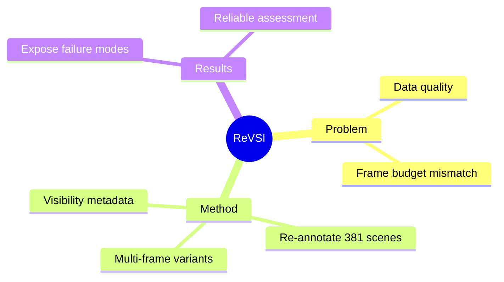

## Summary

ReVSI 指出当前 VLM spatial intelligence 评测存在系统性 invalidity，重新标注 381 scenes 的 QA pairs，提供多 frame budget variant 和 fine-grained visibility metadata。

## Problem & Motivation

当前 spatial intelligence 评测的两个问题：

1. **数据质量问题**：
   - 很多 benchmark 从 point-cloud 3D annotation 衍生 QA
   - 用作 video-based evaluation 时，重建和标注 artifact 会：
     - 漏掉 video 中可见的物体
     - 错标物体 identity
     - 腐蚀 geometry-dependent answer（如 size）

2. **frame budget 不匹配**：
   - 评测假设 full-scene access
   - VLM 实际只在 sparse frames（16-64）上操作
   - 很多问题在模型实际输入下 unanswerable

## Method

ReVSI 的解决方案：

1. **重新标注**：
   - 381 scenes from 5 datasets
   - 使用专业 3D annotation tools
   - Rigorous bias mitigation + human verification

2. **可控评测**：
   - 多 frame budget variant（16/32/64/all）
   - Fine-grained object visibility metadata
   - 支持 controlled diagnostic analyses

## Key Results

- ReVSI 暴露了 prior benchmarks 隐藏的 systematic failure modes
- 提供更可靠、更有诊断性的 spatial intelligence 评估

## Strengths & Weaknesses

**亮点**：
- 问题诊断精准：指出评测 invalidity 的两个根源
- 解决方案务实：重新标注 + frame budget matching
- 33 HF upvotes，认可度中等

**局限**：
- 重新标注成本高（381 scenes）
- Abstract 缺少具体 VLM 评测结果数字

## Mind Map

## Notes

> [未获取全文，仅基于 abstract]

关键 insight：评测 invalidity 比 model capability 更需要先解决。这篇工作对 VLM spatial reasoning 研究很重要。