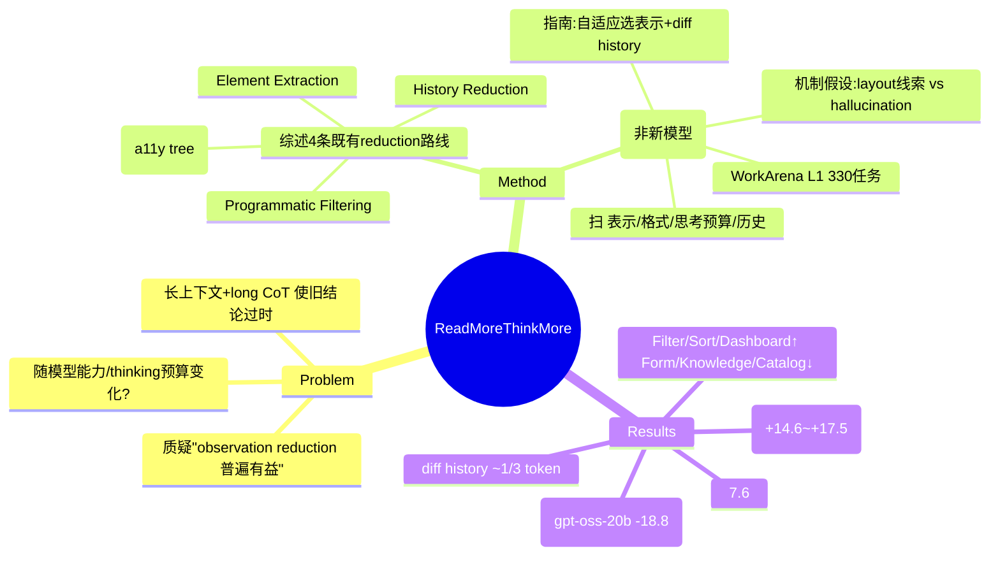

## Summary
这篇论文重新审视 web agent 中“observation reduction 普遍有益”的惯例：在 WorkArena L1 上系统对比 a11y tree 与原始 HTML 两种观察表示，并叠加 thinking budget 与 observation history 两个变量，发现最优观察表示取决于模型能力与 thinking token 预算——强模型（claude-sonnet-4-6、gpt-5.1、gemini-2.5-flash）用完整 HTML 更好（最高 +17.5pp），弱开源模型用 HTML 反而大幅退化（gpt-oss-20b −18.8pp）。它不提出新模型，而是给出经验规律与设计指南：按模型能力/thinking 预算自适应选择观察表示，并用 diff-based history 把观察历史的 token 压到约三分之一。

## Problem & Motivation
既有 web agent 工作普遍把 HTML 的冗长视为障碍，默认要做 observation reduction（元素抽取、a11y tree、程序化过滤等）来压缩上下文。作者质疑这一趋势：近年 LLM 处理长输入与延长 chain-of-thought reasoning 的能力显著提升，那么“observation reduction 是否仍然普遍有益”就值得重新检验。核心问题被提为——observation reduction 的效果如何随**模型能力**与**推理时 thinking token 预算**变化？这关系到部署时“该给 agent 喂精简观察还是完整 HTML”的基本工程决策，而此前缺乏在同一 benchmark 上把“能力 × 观察表示 × 思考预算”三者拉通的系统证据。

## Method
需要区分两层：本文**综述的既有 reduction 路线**（它归纳分类的对象）与**它自己的贡献**（一项受控经验研究 + 设计指南，而非新模型）。

**(A) 它综述/归纳的既有 observation reduction 分类（4 条路线）**
1. **Element Extraction**：只抽取任务相关元素（如 Mind2Web、WebLINX，用 cross-encoder / dual-encoder 对候选元素排序）。
2. **Compact Representations**：把页面转成紧凑表示，典型为 accessibility (a11y) tree。
3. **Programmatic Filtering**：从当前 sub-task 生成 Python 打分程序来过滤 HTML 元素。
4. **History Reduction**（跨步观察的冗余削减）：只保存 action log + 局部 HTML snippet 作为历史。

**(B) 本文自己的贡献——受控经验研究 + 指南（无新模型）**
- **实验设计**：在 WorkArena L1（330 个任务 = 33 类 × 10 seeds）上，把以下维度作为自变量系统扫描：
  - 观察表示 ∈ {a11y tree, 原始 HTML, a11y + screenshot}；
  - 序列化格式 ∈ {xml, indented}（作为 ablation，验证结论不由格式驱动）；
  - thinking token 预算（gpt-5.1 high/low；gemini-2.5-flash budget=16384/128）；
  - observation history ∈ {hist0, hist4, hist9-full, hist9-diff}；
  - grounding 固定为 **id-based**。
  - 覆盖模型：闭源 claude-sonnet-4-6 / gpt-5.1 / o3-mini / gemini-2.5-flash，开源 gpt-oss-120b/20b、Qwen3-VL 系列、Llama-3.1 系列。
- **由发现导出的指南（即本文“方法”层面的产出）**：(1) 依模型能力与 thinking 预算**自适应选择**观察表示——弱模型/小预算用紧凑 a11y，强模型/大预算用完整 HTML；(2) 观察历史采用 **diff-based 表示**以换取 token 效率。
- **机制假设（作者提出但未完全 ablate 证实）**：强模型能利用 HTML 携带的 layout 线索（如 CSS z-index）推断元素遮挡，从而减少 grounding 的 "intercepted" 错误；弱模型在更长的 HTML 输入下 hallucination 上升，not-found 类错误增多。

## Key Results
> Benchmark：WorkArena L1（330 任务，成功率 %）。括号内为相对 a11y baseline 的变化（pp）。

- **强模型偏好 HTML**（Table 1）：claude-sonnet-4-6 52.4 → 67.0（+14.6）；gpt-5.1 high 55.8 → 73.3（+17.5）；gpt-5.1 low 49.1 → 57.9（+8.8）；gemini-2.5-flash budget=16384 45.5 → 56.7（+11.2）。
- **弱开源模型用 HTML 退化**（Table 1）：gpt-oss-20b high 46.4 → 27.6（−18.8）；gpt-oss-120b high 46.7 → 38.8（−7.9）；Qwen3-VL-235B 45.0 → 39.8（−5.2）；Llama-3.1-70B 18.2 → 3.6（−14.6）；Llama-3.1-8B a11y 仅 0.0。**反例/细节**：o3-mini high 39.7 → 32.1（−7.6），说明“闭源/强推理 ⇒ 一定偏好 HTML”并不成立，偏好本质上由能力而非闭源与否决定。
- **格式无关性**（Table 2）：xml 与 indented 两种序列化下结论一致——强模型持续受益于 HTML、弱模型持续退化（如 gpt-oss-20b high indented 46.4 → html+diff 14.8，−31.5）。
- **任务类别差异**（Table 3）：HTML 在 Filter / Sort / Dashboard 类任务上提升，在 Form / Knowledge / Catalog 类任务上退化。
- **观察历史普遍有益**（Table 5，a11y 为底）：多数模型加历史后提升，如 gemini budget=128 由 hist0 28.5 → hist4 39.4（+10.9）；o3-mini high 39.7 → hist9-diff 46.1（+6.4）。**diff-based history 把输入 token 压到约三分之一**，且在 gpt-5.1(low)、o3-mini 上性能“与 full 相当或更好”（此“相当或更好”是作者对这两个设定的表述，非全模型普适；token 约 1/3 的结论则是普适的）。
- **误差分析**（Fig 2 / Table 4）：HTML→a11y 时，强模型（gemini-2.5-flash、gpt-5.1）总误差下降，弱模型（gpt-oss-20b）上升；not-found 错误在 gpt-oss-20b 上显著增加、在 gpt-5.1 上几乎不变；intercepted 错误在所有模型上下降、强模型下降更明显（支撑“强模型利用 layout 线索”的机制假设）。

## Evidence Ledger
| Claim ID | Claim | Type | Source locator | Evidence excerpt | Status |
|:--|:--|:--|:--|:--|:--|
| C1 | Benchmark 为 WorkArena L1，330 任务 = 33 类 × 10 seeds | benchmark-setting | Setup/Intro | "WorkArena L1, which consists of 330 tasks in total: 33 task types × 10 seeds" | source-verified |
| C2 | claude-sonnet-4-6：a11y 52.4 → html 67.0（+14.6） | number | Table 1 | "Claude Sonnet 4.6: a11y 52.4, HTML 67.0" | source-verified |
| C3 | 三个强闭源模型（claude/gpt-5.1/gemini）HTML 优于 a11y；gpt-5.1 high 55.8 → 73.3 | comparison | Table 1 + Abstract | "detailed observations (HTML) are advantageous for higher-capability models"；"gpt-5.1 (high): a11y 55.8, HTML 73.3" | source-verified（注：o3-mini 39.7→32.1 为反例，“能力”而非“闭源”才是决定因素） |
| C4 | 弱开源模型 HTML 退化：gpt-oss-20b high 46.4→27.6（−18.8）；Llama-3.1-70B 18.2→3.6（−14.6） | number | Table 1 | "gpt-oss-20b (high): a11y 46.4, HTML 27.6"；"Llama-3.1-70B: a11y 18.2, HTML 3.6" | source-verified |
| C5 | diff-based history 把输入 token 压到约 1/3，性能与 full 相当或更好 | number | Diff-history 节 / token 表 | "the diff format reduces input token count to approximately one-third" | source-verified（“相当或更好”作者限定于 gpt-5.1(low)、o3-mini；token≈1/3 为普适） |
| C6 | 观察历史普遍提升：gemini budget=128 hist0 28.5→hist4 39.4（+10.9） | number | Table 5 | "gemini-2.5-flash (budget=128): hist0 28.5; hist4 39.4" | source-verified |
| C7 | 中心论点：最优观察表示取决于模型能力与 thinking 预算（弱→a11y，强→HTML） | causal-mechanism | Abstract | "the optimal observation representation depends on model capability and thinking token budget" | source-verified |
| C8 | 强模型利用 layout（CSS z-index）改善 grounding、intercepted 错误减少；弱模型长 HTML 下 hallucination/not-found 增多 | causal-mechanism | Error-analysis 节 | "higher-capability models leverage this information [CSS z-index]"；"increased errors due to hallucination under longer inputs" | source-verified |
| C9 | HTML 提升 Filter/Sort/Dashboard，退化 Form/Knowledge/Catalog | comparison | Task-category 节 (Table 3) | improve "Filter, Sort, and Dashboard"; degrade "Form, Knowledge, and Catalog" | source-verified |
| C10 | 不提新模型；贡献为经验研究 + 设计指南（自适应选表示 + diff-based history） | sota-novelty | Abstract | "we suggest practical guidelines: adaptively select observation representations ... incorporate observation history using diff-based representations" | source-verified |
| C11 | o3-mini high 用 HTML 退化：39.7 → 32.1（−7.6） | number | Table 1 | "o3-mini (high): a11y 39.7, HTML 32.1" | source-verified |

## Strengths & Weaknesses
**亮点**
- **问对了问题**：把“observation reduction 是否有益”从“是/否”改写成“在何种能力 × 思考预算条件下有益”，是典型的 first-principles 重构，直接反驳了社区默认的“压缩总是好”惯例，实用价值高。
- **变量拉通、对照干净**：在同一 benchmark 上同时扫能力、观察表示、序列化格式、思考预算与历史长度；xml/indented 格式 ablation 排除了“结论由格式驱动”的混淆项，增强了主结论可信度。
- **给出可操作 knob**：diff-based history 用约 1/3 token 拿到相当性能，是能直接落地的部署建议。

**局限（多为作者自陈）**
- **单一 benchmark / 单一 grounding**：仅 WorkArena L1、仅 id-based grounding；能否推广到其它站点/领域、以及 coordinate-based 等 grounding 尚未验证。
- **机制未坐实**：CSS layout（z-index）贡献于 HTML 优势的说法基于误差相关性，未做直接 ablation，可能有其它因素。
- **历史实验固定用 a11y**：未探究“HTML + history”这类更 token-heavy 的组合。
- **任务时程短**：WorkArena L1 最多约 15 步，长时程任务上历史的作用未知。
- **能力刻画是黑箱**：论文用“高/低能力”作为解释轴，但能力是多维的（o3-mini 这个反例即提示“强推理”未必等于“偏好 HTML”），缺一个可测量、可预测某模型该用哪种表示的量化指标。

## Mind Map

## Notes
- **与 2605.29397 的关系**：本文（method/findings 向，主张“能力 × 思考预算决定观察表示”）与并行消化的 arXiv:2605.29397《Revisiting Observation Reduction for Web Agents: Comprehensive Evaluation with a Lightweight Framework》（评测框架向）标题相近但为不同论文，注意 cross-link 时勿混淆。
- **对 GUI/Web survey 的信号**：为 GUIAgent-Survey 提供一个反主流数据点——observation reduction 不是免费午餐，对强模型可能有害。可与 `2605-A11yCompressor.md`（规则式 a11y 压缩，主打 token 效率）形成对照：A11yCompressor 假设“压缩普遍有益”，本文则给出“取决于模型能力”的边界条件。
- **待跟进疑问**：作者的“能力”轴是定性分组；是否存在一个可预测“某模型该用 a11y 还是 HTML”的量化 proxy（如 long-context retrieval 得分或 grounding 准确率）？这是把该经验结论工程化的关键缺口。
- **机构**：arXiv abs 页未标注 affiliation，故 `institute` 留空，未据作者推断填写。
