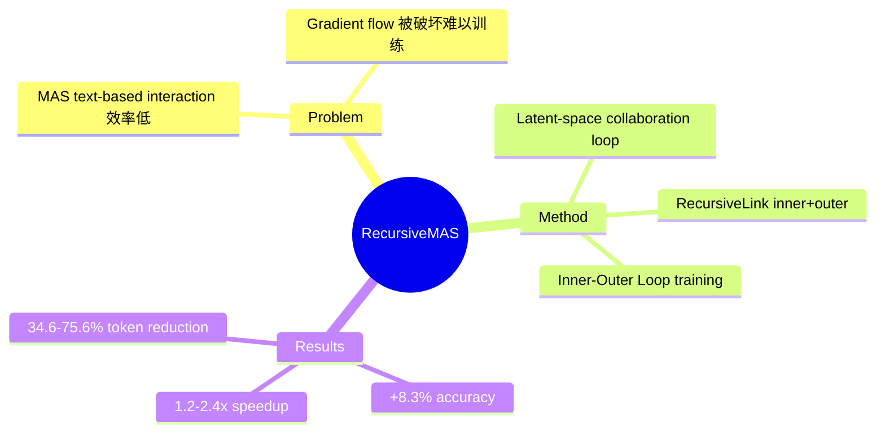

## Summary
将 recursive language model（RLM）的 scaling 思路从单个模型扩展到 multi-agent system，通过 lightweight RecursiveLink 模块实现跨 agent 的 latent-space 递归协作，避免 text-based MAS 的重复解码开销和梯度消失问题。

## Problem & Motivation
Multi-agent system（MAS）通过协作提升复杂任务表现，但现有方法存在两大瓶颈：
1. **效率问题**：text-based 交互需要每个 agent 完整生成文本，其他 agent 等待，引入大量延迟
2. **学习问题**：text-based 交互破坏 gradient flow，难以端到端训练整个系统

核心问题：能否将 agent 协作本身通过递归进行 scaling？

## Method

### RecursiveLink 模块
轻量级 two-layer residual projection，负责 latent states 的传递和 refinement：
- **Inner RecursiveLink**：在每个 agent 内部，consolidate input/output latent states
- **Outer RecursiveLink**：跨 agent 连接 heterogeneous models（不同 model families/sizes）

### RecursiveMAS 架构
所有 agent 通过 RecursiveLink 串联成一个 collaboration loop：
- 中间 recursion rounds 全在 latent space 进行，不解码文本
- 只有最后一个 agent 在最终 round 输出文本答案
- 避免中间 agent 的重复解码开销

### Inner-Outer Loop Training
两阶段渐进式 co-optimization：
- **Inner Loop**：model-level warm start，训练每个 agent 的 inner RecursiveLink
- **Outer Loop**：system-level 训练，gradient 通过 recursion rounds 递归 back-propagate，实现全系统 credit assignment

### 理论分析
1. **Runtime Complexity**：RecursiveLink 直接变换 latent information，比 text-based MAS 更高效（Proposition 3.1）
2. **Learning Dynamics**：latent-space 连接保持 gradient stability，避免 text-based interaction 的 gradient vanishing

## Key Results

### 评测配置
- **9 benchmarks**：Math500, AIME2025/2026, GPQA-D, MedQA, MBPP+, LiveCodeBench, Search
- **4 collaboration patterns**：Sequential reasoning, Mixture-of-experts, Expert-to-learner distillation, Tool-integrated deliberation
- **模型**：Qwen3/3.5, Llama-3, Gemma3, Mistral

### 主要数字
| Metric | Improvement |
|--------|-------------|
| Accuracy | +8.3% average |
| Inference speedup | 1.2x - 2.4x |
| Token reduction | 34.6% - 75.6% |

关键观察：
- 随 recursion depth 增加，性能和效率优势更显著
- structure-agnostic，适配多种 MAS collaboration patterns
- lightweight agents（sub-1.5B）展示 clean scaling trend

## Strengths & Weaknesses

### Strengths
- **问题动机清晰**：直击 MAS 的效率和学习两大痛点，text-based interaction 的局限性分析到位
- **理论支撑**：runtime complexity 和 learning dynamics 双重理论分析，不只是 empirical
- **方法简洁**：RecursiveLink 仅 two-layer projection，参数开销小，却能串联 heterogeneous agents
- **效率数字亮眼**：75.6% token reduction + 2.4x speedup 是实质性提升，不是 marginal gain
- **Generalization 好**：4 种 collaboration patterns 都能适配，说明设计有 generalizable value

### Weaknesses
- **Lightweight 设置占优，但 Scaled 设置如何？** Table 1 显示 Light 用 sub-1.5B agents，Scaled 用 5-10B，但 scaling analysis 不够深入——更大 agents 时 RecursiveLink 是否还够用？
- **与 RLM baseline 的比较需细看**：RLM 本身是新方向，RecursiveMAS 的 advantage 可能有部分来自 RLM paradigm 本身的 scaling power，而非 agent collaboration 的贡献
- **训练成本分析缺失**：Inner-Outer Loop 的训练 overhead 如何？论文声称 efficiency，但训练阶段成本未明确量化
- **Ablation 设计偏保守**：RecursiveLink architecture 的 alternative designs（比如更多层、attention-based）有无探索？

## Mind Map

## Notes
- 与 RLM（looped LM）的关系：RLM 是 single model recursion，RecursiveMAS 是 multi-agent recursion——本质上是把 agent 视为 RLM 的 "layer"
- 对 Agentic RL 的启示：latent-space communication 可能是 future agent training 的重要方向，避免 text-based 的 gradient 问题
- 与 GUI Agent 的关联：如果 grounding module 能接入 latent space 而非 text，可能也能受益于类似 design
- 疑问：cross-agent latent transfer 如何保证 semantic alignment？不同 model families 的 latent space 分布差异大