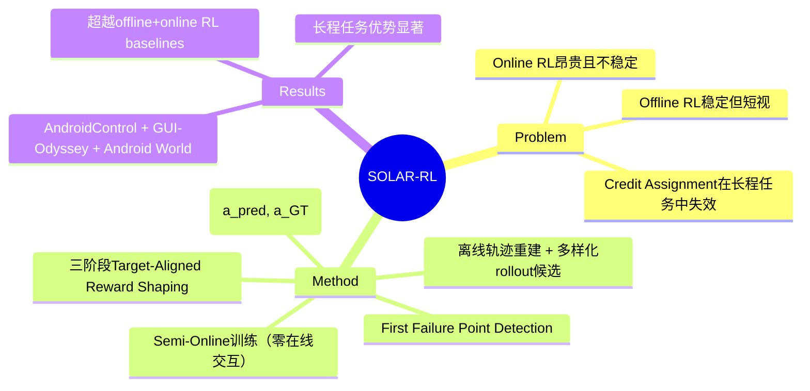

## Summary

SOLAR-RL 提出半在线 RL 框架解决 GUI agent 长程训练的 Credit Assignment Problem。核心创新是从纯静态离线数据中重建多样化 rollout 候选、检测第一条失败步（first failure point）、并通过三阶段目标对齐奖励塑形（Aggregation → Base Normalization → Total Reward Alignment）将稀疏终点奖励转化为稠密步级监督，实现零在线交互成本下的在线级训练效果。

## Problem & Motivation

训练 MLLM-based GUI agent 面临两难困境：Offline RL 稳定但时序短视（丢失全局轨迹上下文），Online RL 能捕捉环境动态但交互成本高且训练不稳定。两者共同面临 Credit Assignment Problem——二元成功/失败信号无法将反馈合理分配到中间步骤。长程任务（30+ 步）中该问题尤为严重：前面步骤正确但因最后一步失败而全轨迹被判负，导致正确行为无法被强化。

SOLAR-RL 的核心 insight：如果能在静态离线数据中"模拟"在线交互的反馈（检测失败点、分配步级奖励），就能兼顾 offline 的稳定性和 online 的细粒度信号。该思路与 UI-Voyager 的 GRSD（需成组 rollout 对比）和 ADMIRE（milestone reward）属于同一问题赛道，但 SOLAR-RL 不依赖在线环境交互。

## Method

**1. Offline Trajectory Reconstruction（离线轨迹重建）**
- 从静态离线数据中为每个 step 生成 N 条多样化 rollout 候选
- 每条轨迹根据 ground-truth 标签进行 per-step validity 检测
- 轨迹在检测到的第一条失败步（first failure point t*）处被回顾性截断

**2. Atomic Action Scoring（原子动作评分）**
- 将每个 action primitive（Click, Scroll, Type 等）映射到连续分数 Φ(a_pred, a_GT) ∈ [0,1]
- 综合考虑动作类型正确性和参数精度

**3. Trajectory-Aware Reward Shaping（轨迹感知奖励塑形）**
- **Trajectory-Level Reward R_traj**: 结合平均步质量、轨迹完整性（T/N_ref）和二元成功指标
- **Target-Aligned Step Rewards**: 仅在有效前缀（breakdown step t* 之前）分配正奖励，对无效/失败步施加惩罚
- **三阶段过程**:
  - Aggregation: 汇总所有步级评分
  - Base Normalization: 以轨迹级质量目标为基准进行归一化
  - Total Reward Alignment: 确保塑形后的步级奖励总和与轨迹级质量目标一致

**4. Semi-Online 训练范式**
- 零在线环境交互：所有"反馈"均从离线数据中重建
- 训练稳定性接近 offline RL，同时提供 online RL 级别的步级监督密度
- 策略优化使用重建轨迹进行 GRPO 式 group-based 更新

## Key Results

实验覆盖三个 GUI agent benchmark：
- **AndroidControl (Low & High)**: 低复杂度和高复杂度移动端控制任务
- **GUI-Odyssey**: 跨应用导航 benchmark
- **Android World**: 真实 Android 长程任务 benchmark

核心结果：
- 在全部 benchmark 上超越强 baseline（包括纯 offline RL 和 online RL 方法）
- 在长程任务上优势更显著（credit assignment 改善的直接体现）
- **零在线交互成本**——所有结果仅使用离线静态数据训练

Ablation 分析验证了 first failure point detection 和三阶段 reward alignment 的关键贡献。

## Strengths & Weaknesses

**亮点**：
- 问题定位精准：直接解决 offline RL 的 credit assignment 盲区，且不依赖在线环境交互（训练成本优势显著）
- 方法设计优雅：first failure point 检测 + 三阶段 reward alignment 构成完整 pipeline，不需要成组 rollout 对比（vs UI-Voyager GRSD）
- 实用性强：离线数据普遍可获取，不依赖环境模拟器或真实设备交互

**局限**：
- 高度依赖 ground-truth action labels 做 per-step validity 检测——标注成本转移到数据准备阶段
- 重建的 rollout 候选多样性受限于离线数据覆盖度；对于严重 OOD 的 action 缺乏有效反馈
- 与 ForkPoint-CreditAssignment idea 高度重叠：first failure point 检测 + 步级奖励 = ForkPoint idea 的核心机制。差异化空间在于 ForkPoint idea 的单轨迹 MI-based fork detection vs SOLAR-RL 的 ground-truth label-based validity detection
- 论文未提供 code 链接，可复现性待确认

**对 ForkPoint idea 的影响**：SOLAR-RL 是最接近 ForkPoint idea 的 concurrent work。关键区别：SOLAR-RL 用 ground-truth labels 做 validity 检测（需要标注），ForkPoint idea 用 state-action mutual information 做 fork detection（无监督）。若 ForkPoint 的无监督检测能匹配 SOLAR-RL 的有监督检测精度，则差异化成立；否则 ForkPoint 方向基本被覆盖。

## Mind Map

## Notes

- 与 ForkPoint-CreditAssignment-GUI idea (16/25 → 12/25) 高度竞争。SOLAR-RL 的 first failure point detection 使用 ground-truth label-based 方式，ForkPoint 提出无监督 MI-based 方式——若后者无法匹配前者精度，ForkPoint 方向不可行
- UI-Voyager (GRSD, 需成组 rollout) + SOLAR-RL (单轨迹 validity) + GiGPO (anchor states) + ProxMO (soft proximity) 共同覆盖了 credit assignment 的大部分设计空间——该方向的窗口正在迅速关闭
- 下一步应快速阅读 ProxMO 确认是否还有未被覆盖的差异化角度
