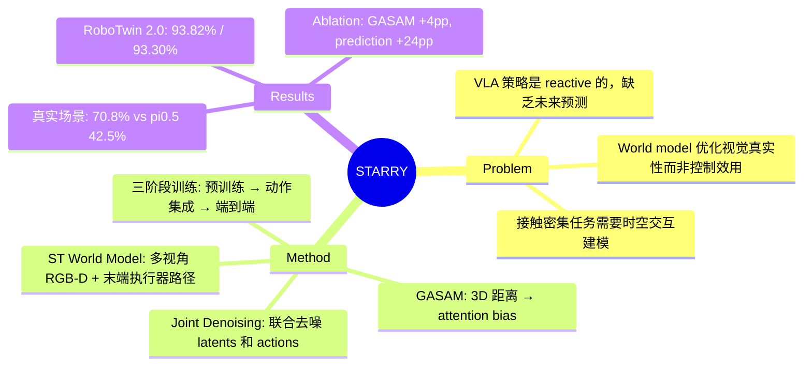

## Summary

STARRY 提出了一种 action-centric 的空间-时序世界模型策略，通过联合去噪未来 spatial-temporal latents 和 action sequences，并引入 Geometry-Aware Selective Attention Modulation (GASAM) 将预测的深度和末端执行器几何信息转化为 token 级别的注意力权重，从而将世界模型的预测直接对齐到动作生成上。在 RoboTwin 2.0 上达到 93.82%/93.30% 的成功率，真实场景中相比 pi0.5 从 42.5% 提升至 70.8%。

## Problem & Motivation

现有 VLA 策略本质上是 reactive 的——仅根据当前观测做出反应，缺乏对未来时空交互的显式建模。而现有的 world-model-enhanced 策略虽然引入了预测，但优化目标是视觉真实性而非控制效用，导致"预测得好看"不等于"控制得好"。在空间约束强、接触密集的操作任务中，不预测即将到来的接触点和物体轨迹会导致频繁失败。核心问题在于：**如何让世界模型的时空预测直接服务于动作生成，而非独立于控制之外？**

## Method

STARRY 包含四个核心模块：

1. **ST World Model**：将多视角 RGB-D 输入与投影的末端执行器路径整合为统一输入布局，使用 diffusion-based 架构同时预测未来的 appearance、motion 和 geometric constraints latents。

2. **Joint Denoising**：未来 latent 和 action sequence 在匹配的时间步上同步去噪。这使得时间维度上的预测与控制生成直接对齐，而非作为两个独立的优化目标。

3. **Geometry-Aware Selective Attention Modulation (GASAM)**：核心创新。几何模块预测未来的深度图和末端执行器坐标，计算 gripper 与场景点之间的 3D 距离，将距离转换为 token 级别的权重。这些权重作为 additive bias 注入 action attention 的 softmax 之前，引导注意力聚焦于空间关键区域，同时保留语义处理能力。

4. **三阶段训练**：Stage 1 进行大规模视频预训练；Stage 2 引入动作和几何模块；Stage 3 端到端联合优化，启用 GASAM。

关键设计思路：不是让世界模型"自顾自地"预测未来视频，而是让预测的 latents 与 action tokens 共享表示空间，再通过几何信息显式引导注意力分配。

## Key Results

**RoboTwin 2.0（50 个双臂任务）：**

| 方法 | Clean | Randomized |
|:-----|:------|:-----------|
| pi0.5 | - | - |
| X-VLA | - | - |
| Motus | - | - |
| LingBot-VA | 92.93% | 91.55% |
| **STARRY** | **93.82%** | **93.30%** |

**Ablation 发现：**
- 在已有 world model 的基础上加入 GASAM，提升超过 4 个百分点
- 对 reactive baseline 加入 future prediction，提升约 24 个百分点（说明预测本身非常关键）

**真实场景（ARX R5 双臂平台，3 个复杂任务）：**
- pi0.5: 42.5% 平均成功率
- STARRY: 70.8% 平均成功率（+28.3%）
- 在长时序多步骤任务中提升最为显著（+31.7%），体现更强的长程协调能力

## Strengths & Weaknesses

**Strengths：**
- **Joint denoising 设计精巧**：将 world model 和 action generation 统一到一个去噪过程中，避免了两阶段方法的信息断裂。这个设计选择有明确的控制论动机——预测应当直接服务于决策
- **GASAM 的几何 grounding**：将 3D 距离信息以 attention bias 的形式注入，是一种 principled 的方式将空间先验编码进 transformer 架构，比简单的 concatenation 或 cross-attention 更有结构性
- **Ablation 信息量大**：24 个点的 reactive→predictive 提升和 4 个点的 GASAM 增益清晰展示了各组件的贡献
- **真实场景验证**：在物理机器人上的验证增强了说服力，尤其是长时序任务的显著提升

**Weaknesses：**
- **真实场景覆盖面窄**：仅 3 个任务、1 个硬件平台（ARX R5），泛化性尚待验证
- **深度预测依赖性强**：GASAM 的有效性依赖准确的 depth 和 position 预测；在遮挡严重或观测质量差的场景中，几何预测退化可能直接影响控制性能
- **计算开销未讨论**：三阶段训练 + 视频预训练 + 多视角 RGB-D 处理，相比 reactive VLA 的额外计算成本未在 abstract 层面体现
- **缺少与更多 world model 方法的对比**：如 DreamDojo、UniSim 等 world model 方法未被列为 baseline，定位对比不够充分

## Mind Map

## Notes

- 这篇论文的核心 insight 值得关注：**world model 的价值不在于预测得准，而在于预测对控制有用**。这与 Dreamer 系列在 RL 中的思路一脉相承，但在 manipulation 领域的具象化表达
- GASAM 将几何信息注入 attention 机制的做法，可能对 GUI Agent 的 spatial grounding 也有启发——将 UI 元素的空间距离转化为 attention 权重
- 与 pi0.5 的对比中，长时序任务提升最大（+31.7%），这暗示 world model 的价值主要体现在需要 foresight 的场景，简单抓取任务可能不需要
