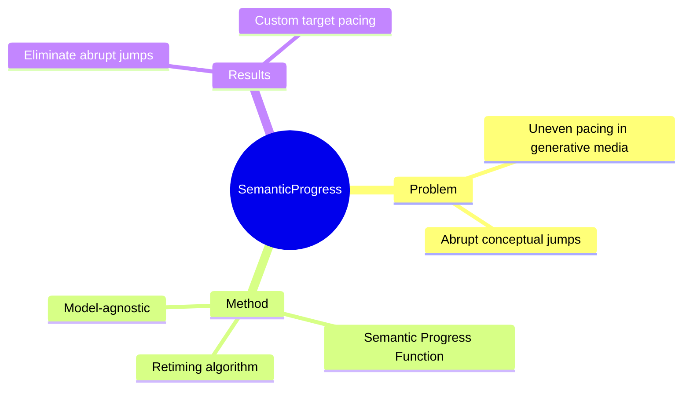

## Summary

提出 Semantic Progress Function (SPF) 量化视频叙事进度，通过 retime algorithm 重分布概念变化，解决生成媒体中的 uneven pacing 问题（静态段落突然跳跃到概念飞跃）。

## Problem & Motivation

> [未获取全文，仅基于 abstract]

**问题**：生成媒体（AI 视频）存在 uneven pacing——长时间静态后突然概念飞跃，节奏不连贯。

**动机**：需要量化叙事进度的统一指标，用于检测 timing flaws、评估 pacing、指导剪辑。

**重要性**：视频生成质量不只看帧，叙事节奏是用户体验的关键。

## Method

> [未获取全文，仅基于 abstract]

**Semantic Progress Function (SPF)**：
- One-dimensional curve 量化 temporal meaning shifts
- 单轴追踪概念变化，normalize 叙事进度

**Retiming Algorithm**：
- 均匀分布概念变化
- 消除 abrupt jumps
- 支持 arbitrary target pacing

**Model-agnostic**：
- 兼容多种生成系统
- 作为分析工具 + timing correction 基础

## Key Results

> [未获取全文，仅基于 abstract]

- 成功消除 abrupt conceptual jumps
- 支持手动调整视频 timing
- 可 follow customized progression curves
- 兼容多种视频生成工具

## Strengths & Weaknesses

**亮点**：
- 问题定义新颖（生成视频的 pacing 问题）
- Model-agnostic 设计通用性强
- SIGGRAPH 2026 顶会认可

**局限**：
- 与 GUI Agent 研究方向关联度低（video generation 而非 grounding/action）
- 未获取全文，技术细节待补充
- 具体数值 benchmark 缺失

**与 World Model 的关联**：
- SPF 的概念进度量化与 World Model 的 temporal prediction 有潜在关联
- 视频叙事节奏控制是 video world model 的下游应用

## Mind Map

## Notes

> [未获取全文，仅基于 abstract]

待追踪：
- SPF 的具体计算方法（semantic embedding 距离？）
- 与 World Model temporal prediction 的关联
- 是否可用于 GUI Agent 的 action sequence pacing 分析