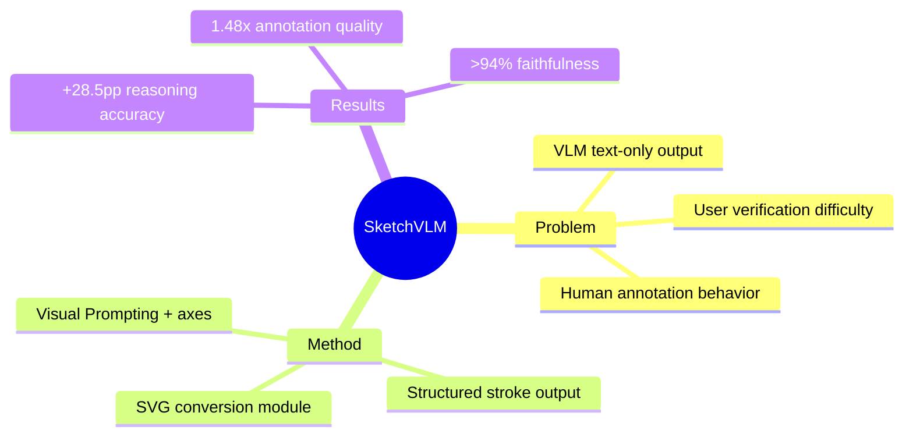

## Summary

SketchVLM 提出 training-free、model-agnostic 框架，使 VLM 能够在图像上生成 non-destructive SVG overlays 来可视化解释推理过程，在 7 个 visual reasoning 和 drawing benchmarks 上取得 up to +28.5pp accuracy 提升和 1.48x annotation quality 改进。

## Problem & Motivation

VLM（如 Gemini-3-Pro、GPT-5）回答图像问题时仅输出文本，用户难以验证。而人类回答时会自然地指出、标记、绘制来解释。现有方法的局限：
1. **text-only output**：无法提供视觉解释，难以验证
2. **image-editing approaches**：破坏原图，不可编辑
3. **fine-tuned sketching**：需要额外训练，模型依赖性强

核心动机：让 VLM 像 human一样用视觉 annotation 解释推理，且不破坏原图、无需训练、跨模型通用。

## Method

框架三阶段设计：

1. **Visual Prompting**：在输入图像上叠加坐标轴，帮助模型精确定位
2. **Customized Instructions**：定制 prompt 强制模型输出结构化 stroke coordinates
3. **Conversion Module**：将数值序列转换为渲染曲线，叠加到原图

关键特点：
- **Non-destructive**：SVG overlay 不修改原图像素
- **Editable**：用户可进一步调整 annotation
- **Faithful**：annotation 与 textual answer 一致性 >94%
- **Multi-turn support**：支持交互式迭代生成

评估任务（7 个）：
- Visual reasoning：maze navigation, ball-drop trajectory, object counting
- Drawing：part labeling, connect-the-dots, draw shapes around objects

## Key Results

**Reasoning Performance**：
- Physics trajectory prediction：96.0 ± 1.4（Gemini）
- Connect-the-dots pixel error：5.92（最优）
- Enumeration：94.5% correctness（OpenAI）

**Annotation Quality**：
- Annotation-text alignment：>94%（Gemini + GPT-5）
- Human-aligned score：3.70/5（GPT-5）

**对比 baseline**：
- vs image-editing：+28.5pp reasoning accuracy
- vs fine-tuned sketching：1.48x annotation quality

## Strengths & Weaknesses

**亮点**：
- Training-free，无需额外训练即可应用于现有 VLM
- Model-agnostic，跨 Gemini/OpenAI/Qwen 等模型验证
- Non-destructive SVG overlay 设计优雅，可编辑且不破坏原图
- Annotation-text faithfulness >94%，证明可视化与文本答案一致
- 28.5pp reasoning accuracy 提升显著

**局限**：
- 小模型（Qwen2.5-VL-7B）在复杂 drawing commands 上表现不佳
- Reference grid overlay 对 GPT-5 有负面影响（error 99.34）
- Hand-drawn strokes 对小目标精度不足
- Multi-turn 与 single-turn accuracy 相似但计算成本更高

**与 GUI Agent 的关联**：
- Visual annotation 与 GUI grounding 的"show me where"需求契合
- Coordinate axis prompting 与 grounding precision 相关
- Faithfulness constraint 可用于 GUI action verification

## Mind Map

## Notes

待追踪：
- 与 GUI grounding（如 MEGA-GUI）的结合潜力——"show me where you clicked"的可视化验证
- 小模型 performance gap 的根本原因
- Coordinate prompting 对 GUI element localization 的启发