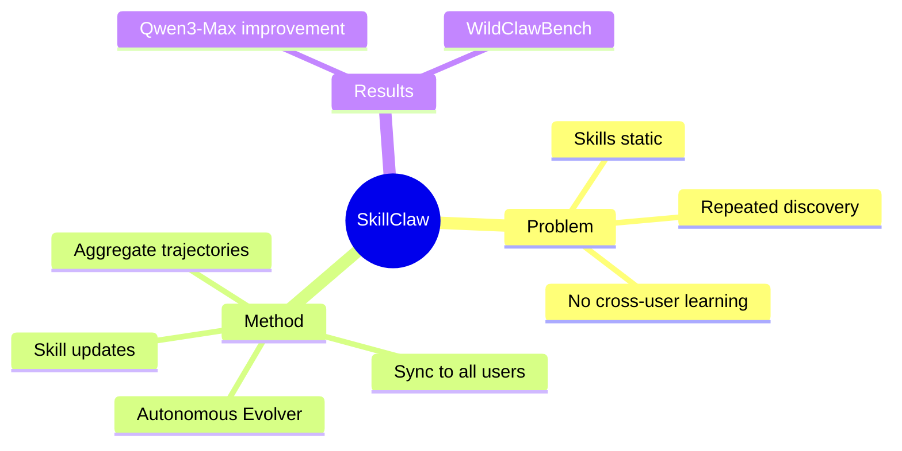

## Summary

SkillClaw 提出了 Agent skill 的集体演化框架：跨用户交互轨迹聚合 → autonomous evolver 提取行为模式 → 更新共享 skill 库 → 同步到所有用户。实现跨用户知识迁移和累积能力提升。

## Problem & Motivation

LLM agent 的 skill 在部署后基本静态。问题：
- 相似 workflow、工具使用模式、failure mode 被不同用户重复发现
- 系统无法从经验中改进
- 跨用户的互补信号无法转化为可靠的 skill 更新

核心洞察：**跨用户交互是 skill 进化的 primary signal**。

## Method

SkillClaw 框架：

1. **轨迹聚合**：持续聚合用户使用过程中生成的轨迹
2. **Autonomous Evolver**：处理轨迹，识别 recurring behavioral patterns
3. **Skill 更新**：转化为 skill set 的更新（refine existing skills 或 extend new capabilities）
4. **共享同步**：skill 维护在共享库，同步到所有用户

关键设计：
- 改进在一个 context 发现 → 传播到 system-wide
- 用户无需额外 effort，系统自动学习

## Key Results

在 WildClawBench 上：
- Qwen3-Max 在真实 agent 场景下显著提升
- 仅需有限交互和反馈即可见效

## Strengths & Weaknesses

**亮点**：
- 核心 idea 清晰：skill 应该从跨用户交互中持续进化，而非静态
- 286 HF upvotes，社区关注度极高
- 与 OpenClaw 系统集成，直接落地

**局限**：
- Abstract 缺少具体数字（"显著提升"无量化）
- Evolver 的设计细节未知（如何识别 pattern？如何避免 bad pattern？）
- 跨用户 skill 共享的隐私和安全问题未提及

## Mind Map

## Notes

> [未获取全文，仅基于 abstract]

关键问题：
- Evolver 如何识别好的 pattern vs bad pattern？
- 如何处理 skill 冲突？
- 跨用户共享的 privacy 问题？