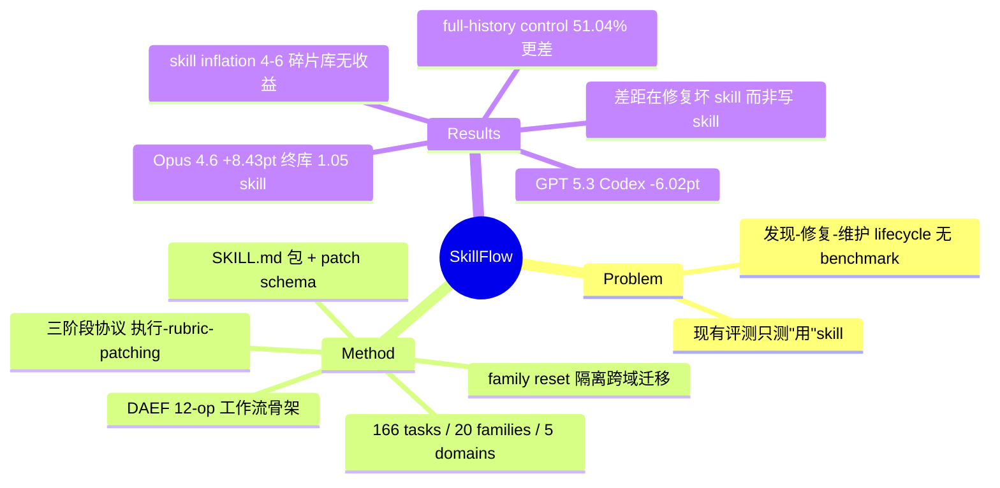

## Summary

SkillFlow 是第一个把 agent 的 skill lifecycle（从经验中发现 skill、失败后修复 skill、长期维护 skill 库）作为评测对象的 benchmark：166 个任务、20 个 family、5 个领域，agent 在 family 内按难度顺序连续做题，每题后基于轨迹与 verifier 反馈生成 skill patch 更新库。核心结论是收益高度分化——Claude Opus 4.6 从 62.65% 提到 71.08%（+8.43pt），而 GPT 5.3 Codex 反降 6.02pt；作者归因为模型差距在"能否识别并修复坏 skill"，而非能否写 skill。

## Problem & Motivation

现有 skill 相关评测（如 SkillsBench）测的是模型**用**现成 skill 的能力，memory/skill-induction 工作（SkillWeaver、SkillRL、MemSkill）证明了经验衍生 skill 有用，但都没有回答一个更接近 lifelong learning 本质的问题：agent 能否**自己**从任务求解过程中发现并总结可复用 skill、在失败后修复它们、并让 skill 库随时间保持连贯而非膨胀腐化。SkillFlow 把这三件事（discovery、repair/evolution、library maintenance）做成统一的顺序评测协议。

## Method

**"Skill" 的操作化定义**：一个 skill 是结构化的可复用能力包——`SKILL.md`（YAML frontmatter 的 name/description + markdown 指令）加可选 `scripts/`（可执行辅助脚本）、`references/`（文档/schema）、`assets/`（模板）。粒度要求是跨任务变体泛化的 procedural workflow，不是单实例笔记。库更新通过极简的 **skill-patch schema**：`summary`（自然语言 lesson）、`upsert_files`（路径→内容）、`delete_paths`（删除废弃文件），刻意保持最小可审计接口。

**DAEF（Domain-Agnostic Execution Flow）**：任务用 12 种 operation 节点词表（read / extract / retrieve / normalize / filter / align / compute / compare / detect / update / validate / output）抽象成保留类型与依赖结构、去除领域 grounding 的工作流骨架，使同一骨架可实例化到 finance、supply chain、healthcare 等不同领域。

**任务构建**：64 个 seed task（18 来自 SkillsBench、46 来自 GDPval），从 8,000+ 开源仓库筛出 2,318 个 skill 做 embedding 匹配（Qwen3-embedding-4B）；Architect agent（GPT-5.3-Codex）生成任务、Critic agent（Claude Opus 4.6）按一致性/难度梯度/可解性审核（最多 5 轮打回），最终每 family 8-9 题；人工按 instruction leakage、逻辑正确、环境正确、难度校准四维复核。成品：166 tasks / 20 families / 5 domains（Finance & Economics 3、Operations & Supply Chain 5、Healthcare 2、Governance & Strategy 3、Data & Document Intelligence 7 个 family）。

**Lifelong 评测协议**：agent 在 family 内按难度顺序逐题执行，维护可更新 skill 库 S_t。每题三阶段：(1) 用当前库执行，产出轨迹 τ_t；(2) 收到 verifier 派生的 rubric r_t（缺失/错误内容的规范化文字描述）；(3) 由固定 prompt 模板生成 skill patch Δ_t 并应用入库。patch prompt 强调从轨迹泛化而非复述、优先采信 verifier 证据而非 agent 自述、最小编辑、progressive disclosure（长文档只进 references/）。**Family reset**：skill 不跨 family 携带——协议明确只测同类工作流内的 lifelong 学习，排除跨异构工作流的 skill 检索混淆因素。

**指标**：三组——task success rate（二值通过率，benchmark 级平均）；效率（每题平均 turns、美元成本、output tokens）；skill 生成与复用（family 终库 skill 数 `#Skills`、读取/调用库内 skill 的任务占比 `%use`）。注意：**没有**显式的 forgetting、transfer 或 skill 冗余度量——库健康度只通过 #Skills 与最终成绩间接刻画。

**对照设置**：vanilla（无 skill 机制逐题做）vs. skill evolution（完整协议）vs. historical-trajectory control（不做 skill 抽象、直接前置全部历史交互作为上下文）。共评 11 个模型变体、5 套 harness：Claude Sonnet/Opus 4.5+4.6（Claude Code）、MiniMax M2.5/M2.7（Claude Code）、GPT 5.4 与 GPT 5.3 Codex（Codex CLI）、Qwen-Coder-Next 与 Qwen3-Coder-480B（Qwen Coder）、Kimi K2.5（Kimi CLI）。

## Key Results

- **正向头部**：Claude Opus 4.6 vanilla 62.65% → 71.08%（+8.43pt），终库仅 1.05 个 skill、45.78% 使用率；MiniMax M2.5 +6.63pt（28.31→34.94）；Claude Sonnet 4.5 +6.02pt（49.40→55.42）。
- **负向/无效**：GPT 5.3 Codex **-6.02pt**（52.41→46.39）；Qwen-Coder-Next -0.60pt；Kimi K2.5 使用率高达 66.87% 却只 +0.60pt——**skill 使用率与收益脱钩**。
- **对照上限检验**：Opus 4.6 上 full-history control 仅 51.04%，低于 vanilla 和 skill 协议——支持"压缩成 skill 抽象"优于"堆原始经验上下文"。
- **效率**：Opus 4.6 开 skill 后 turns +1.66 但 cost -7.52%、output tokens -20.33%；弱模型（Qwen-Coder-Next）则 cost/tokens 都 +~10%，skill 机制反成开销。
- **六条 findings 中最有信息量的三条**：(a) 错误 skill 一旦入库会造成 systematic downstream drift——后续任务继承同一错误抽象，把局部错误放大为序列级 pattern；(b) 强设置收敛到 1-2 个不断修订的统一 skill，弱设置单调堆到 4-6 个碎片 skill（Qwen 系 5.2-5.45 个）而收益弱/为负，作者称之为 "fragmentation through skill inflation"；(c) 模型间的关键差距在**修复坏 skill** 的能力，而非生成 skill 的能力。

## Evidence Ledger

| Claim ID | Claim | Type | Source locator | Evidence excerpt | Status |
|:--|:--|:--|:--|:--|:--|
| C1 | 166 tasks / 20 families / 5 domains，每 family 8-9 题按难度排序 | number | Abstract; §2.1 | "166 tasks across 20 families" | self-checked |
| C2 | skill 操作化为 SKILL.md 包（frontmatter+指令+可选 scripts/references/assets） | benchmark-setting | §2.4 | "A skill is a reusable capability package" | digest |
| C3 | skill-patch schema 为 summary / upsert_files / delete_paths 三字段 | benchmark-setting | §2.4 | — | digest |
| C4 | DAEF 用 12 种 operation 节点词表抽象跨域工作流 | benchmark-setting | §2.2 | "read, extract, retrieve, normalize, filter, align, compute, compare, detect, update, validate, output" | digest |
| C5 | 64 seed tasks（18 SkillsBench + 46 GDPval）、8,000+ 仓库筛出 2,318 skills、Architect+Critic 双 agent 生成 | number | §2.3 | — | digest |
| C6 | 每题三阶段（执行/verifier rubric/patching），family reset 排除跨 family transfer | benchmark-setting | §2.4 | "evaluate lifelong learning within a single class of agent tasks" | digest |
| C7 | Claude Opus 4.6：62.65% → 71.08%（+8.43pt），1.05 skills、45.78% use | number | Table 1 | — | self-checked |
| C8 | GPT 5.3 Codex 退化：52.41% → 46.39%（-6.02pt） | number | Table 1 | — | self-checked |
| C9 | Kimi K2.5 使用率 66.87% 但仅 +0.60pt | comparison | Table 1 | — | digest |
| C10 | full-history control 在 Opus 4.6 仅 51.04%，低于 vanilla | comparison | §3.3 Finding 1; App. Table 6 | "reaches only 51.04%" | digest |
| C11 | 强设置终库 1-2 skill；弱设置 4-6 碎片 skill（Qwen 5.45/5.2）收益弱或负 | comparison | §3.3 Findings 3-4 | "fragmentation through skill inflation" | digest |
| C12 | 模型差距在修复坏 skill 而非写 skill | causal-mechanism | §3.3 Finding 6 | "the key model gap lies in repairing bad skills, not in writing skills" | digest |
| C13 | 错误 skill 入库导致 systematic downstream drift | causal-mechanism | §3.3 Finding 2 | "Incorrect skills create systematic downstream drift" | digest |
| C14 | Opus 4.6 开 skill 后 turns +1.66、cost -7.52%、tokens -20.33% | number | Table 1 | — | digest |
| C15 | 11 模型变体、5 套 harness | benchmark-setting | §3.1 | — | digest |
| C16 | 指标仅 success/效率/#Skills/%use，无 forgetting/transfer/冗余度量 | benchmark-setting | §3.2; Table 1 | — | digest |
| C17 | 机构 USTC(10)+Toronto(1)+Sydney(1)，Zhen Fang 通讯 | benchmark-setting | 首页脚注 | — | digest |

> 核验边界：C1/C7/C8 的 headline 数字经 arXiv HTML 直取自核（main-loop curl，非独立 verifier 子代理——本轮 verifier 因额度中断）；其余 claim 为 digest 级，未经独立 verifier 复核，引用前建议二次核对。

## Strengths & Weaknesses

**亮点**：
- **问对了问题**：把评测对象从"会不会用 skill"（SkillsBench）移到"能不能发现-修复-维护 skill"，正是 self-evolving agent 路线缺的 benchmark 化环节；且 vanilla / skill-evolution / full-history 三重对照让"skill 抽象是否优于原始经验堆积"第一次有了可比数字。
- **负结果有信息量**：GPT 5.3 Codex 退化、Kimi 高使用率零收益、skill inflation 模式，这些反例比 Opus 的正增益更能说明 skill evolution 不是免费午餐；"差距在修复而非生成"是可指导方法设计的机制判断（与 [[Papers/2606-SkillNb]] 的 gate/修复导向、[[Papers/2604-SkillClaw]] 的 A/B 验证后 merge 相互印证）。
- skill 载体直接采用 SKILL.md 生态格式 + 最小 patch 接口，贴近真实 agent harness 的使用方式，外部效度好。

**局限**：
- **Family reset 显著削弱 "lifelong" 标签**：每 family 只有 8-9 题、跨 family 不携带 skill，因此测的是短程 within-family 演化，不涉及长程积累、跨域迁移和 catastrophic forgetting——名字里的 "lifelong" 大于实际协议覆盖面。
- **无显式库健康度量**：redundancy / homogenization / 退化只靠 #Skills 与成绩间接观察，缺专门指标；"unified skill 优于 fragmented" 的结论也可能与模型能力混淆（强模型本来就更会做题也更会收敛库）。
- **verifier/rubric 设计细节不透明**：成功判定与 rubric 反馈的生成方式论文语焉不详，而 rubric 是否泄露解法直接影响 skill patch 的"学习"含金量；人工审核里有 instruction-leakage 检查，但未给出量化保证。
- 任务生成与评测都深度使用 Claude Opus 4.6（Critic agent）和 GPT-5.3-Codex（Architect），存在评测对象参与出题的自指风险，论文未讨论。
- 无 limitations 章节；每模型绑定各自 harness（Claude Code / Codex CLI 等），模型差异与 harness 差异不可分离。

## Mind Map

## Connections

- [[Papers/2604-SkillClaw]] — 同月的 skill 集体演化系统：day-night loop + A/B gate 后 merge；SkillFlow 提供了它缺的标准化评测（但 SkillFlow 是单 agent within-family，SkillClaw 是多用户跨 session）。
- [[Papers/2606-SkillNb]] — SKILL.nb 的 gated execution/修复回收与 SkillFlow "差距在修复坏 skill" 的结论互为方法-证据呼应。
- [[Papers/2602-MemSkill]] — 把 memory 抽取操作本身升为可演化 skill；SkillFlow 的 patch 机制是其无训练版近亲（prompted patch vs. PPO controller）。
- [[Papers/2607-MetaSkillEvolve]] — 快环 task skill + 慢环 meta-skill 的递归演化，可直接在 SkillFlow 上受检（是否避免 skill inflation）。
- [[Papers/2601-MemRL]] — 经验层自演化的另一路线（episodic memory + Q 重排）；SkillFlow 的 full-history control 结果（51.04% < vanilla）为"抽象优于原始经验"提供了对立证据点。
- [[Papers/2504-SkillWeaver]] — web agent skill induction 先驱，SkillFlow 在 related work 中将其归为"证明 skill 有用但未测 lifecycle"的一类。
- [[Topics/SelfEvolvingAgents-Survey]] — 本文是该 survey "experience-driven lifelong learning benchmark 化"前沿的核心条目，归 Benchmarks 章 + tool/skill 演化路线。

## Notes

- verifier 与 rubric 的具体实现是全文最大信息缺口，若后续要引用其协议严谨性，需查 GitHub repo（候选 repo-digest 对象）。
- "lifelong" 实为 8-9 题的 within-family 短程演化，survey 引用时措辞应降级为 "sequential within-family skill evolution"，避免继承 overclaim。
