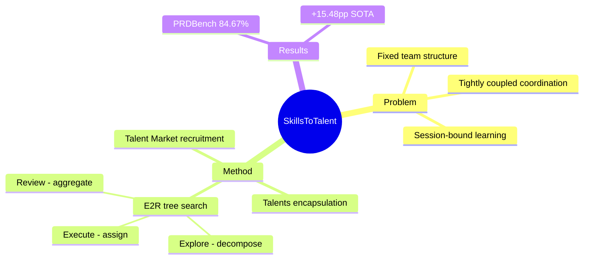

## Summary

提出 OneManCompany (OMC) 框架，将 multi-agent systems 从"固定团队结构+紧耦合协调"提升到"组织架构层面"——通过 Talents（可移植 agent 身份）、Talent Market（按需招募）、E²R tree search（探索-执行-评审循环）实现自组织、自改进的 AI 组织。PRDBench 84.67% 成功率，+15.48pp SOTA。

> [未获取全文，仅基于 abstract]

## Problem & Motivation

**问题**：现有 multi-agent systems 受限于三个约束：固定团队结构、紧耦合协调逻辑、session-bound learning。每次任务需要预先配置 team，无法动态调整；coordination logic 与具体 agents 紧耦合，替换 agent 需重写；学习仅限于单次 session，无法跨 session 积累。

**洞察**：作者认为根本问题是缺少"组织架构层"——一个独立于 individual agent capabilities 的 layer，负责"how a workforce is assembled, governed, and improved over time"。类比人类企业：员工能力 vs 组织管理是两个独立的维度。

**为什么重要**：开放任务（open-ended tasks）需要动态调整 agent 组合——固定 pipeline 无法应对未知场景。组织架构层是实现 self-organizing、self-improving AI systems 的前提。

## Method

**OneManCompany (OMC) 框架**：

1. **Talents**：将 skills、tools、runtime configurations 封装为可移植的 agent identities。通过 typed organisational interfaces 与 heterogeneous backends 交互——同一个 Talent 可以绑定不同的 backend（如不同的 LLM）。

2. **Talent Market**：community-driven 的按需招募机制。任务执行中发现 capability gap → 从 Market 招募新 Talent → 动态 reconfigure organization。Market 隐含"skill library"概念，但强调"封装"而非单纯 skill list。

3. **Explore-Execute-Review (E²R) Tree Search**：
   - **Explore**：top-down 分解任务为 accountable units（子任务）
   - **Execute**：分配给 Talents 执行
   - **Review**：bottom-up 聚合执行结果 → systematic review & refinement
   - 形成单循环 hierarchical loop，统一 planning/execution/evaluation
   - 提供 termination 和 deadlock freedom 的形式化保证

**关键设计理念**：将人类企业的反馈机制映射到 AI 组织——员工考核→绩效评估→组织调整。

## Key Results

> [未获取全文，仅基于 abstract]

- **PRDBench**: 84.67% success rate，+15.48pp over SOTA
- **Cross-domain case studies**: 展示跨领域泛化能力（具体数字未在 abstract 中披露）

**缺失信息**：PRDBench 的具体定义、baseline 选择、cross-domain case studies 的详细结果、E²R tree search 的形式化证明内容——需全文获取。

## Strengths & Weaknesses

**Strengths**:
- **问题定义精准**：将"组织架构层"缺失定位为 multi-agent systems 的根本瓶颈，这比"更好的 coordination algorithm"更本质
- **设计理念新颖**：Talents 封装 + Market 招募 + E²R loop 三位一体，形成完整组织架构
- **形式化保证**：termination + deadlock freedom guarantee（但具体证明需全文确认）

**Weaknesses**:
- **Talent Market 的可扩展性存疑**：community-driven market 如何维护？质量如何保证？是否需要 central registry？abstract 未解释
- **E²R vs 现有 planning 方法**：与 HTN planning、hierarchical RL 的本质区别是什么？"unified loop"是否只是概念包装？需全文对比
- **PRDBench baseline 选择**：+15.48pp SOTA 但未披露 baseline——是公平对比还是 cherry-picking？
- **Cross-domain 具体数字缺失**："demonstrating generality"但无具体指标

**与 GUI Agent 的关联**：框架层面的 multi-agent coordination 设计，可启发 GUI Agent 的 task decomposition + agent recruitment 策略（如 grounding agent + planning agent + execution agent 的动态组合）。但非直接技术贡献。

## Mind Map

## Notes

- 与 [[Papers/2604-ClawGUI]] 的 ClawTrace（skill distillation）可能有互补视角：ClawTrace 关注 skill 层，OMC 关注 organization 层
- E²R loop 的 "termination guarantee" 是否适用于 open-ended tasks？形式化证明的 scope 需确认
- Talent Market 的"typed organisational interfaces"设计值得深入——可能启发 GUI Agent 的 tool/skill interface standardization