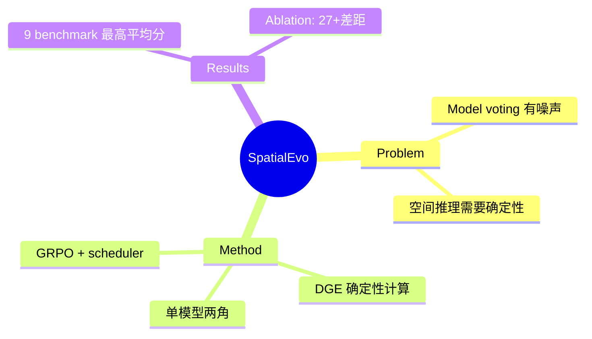

## Summary

提出用 Deterministic Geometric Environment (DGE) 替代 model consensus 做 self-evolving 训练。核心 insight 是 3D 空间推理的答案可以从点云和 camera pose 中确定性计算，不需要模型投票来构造伪标签。单模型分饰 questioner 和 solver 两角，在 DGE 的"零噪声"奖励信号下通过 GRPO 做 online RL，配合 task-adaptive scheduler 自动涌现 curriculum。9 个 benchmark 上 3B 和 7B 均达最高平均分。

## Problem & Motivation

Self-evolving 训练中的 model voting 问题：
- Model consensus 构造伪标签有噪声
- 空间推理需要确定性答案

## Method

**核心设计**：
1. **DGE (Deterministic Geometric Environment)**：
   - 从点云和 camera pose 确定性计算答案
   - 替代 model voting

2. **单模型两角**：
   - Questioner + Solver 同一模型

3. **GRPO + task-adaptive scheduler**：
   - 自动涌现 curriculum

## Key Results

- 9 个 benchmark 上 3B 和 7B 均达最高平均分
- **关键 ablation**：w/o Physical Grounding → VSI-Bench 从 46.1 暴跌到 18.8（27+差距）

## Strengths & Weaknesses

**亮点**：
- 核心 insight 干净且正确——3D 几何的确定性属性是 self-evolving 的天然优势
- w/o Physical Grounding ablation 最直接有力：27+差距一锤定音
- 🔥 Rating 3

**局限**：
- "零噪声"是自欺欺人：DGE 第一阶段 entity parsing 靠 GPT-OSS-120B
- 适用边界极窄：只能跑 ScanNet 类室内静态场景
- 室外/动态场景不可用

## Mind Map

## Notes

> [基于月度总结的点评，未获取全文]

核心 insight 正确、ablation 有力，但适用场景极窄。DGE 的第一阶段 entity parsing 仍依赖 LLM，噪声只是被转移了。