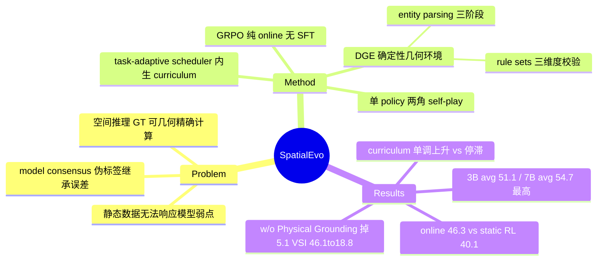

## Summary

提出用 Deterministic Geometric Environment (DGE) 替代 model consensus 做 self-evolving 训练。核心 insight：3D 空间推理的 ground truth 是 underlying geometry 的确定性结果，可从点云和 camera pose 精确计算，不需要模型投票来造伪标签。单个 shared-parameter policy 分饰 questioner 和 solver，在 DGE 的"零噪声"奖励下用 GRPO 做纯 online RL，配合 task-adaptive scheduler 自动涌现 curriculum。9 个 benchmark 上 3B（avg 51.1）和 7B（avg 54.7）均达最高平均分，且不损害 general visual understanding。

## Problem & Motivation

静态数据集的三大局限：无法响应模型薄弱处、模型变强后无法生成更难样本、无法在不成比例增加人工标注的情况下 scale。现有 self-evolving 方法（VisPlay、EvolMM）则共享一个致命缺陷——用 majority voting / self-consistency 构造伪标签，**继承了模型自身的预测误差**，强化而非纠正错误（"model consensus as reward proxy, introducing systematic bias where precise physical grounding is required"）。

作者的关键洞察：**空间推理独有的属性是 ground truth 可从 3D geometry 精确计算而无需模型判断**——绝对距离问题归约为最近点计算，camera orientation 归约为旋转矩阵上的算术。这把"伪标签噪声"这一 self-evolving 的根本障碍直接绕开。问题 formulation 干净且正确。

## Method

**任务空间**：16 类空间推理任务，覆盖三种观测粒度——multi-image scene-level（6 类：object counting/size、absolute/relative distance、relative direction、room size）、single-image（3 类）、dual-image（7 类，含 inter-camera position/elevation、camera motion 等）。所有答案可从场景几何资产程序化精确计算。

**1) Deterministic Geometric Environment (DGE)**：把自然语言问题映射到 3D 资产做客观验证，用 programmatic geometric computation 替代 model judgment。两个子模块：

- *Task-Specific Validation Rule Sets*：每类任务有几何验证规则，强制三个维度——premise consistency（场景实体存在且唯一定位）、inferential solvability（几何前提可无歧义计算，如点云密度/视差充分）、degeneracy filtering（剔除物理不稳定/低价值边界 case）。
- *Automated Verification Pipeline（三阶段）*：① Entity Parsing——轻量 LLM 从 free-form 问题抽取结构化元素（frame index、object category、空间关系）；② Legality Verification——对照规则集校验，非法问题触发截断 + 负奖励；③ Ground-Truth Synthesis——对合法问题调用几何工具箱（rigid-body 坐标变换、点云 bbox 拟合与拓扑分析、depth-map 透视投影、平面法向估计）输出精确答案 + 可解释的中间几何状态。

**2) Spatial-Grounded Policy Co-Evolution（self-play）**：单 policy πθ 通过 role-conditioned prompting 在 questioner 和 solver 间切换。共享参数使 solver 梯度改进 questioner 的感知、questioner 的几何直觉加深 solver 的推理。

- *Task-Adaptive Scheduling*：每类任务维护累计分 Sk 与采样数 Nk，用 pseudo-observation smoothing 估计历史有效准确率 ā_k；采样权重 w_k 与 ā_k 负相关，并设最小探索权重 δ 防止已掌握任务被排除——curriculum 由模型表现内生驱动。
- *Questioner Reward*：r_Q = α·f_fmt + (1-α)·f_valid·f_obs（α=0.1）。f_valid 为 DGE 几何合法性，f_obs 为轻量 LLM 评的视觉观测质量，二者耦合相乘提供 gating 语义。
- *Solver Reward*：合法问题 r_A = α·f_fmt + (1-α)·f_acc；非法问题 r_A = α·f_fmt + (1-α)·f_explain（解释失效原因的质量），使非法问题也成为学习信号。

**3) GRPO 训练**：每个训练场景 scheduler 采样任务→questioner 生成 n 候选问题→DGE 验证并对合法问题算 ground truth + questioner reward→语义去重得 m 个唯一问题→每问题 solver 采 n 候选答案算 solver reward→形成 m 个独立 GRPO 组，组内算 advantage。questioner/solver 共享单一参数集，梯度联合更新。**全程纯 online RL，无 SFT 阶段。**

**数据**：从 ScanNet、ScanNet++、ARKitScenes 训练 split（约 4K 源场景）构建 DGE，从 dense reconstruction + multi-view stream 得无噪声几何监督，但模型输入只需 RGB。Backbone：Qwen2.5-VL-3B/7B-Instruct。

## Key Results

**主结果（Table 1，9 benchmark）**：

- Qwen2.5-VL-3B：average 51.1（最高）。VSI-Bench 39.2（baseline 28.1）、ViewSpatial 42.3（baseline 36.2）、EmbSpatial 61.2（baseline 55.9）；MMStar 55.2、RealWorldQA 66.5 保持 general 能力；
- Qwen2.5-VL-7B：average 54.7（最高）。VSI-Bench 46.1（baseline 31.1）、ViewSpatial 43.2（baseline 36.4）、EmbSpatial 66.0（baseline 63.6）；
- 对手在 general benchmark 上崩溃：SpatialLadder/ViLaSR 在 V-STAR 跌到 ~36（baseline 74.9–78.5），SpaceR 在 CoreCognition 跌到 29.1（baseline 56.8），暴露其牺牲通用能力换空间分数。

**Ablation（Table 2，7B，Δ avg）**：

- **w/o Physical Grounding（换成 majority-vote）：↓5.1，最大降幅**——VSI-Bench 从 46.1 暴跌到 18.8（27+ 差距），证实 majority-voting 会"consolidate systematic prediction bias"，这是全文最有力的一锤；
- w/o Solver ↓3.2 > w/o Questioner ↓1.6（在线几何推导是核心）；
- w/o Adaptive Scheduler ↓0.3、w/o Validity Reward ↓0.8、w/o Observation Reward ↓0.2、w/o Explanation Reward ↓0.4。

**Online vs Static（Table 3，VSI-Bench）**：SpatialEvo online RL 46.3 > SpatialLadder RL 40.1；SFT 对比中 SpatialEvo offline data 43.9 ≈ SpatialLadder data 43.7 > SpaceR 36.3 > SpatialSSRL 28.1——在线自演化优于静态 RL baseline 与所有静态数据 SFT。

**Curriculum 涌现（Table 4，4 轮迭代）**：有 scheduler 单调上升 44.2→45.0→45.1→46.1；无 scheduler 停滞下滑 44.2→44.5→43.7→43.4。Iter 4 时权重集中在弱类（Rel. Dir. 21.8% vs 均匀 16.7%）。

## Strengths & Weaknesses

**亮点**：

- 核心 insight 干净且正确——3D 几何的确定性属性是 self-evolving 的天然优势，直接绕开伪标签噪声这一根本障碍；
- w/o Physical Grounding ablation 最直接有力：majority-vote 让 VSI-Bench 从 46.1 崩到 18.8，27+ 差距一锤定音，把"为什么 DGE 比 model consensus 好"量化得很清楚；
- 纯 online RL 无 SFT + 内生 curriculum（scheduler 有/无的单调 vs 停滞对比）说明设计的自洽性；保住 general benchmark（MMStar/RealWorldQA）也是相对对手的优势。

**局限**：

- "零噪声"并非完全成立：DGE 第一阶段 entity parsing 仍靠轻量 LLM，作者自己承认 ambiguous reference / underspecified target 会让 parsing 出错并传播到验证与计算；噪声只是从"伪标签投票"转移到"parsing + 点云质量"；
- 适用边界极窄：依赖 high-fidelity 3D 资产（室内点云重建 + 标定 pose + 完整覆盖），只能跑 ScanNet 类静态室内场景，室外/动态场景因点云稀疏、尺度变化、运动物体而失效；
- ground-truth 计算对点云质量敏感，reconstruction artifact / sparsity / occlusion 会降低几何算子精度，连续型任务尤甚（reward 的 relative-error tolerance band 只能部分吸收）。

潜在影响：为"哪些任务适合 verifiable self-evolving RL"提供了一个清晰范式——凡是 ground truth 可程序化精确计算的 domain（几何、代码、数学）都可复用此思路。从 abstract-only 印象的 rating 3 上调到 4：insight 与 ablation 的说服力比此前判断更强。

## Mind Map

```mermaid
mindmap
  root((SpatialEvo))
    Problem
      静态数据无法响应模型弱点
      model consensus 伪标签继承误差
      空间推理 GT 可几何精确计算
    Method
      DGE 确定性几何环境
        rule sets 三维度校验
        entity parsing 三阶段
      单 policy 两角 self-play
      GRPO 纯 online 无 SFT
      task-adaptive scheduler 内生 curriculum
    Results
      3B avg 51.1 / 7B avg 54.7 最高
      w/o Physical Grounding 掉5.1 VSI 46.1to18.8
      online 46.3 vs static RL 40.1
      curriculum 单调上升 vs 停滞
```

## Notes

- 把 self-evolving 的核心矛盾（伪标签噪声）转化为"是否存在可程序化验证的 oracle"，这是可迁移的 meta-insight——同样适用于代码（执行结果）、数学（符号验证）。
- DGE 的"零噪声"是相对的：噪声从 reward 端被推到了 perception/parsing 端。真正的 open question 是去掉显式 3D 表示（用 implicit/learned 几何）后能否保持 verifiability，作者也指向这个方向。
- 与 SpatialLadder/ViLaSR/SpaceR 对比阅读：它们牺牲 general 能力换空间分数，SpatialEvo 的 general benchmark 保持是关键差异点。
- 可对照 VLA Safety 笔记中提到的 "self-evolving training with pose-based exploration"（EvoVLA），同属 self-evolving 思路但 verifier 不同。
