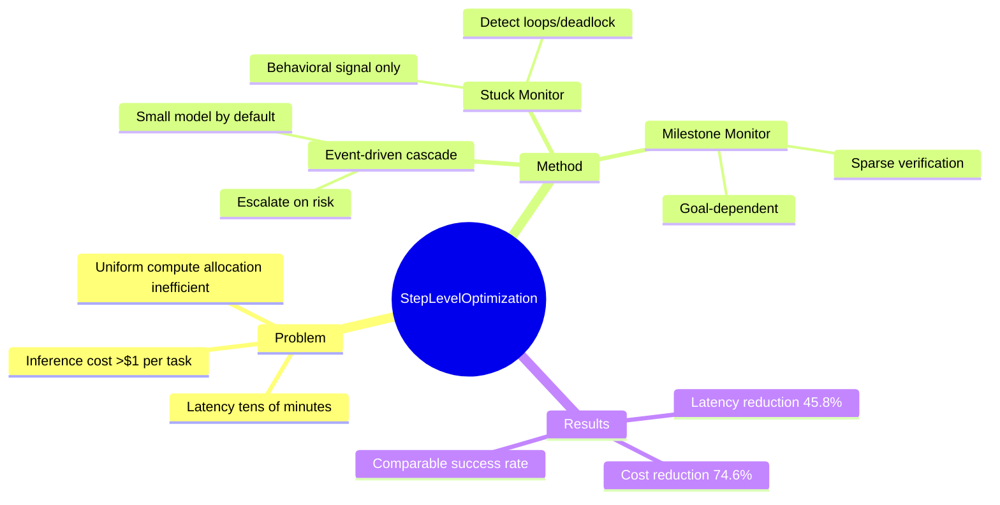

## Summary

提出 event-driven step-level cascade，让 computer-use agent 默认用小模型，仅在风险升高时才 escalte 到大模型。核心洞察：GUI 任务的 trajectory 高度 heterogeneous，大部分步骤是 routine，错误集中在少数 high-risk moments。

## Problem & Motivation

**为什么重要**：Computer-use agent 的核心痛点不是成功率，而是推理成本和延迟。现有系统每一步都调用大模型，单任务成本可超过 $1，耗时 tens of minutes。这种 uniform compute allocation 对 production deployment 是致命障碍。

**现有方法局限**：
1. Query-level cascade 不适用：GUI 任务是 evolving interaction，不是 single query
2. Difficulty is state-dependent：同一任务不同阶段难度差异巨大
3. Errors compound：一步出错可能潜伏多步后才显现
4. Naive step-level verification 会 erase efficiency gain

**两种 failure mode**（从 benchmark 数据归纳）：
- Progress stalls：agent 循环、重复无效动作、卡住不动（done-but-failed rate 25.3%-37.5%）
- Silent semantic drift：agent 已经偏离目标但继续做 locally plausible actions

## Method

**整体架构**：Event-driven, step-level cascade。默认用 π_small，当 monitor 检测到高风险时 escalate 到 π_large。

### 两个 Monitor

1. **Stuck Monitor (S_φ)**：检测 progress degradation
   - 输入：最近 K 步的 reasoning-action window w_t
   - 只用 local behavioral signal（不依赖 task description）
   - 触发条件：p_stuck ≥ θ_s → 下一步 escalate

2. **Milestone Monitor (M_ψ)**：识别语义 checkpoint
   - 输入：task instruction u + window w_t（goal-dependent）
   - 触发条件：p_mile ≥ θ_m → 调用 verifier 检查两个问题：
     - Progress validity：从上次 milestone 到当前是否在推进？
     - Intent consistency：UI 状态是否还符合用户意图？
   - Verification pass → commit milestone；fail → escalate

### 关键设计

- **Compact window**：只看最近 K 步的 (rationale, action) 序列，不依赖 screenshot/DOM，成本极低
- **Model-agnostic**：不改变底层 agent architecture，plug-and-play
- **Training via LLM supervision**：用强 LLM 标注 stuck/non-stuck 和 milestone，训练 ModernBERT encoder
- **Hysteresis & bounded recovery**：防止 thrashing，保证 routing stability

## Key Results

**Benchmarks**：OSWorld, WebArena

**主要数字**：
- Cost reduction: up to 74.6%（相比 always-large）
- Latency reduction: up to 45.8%
- Success rate：与 always-large policy comparable（具体数字未从 HTML 提取）

**Insight**：
- Event-driven escalation 显著优于 fixed-interval（后者要么过度调用要么错过关键时刻）
- Stuck Monitor 和 Milestone Monitor complementary：前者 catch behavioral loops，后者 catch semantic drift

## Strengths & Weaknesses

**亮点**：
1. **问题定位精准**：不是 "如何让 agent 更聪明"，而是 "如何让 agent deployment economically viable"。这是 production 视角的 real problem
2. **方法简洁**：两个 lightweight monitor + threshold-based cascade，没有复杂的 RL 或 architectural change
3. **Plug-and-play**：可以叠加在任何现有 agent 上（Claude, GPT, Qwen 等），deployment value 明确
4. **Failure mode 分析扎实**：从真实 benchmark trajectory 归纳出 two distinct failure patterns，这是 empirical grounding

**局限**：
1. **Monitor training data 来自 LLM supervision**：训练 ModernBERT 的 label 由强 LLM 生成，存在 bootstrapping bias。如果 LLM 自己都判断不准 stuck/milestone，monitor 就学歪了
2. **Threshold tuning 是 black art**：θ_s 和 θ_m 如何选？paper 提到 trade off success vs cost，但没有给出 systematic 方法
3. **Verifier 本身还是强模型**：Milestone verification 需要调用 strong model 看 screenshot，这部分成本没算清楚
4. **只验证了两个 benchmark**：OSWorld 和 WebArena 都是 research benchmark，real enterprise deployment 会不会有不同 failure pattern？

**潜在影响**：
- 对 computer-use agent 从 research toy → production reality 有实际价值
- "Step-level optimization" 这个 formulation 可能延伸到其他 multi-turn agent 场景（web agent, mobile agent, embodied）

## Mind Map

## Notes

- **与 routing/cascade literature 的关系**：LLM cascading 通常是 query-level（judge answer quality → escalate），这里改成 step-level 是 natural extension 但难度更高（state-dependent difficulty, error compound）
- **Potential extension**：这个 framework 能否用于 VLA？manipulation trajectory 也有类似 heterogeneous difficulty 分布
- **Missing experiment**：没有对比 "oracle monitor"（假设 perfect detection），看不出 monitor 质量对最终结果的影响 upper bound