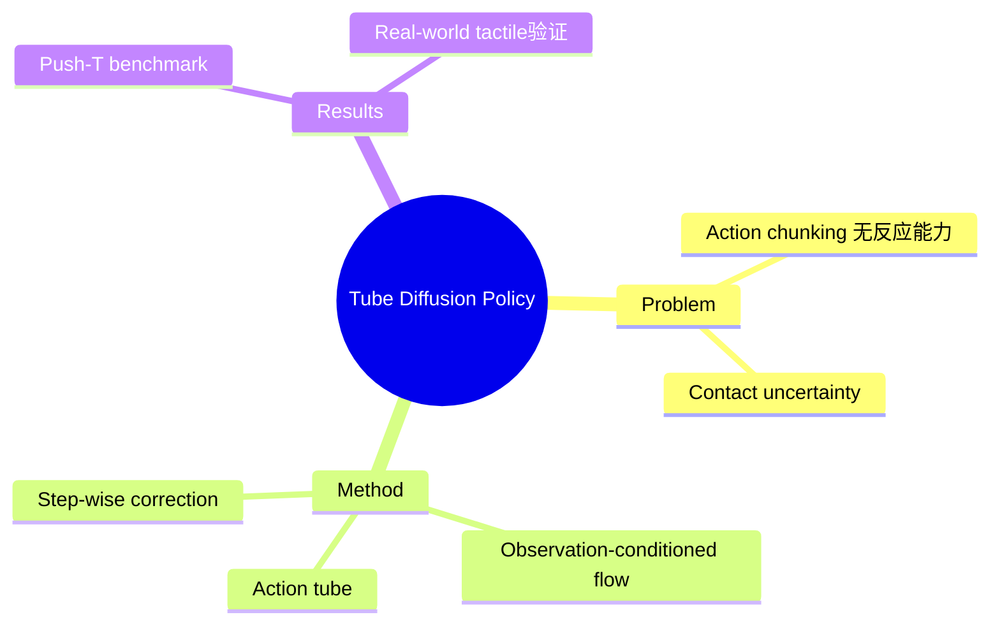

## Summary

Tube Diffusion Policy (TDP) 将 diffusion-based imitation learning 与 tube-based feedback control 结合，用 observation-conditioned feedback flow 形成 action tube，支持快速自适应反应。解决 contact-rich manipulation 中 action chunking 无法实时反应的问题。

## Problem & Motivation

Contact-rich manipulation 问题：
- Action chunking 无法在执行中反应未知观测
- Contact uncertainty 和 tactile feedback 需要高频反应控制

## Method

**核心设计**：
1. **Observation-conditioned feedback flow**: 围绕 nominal action chunks 形成 action tube
2. **Tube-based feedback control**: 快速自适应反应
3. **Step-wise correction mechanism**: 减少去噪步数，支持实时高频控制

**优势**: Diffusion expressivity + reactive control

## Key Results

- Push-T benchmark 和 3 个 visual-tactile dexterous manipulation tasks
- 超过 SOTA imitation learning baselines
- Real-world 实验验证 contact uncertainty 下的鲁棒反应
- Score 7

## Strengths & Weaknesses

**亮点**：
- Action tube concept 有价值——将 diffusion policy 与 feedback control 结合
- Step-wise correction 减少 denoising steps
- Tactile + vision 多模态

**局限**：
- 与 World Model 关联：这是 policy learning，而非环境预测/建模
- Contact-rich 场景专用，泛化性未知

## Mind Map

## Notes

> [基于 arXiv abstract]

Diffusion Policy 的 reactive extension。与 World Model 的关联：action tube 是一种 trajectory prediction，可视为局部 world model。