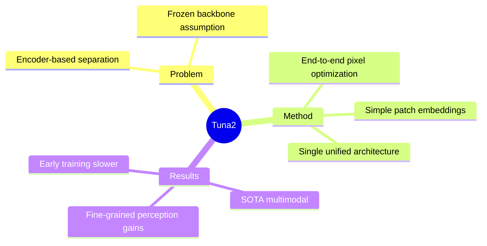

## Summary

Tuna-2 证明 pretrained vision encoder 不是 multimodal model 的必要组件——直接使用 pixel embeddings + simple patch embedding layers 可达到 SOTA，且 fine-grained visual perception 在大尺度训练时优于 encoder-based 方法。

## Problem & Motivation

> [未获取全文，仅基于 abstract]

**问题**：现有 multimodal model 使用分离的 visual representation for understanding vs generation，依赖 pretrained vision encoder（如 CLIP、SigLIP）作为 frozen 或 partially-frozen backbone。

**动机**：Vision encoder 可能不是最优方案——native pixel-level training 可能提供更好的 fine-grained perception 和 unified understanding-generation。

**重要性**：挑战了 multimodal model 的 foundational design choice——"encoder is necessary" assumption。

## Method

> [未获取全文，仅基于 abstract]

**架构**：
- 移除传统 vision encoder modules
- 使用 simple patch embedding layers
- Fully end-to-end optimization from raw pixels

**关键设计**：
- Single architecture for understanding + generation
- Pixel-level training 无中间 latent
- Native image processing

## Key Results

> [未获取全文，仅基于 abstract]

- **SOTA multimodal benchmarks**
- **Matches latent-based techniques for synthesis quality**
- **Fine-grained visual perception excels at larger scales**
- **Encoder-based variant converges faster in early pretraining**（但最终 pixel-based 更优）

## Strengths & Weaknesses

**亮点**：
- 挑破 foundational assumption——encoder not necessary
- End-to-end pixel optimization 概念简洁
- Fine-grained perception advantage 对 grounding 有意义
- Unified architecture for understanding + generation

**局限**：
- Early training convergence slower than encoder-based
- 需要更大 scale 训练才能体现优势
- 工程成本可能高于 encoder-based（无 frozen encoder leverage）

**与 GUI Grounding 的关联**：
- Fine-grained visual perception 是 grounding 的核心需求
- Pixel-level training 可能比 encoder-based 更适合 GUI 元素的精细定位
- 但 Tuna-2 侧重 general multimodal，未针对 grounding 任务验证

## Mind Map

## Notes

> [未获取全文，仅基于 abstract]

待追踪：
- Patch embedding layers 的具体设计（是否类似 ViT？）
- 与 GUI grounding 的潜在结合——pixel-level training vs encoder-based for fine-grained element localization
- Scaling law——多少 scale 才能体现 fine-grained perception 优势
- 是否可以与 FPN 结合（multi-scale pixel embeddings？）