## Summary

针对 GUI agent 两大失败模式——过早宣告完成（false completion）与重复动作死循环——提出模块化框架 VLAA-GUI：每步强制执行的 Completeness Verifier（双层完成校验）+ 三级固定升级的 Loop Breaker + 按需调用的 Search/Coding/Grounding Agent，用 Opus 4.6 backbone 在 OSWorld-Verified 上取得 77.45%（100 步），号称首个单 pass 超过人类 72.4% 的框架。

## Problem & Motivation

现有 GUI agent 的任务终止依赖模型的隐式判断而非可观察的 UI 证据，导致 agent 常在"Save As"对话框刚打开、文件尚未写入时就宣告成功；同时 agent 会陷入重复执行同一失败动作的循环，而现有 anti-looping 启发式只在单一粒度运作，无法跨交互模态或规划策略升级。作者的量化动机很强：分析显示 **失败任务中 >86% 是 agent 自认为已成功的 false completion**——失败时 agent 几乎总以为自己赢了。

## Method

**架构**：单一 Manager agent 做 perceive–reason–act 循环，保留全程任务所有权，**无 hierarchical planner、无 memory 模块**（作者明说 planner 在其框架中表现差、memory 为简洁性移除）。两个 mandatory 工具在**每个动作后**强制调用，三个 on-demand 工具由 Manager 按需调用（与 UI 原语同处一个 action space）。

**1. Completeness Verifier（双层，判据是 prompt 强制的 UI-observable 证据，执行者仍是 LLM）**：
- **Completion Gate**（prompt 级）：任务开始时把指令改写为 1–3 条 UI 可观察的 success criteria（按钮标签、文件列表、toggle 状态等；hidden-state 条件必须改写成 observable proxy；精确值打 `[EXACT CHECK]` 标签）；每步先对照 criteria 自检再选动作；另有按动作类型的 micro-verification 规则表（点击→新 UI 元素可见；toggle→状态标签变化；输入→字段含文本；保存→新文件/成功 toast；无可见变化→wait 后复查、禁止立即重试）。
- **Completeness Model Judge**（agent 级）：Gate 输出 done 后，由独立调用的 MLLM judge（**与 Manager 同 backbone**，低温）接收指令+当前截图+近期轨迹，输出二值 accept/reject JSON。Prompt 强制保守规则：每条 criterion 需直接视觉证据；副作用动作（保存/发送/导出）需可见确认；UI 须稳定；精确值（hex 色、字号）必须在屏幕/轨迹中逐字可读，"看起来像绿色"不算 #00FF00；轨迹交叉核对 code agent 输出；模型措辞含 "not sure/unclear" 时后处理直接改判 incomplete（prefer false negatives）。终止需 Gate 与 Judge 双方同意；reject 理由追加进轨迹。

**2. Loop Breaker（三级固定升级，每步强制检查）**：维护动作重复计数器与屏幕状态重复计数器，升级逻辑为规则式：
- **Tier 1 模态切换**：同一动作+同一目标连续 2 次无可见变化 → 下一动作**必须**换交互模态（键盘快捷键 ↔ 菜单点击 ↔ 命令行）。
- **Tier 2 策略切换**：同一屏幕状态连续出现 3 次 → **必须**整体换策略（如菜单导航 → 程序化文件编辑）或直接 `agent.fail()`。
- **Tier 3 反思判官**：外部 Reflection Agent（同 backbone）每步检查轨迹，输出 KEEP/SWITCH；SWITCH 时注入 hard directive **拉黑重复动作**、强制 Manager 从剩余动作中选。关键细节：Reflection prompt 明文禁止推荐任何具体动作（"DO NOT encourage a specific action in particular"），只给证据性反馈——即**恢复动作的选择完全没有按错误情形自适应的成分**，三级触发条件和响应动作类型全部硬编码，具体替代动作的选择被抛回给 Manager 自己。

**3. Search Agent**：不走 OS-Symphony 式视觉浏览器搜索，而是直接单次 query 带 native search grounding 的 LLM（Gemini 3 Pro / 3.1 Pro），返回纯文本教程注入 belief state。仅在 workflow 不熟悉且教程可能存在时调用。

**4. Coding Agent**（独立 20 步 Python/Bash 预算，仅限 ≥20 单元的批量编辑/重计算/GUI 路径被堵）与 **Grounding Agent**（默认 Seed 1.8，自然语言元素描述→坐标；一个变体换 MAI-UI）。

## Key Results

**OSWorld-Verified（361 任务，排除 8 个 Google Drive 任务）**，100 步预算：
- Opus 4.6 **77.45%**、Opus 4.5 74.89%（+MAI-UI grounder → 76.26%）、Gemini 3.1 Pro 72.47%、Sonnet 4.6 71.67%、Gemini 3 Flash 68.77%；人类 72.4%，三个 backbone 单 pass 超人类。
- 对比 baseline：HIPPO w/ Opus 4.5 74.49%、Agent S3 w/ Opus 4.5 67.46%、Agent S3 w/ GPT-5 62.63%、OS-Symphony w/ GPT-5 65.84%。**注意同 backbone 对比：VLAA-GUI w/ Opus 4.5 74.89% vs HIPPO w/ Opus 4.5 74.49%，仅 +0.4pp**；77.5% 头条数字用的是 baseline 都没用过的 Opus 4.6。
- **步数效率**是最强卖点：Sonnet 4.6 15 步 64.13%、Opus 4.6 15 步 64.75%，已超最佳已发表 50 步系统（OS-Symphony 63.61%）；Opus 4.6 50 步 73.85% 即超人类。
- **WindowsAgentArena**（154 任务，Manager 仅测 Gemini 3 Flash）：61.0%@100 / 60.4%@50，超 Agent S3 w/ GPT-5（56.6%）4.4pp。

**Ablation（组件贡献强烈依赖 backbone 与步数预算）**：
- Sonnet 4.6 @100：去 Verifier −2.9pp（71.67→68.81）、去 Search −1.6pp、去 Loop Breaker 仅 −0.04pp（100 步下 Sonnet 自己能恢复）；@50 去 LB −1.4pp。
- Gemini 3 Flash：@50 去 LB −4.2pp、@100 去 Search −3.0pp——弱 backbone 更依赖外部恢复与知识。
- **负结果（诚实且信息量大）**：Flash @15 时 Verifier −11.3pp、Search −9.7pp、Loop Breaker −6.15pp 全部**有害**——工具调用消耗动作步，弱模型在紧预算下付不起 overhead；Table 4 甚至显示 Flash @50 去掉 Verifier 反而 63.14→66.00 更好。
- WAA @50：去 Verifier 使 Office 从 32.6% 崩到 11.6%（−21pp）。

**失败模式量化**：
- False completion 主导：即便加 Verifier，False Done/Failed（FDF）仍 >86%。Sonnet 4.6 @100：FDF 95.5→91.9%、False Done/All 30.4→26.5%、DONE 准确率 69.6→73.5%；Flash @50 FDF 降幅最大（80.2→52.6%）。即被接受的完成宣告中仍约 1/4 是错的。
- Loop：Flash 的 wasted steps ratio 4.9→2.8%（近乎减半）、Loop/Failed 20.7→16.2%；Sonnet 本身少循环（Loop/All 5.0% vs Flash 10.6%）。

## Strengths & Weaknesses

**Strengths**：
- 打点极准：false completion（>86% 失败自认成功）和 loop 是被 VeriGUI 等 failure 分析反复证实的两大失败模式，本文对症下药且给了干净的前后量化（FDF/FDA/WSR）。
- 15 步超 50 步 SOTA 是本文最硬的数字——说明收益主要来自砍掉浪费步而非堆预算，这比刷 100 步上限更有信息量。
- Ablation 诚实：主动报告弱 backbone 紧预算下三个组件全部为负的结果，并给出"工具 overhead 挤占执行步"的一致解释；"去 planner/memory 反而更好"的负设计发现也有价值。
- 五个 backbone 全面验证，跨 Anthropic/Google 模型族成立。

**Weaknesses**：
- **头条 claim 掺水**：77.5% 与"首超人类"主要是 backbone 红利——同 Opus 4.5 对比只领先 HIPPO 0.4pp；框架自身贡献（ablation 合计约 3–6pp）远小于换代模型的贡献。
- **成本完全不报**：Loop Breaker（含每步 Reflection Agent 调用）+ Verifier 每个动作后强制各跑一次，加上 grounding，每步 3–4 次模型调用；全文无任何 token/延迟/费用数字，"效率"只用步数衡量。
- Verifier 是**同 backbone 自我审查**：作者自己引了 Self-Grounded Verification 的 agreement bias 结论，却靠 prompt 严苛度而非独立模型来缓解；FDF 加了 Verifier 仍 >86%，主导失败模式只被削掉 4–6pp。
- Search Agent 依赖 Gemini 的 search grounding 引入外部 web 知识，OSWorld 任务教程在网上普遍存在——能力归属（agent vs 检索）模糊且不可复现（搜索结果随时间漂移）。
- 恢复策略零自适应：三级阈值（2 次无变化 / 3 次同屏）硬编码，恢复响应固定为"换模态/换策略/拉黑"，不区分 mismatch 类型；这正是 [[Ideas/MismatchTriage-LongHorizonRecovery-GUI]] 定义的 fixed-escalation baseline 家族成员（与 LongHorizonUI staged fallback 同类），未测任何 per-mismatch 恢复动作选择的 headroom。
- WAA 只测了最弱的 Flash 一个 Manager；各变体的 Search/Grounder 配置互不相同，归因不干净。Table 8（Flash @50 w/ LB 61.68%）与 Table 2/4（63.14%）数字对不上，报告有 sloppiness。

## Mind Map

```mermaid
mindmap
  root((VLAA-GUI))
    Problem
      False completion 主导失败 >86%
      重复动作循环
      单粒度 anti-looping 无法升级
    Method
      Completeness Verifier
        Completion Gate 每步自检 UI criteria
        MLLM Judge 双确认 accept/reject
      Loop Breaker 三级固定升级
        T1 2次无变化换模态
        T2 3次同屏换策略
        T3 Reflection 拉黑动作
      Search Agent 单query LLM教程
      Coder + Grounder 按需
    Results
      OSWorld 77.45 Opus4.6 超人类72.4
      15步64.75超50步SOTA
      WAA 61.0
      弱backbone紧预算组件全为负
```

## Notes

- 对 [[Ideas/MismatchTriage-LongHorizonRecovery-GUI]] 的 novelty 边界：VLAA-GUI 的 Loop Breaker 是**纯规则固定升级**（触发条件=重复计数器，响应=固定动作类别），Tier 3 的 reflection 明文禁止推荐具体恢复动作——不存在任何按 mismatch 情形选择恢复动作的成分。它应进该 idea 的 fixed-escalation baseline 表（与 LongHorizonUI 并列），不构成 novelty 威胁；反而其"Loop Breaker 在 Sonnet@100 只 +0.04pp、Flash@15 −6.15pp"是 recovery 干预价值条件性的又一证据（与 [[Papers/2607-TSR]] 符号翻转同款）。
- 与 [[Papers/2604-VeriGUI]] 呼应：其 72.3% 失败来自重复无效动作 timeout；本文 FDF>86% 从另一侧面确认 completion 判断是 detection 层的最大缺口。
- 相关系统：[[Papers/2504-AgentS2]]（Agent S 家族）、[[Papers/2601-EvoCUA]]、[[Papers/2606-OSWorld2]]。
- 待核查：HIPPO (hippo2026) 与 Agent S3 vault 尚无笔记；Agent S3 用 best-of-N trajectory selection，与本文 single-pass 的可比性需要看原文确认预算口径。
