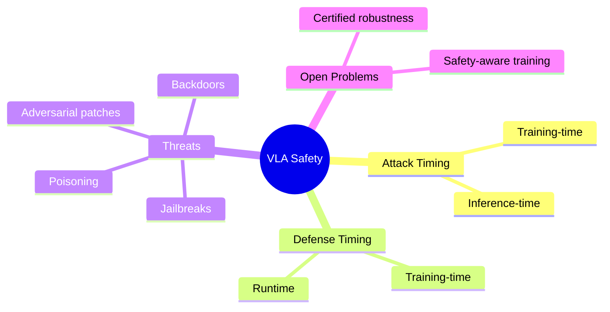

## Summary

这是 VLA（Vision-Language-Action）安全的系统性 Survey。按 attack timing 和 defense timing 双轴组织，覆盖 training-time/inference-time threats 和 defenses。

## Problem & Motivation

VLA 是 embodied intelligence 的统一 substrate，带来新的安全挑战：
- **不可逆物理后果**
- **多模态攻击面**（vision、language、state）
- **实时延迟约束**
- **长 horizon 误差传播**
- **数据供应链漏洞**

文献碎片化（robotic learning、adversarial ML、AI alignment、autonomous systems safety）。

## Method

Survey 组织方式：

**双时间轴**：
- Attack timing：training-time vs inference-time
- Defense timing：training-time vs inference-time

**四个视角**：
- Attacks
- Defenses
- Evaluation
- Deployment

**覆盖内容**：
- Training-time threats：data poisoning、backdoors
- Inference-time attacks：adversarial patches、cross-modal perturbations、semantic jailbreaks、freezing attacks
- Training-time & runtime defenses
- 6 deployment domains 的安全挑战

## Key Results

作为 Survey：
- 统一的 VLA safety taxonomy
- 连接碎片化文献
- 开放问题：certified robustness、physically realizable defense、safety-aware training、unified runtime safety architecture、standardized evaluation

## Strengths & Weaknesses

**亮点**：
- 问题定义清晰：VLA safety 是新问题，区别于 LLM safety 和 classical robotic safety
- 双时间轴组织合理
- 31 HF upvotes

**局限**：
- Survey 类，需要看全文判断深度
- VLA 安全研究还处于早期，很多问题是 open

## Mind Map

## Notes

> [未获取全文，仅基于 abstract]

VLA 安全是 embodied AI 的关键问题。这篇 Survey 可能成为 VLA safety 研究的标准参考。重点关注：
- Inference-time attack 的具体形式
- 6 deployment domains 的安全挑战差异