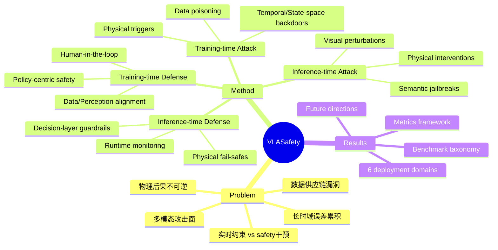

## Summary
首个 VLA 安全领域系统性 Survey，按 attack timing (training/inference) 和 defense timing 两轴组织威胁-防御配对，覆盖数据投毒、后门、对抗扰动、语义 jailbreak、物理攻击等威胁面，以及训练时防御、运行时监控、fail-safe 机制，最后讨论六大部署场景和未来方向。

## Problem & Motivation
VLA 模型正在成为具身智能的统一基座，但其安全挑战与 text-only LLM 有本质不同：(1) 物理后果不可逆；(2) 多模态攻击面；(3) 实时 latency 约束；(4) 长时域 trajectory 误差累积；(5) 数据供应链漏洞。现有文献分散于 robot learning、adversarial ML、AI alignment、autonomous systems safety 等社区，缺乏统一视角。

## Method
Survey 的核心组织框架：
- **双 timing 轴**：attack timing (training vs inference) + defense timing (training vs inference)，将威胁与防御阶段配对
- **Section 3-4**：Training-time threats (data poisoning, physical triggers, temporal/state-space backdoors) + Training-time defenses (data/perception alignment, policy-centric safety optimization, human-in-the-loop)
- **Section 5**：Inference-time attacks (semantic jailbreaks, visual perturbations, physical interventions) + Inference-time defenses (decision-layer guardrails, runtime monitoring, physical fail-safes)
- **Section 6**：Safety benchmarks (adversarial robustness, task-level safety, comprehensive capability-safety, jailbreak/alignment, runtime monitoring) + Metrics (SVR, RejR, CR, ASR, certified robustness radius)
- **Section 7**：六大部署场景（自动驾驶、家用机器人、工业制造、医疗辅助、公共服务、野外作业）+ cross-domain challenges (sim-to-real gap, safety-capability Pareto frontier, fleet-level safety)
- **Section 8**：Future directions (certified robustness for embodied trajectories, physically realizable defenses, safety-aware training, unified runtime architectures, standardized evaluation, lifecycle safety)

> [未获取全文，仅基于 abstract + HTML TOC + Introduction + Background 部分]

## Key Results
Survey 性论文，主要贡献是框架性和 taxonomic：
- 提出首个 VLA 安全统一 taxonomy（双 timing 轴）
- 整合分散文献：涵盖 training-time backdoors、inference-time adversarial perturbations、jailbreak、runtime monitoring、certified defenses
- 系统分析现有 benchmark 和 metrics，指出评价方法缺口
- 讨论六大部署领域的安全挑战和 cross-domain patterns

## Strengths & Weaknesses
**Strengths**:
- 首次系统性整理 VLA 安全领域，填补空白
- 双 timing 轴框架清晰，将威胁与防御配对便于理解 mitigation 阶段
- 覆盖范围广：从训练数据投毒到运行时 fail-safes，从 benchmark 到部署场景
- GitHub repo (Awesome-VLA-Safety) 持续更新，有 community contribution 机制

**Weaknesses**:
- Survey 性工作，无新方法/实验，仅文献整理
- 部分威胁类型（如 freezing attacks、proprioceptive state-space poisoning）描述较简略，需参考原始论文
- 未深入讨论 safety-capability trade-off 的具体量化方法

**潜在影响**：
- 为 VLA safety 研究提供统一坐标系，便于定位新工作
- 催化跨社区对话（robotic learning ↔ adversarial ML ↔ AI alignment）
- 指出关键 open problems（certified robustness、physically realizable defenses），可能成为后续研究热点

## Mind Map

## Notes
- 与 GUI Agent 安全有交叉：多模态攻击面、实时约束、runtime monitoring 均相关
- Certified robustness for embodied trajectories 是关键 open problem——VLA trajectory 需要不同于 image/text 的 robustness 证明
- Physically realizable defenses：如何在物理世界部署对抗防御（如 adversarial patch 需打印贴在物体上）
- Safety-aware training：将 safety 作为 first-class design objective，而非事后补救