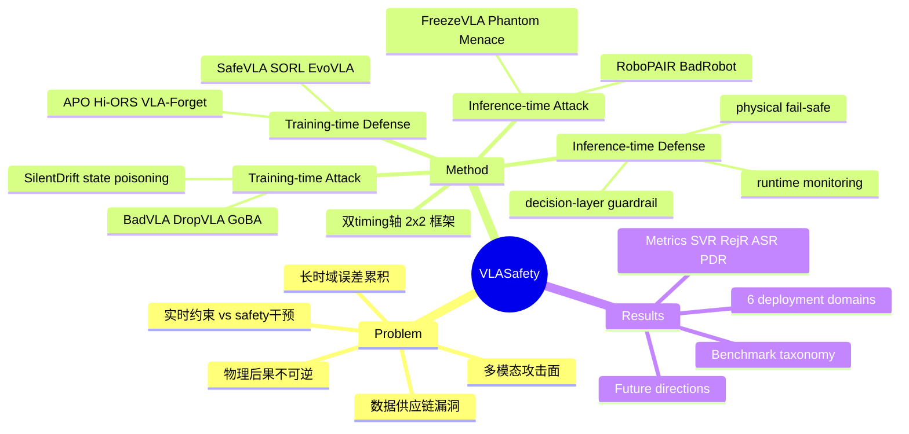

## Summary

首个 VLA 安全领域系统性 Survey。用 attack timing (training/inference) × defense timing 的双 timing 轴组织威胁-防御配对，覆盖 data poisoning、backdoor、对抗扰动、semantic jailbreak、物理攻击等威胁面，以及 training-time 对齐、runtime monitoring、physical fail-safe 等防御，最后系统梳理 benchmark/metric、六大部署场景与 future directions，并配套持续更新的 Awesome-VLA-Safety repo。

## Problem & Motivation

VLA 正成为具身智能的统一基座，但其安全挑战与 text-only LLM 有**本质区别**：(1) embodied consequences——物理动作部署后不可逆；(2) multimodal attack surface——视觉观测、语言、proprioceptive state 都可被利用；(3) real-time 约束——latency-heavy 防御在毫秒级控制中可能失效；(4) error compounding——单点扰动在 long-horizon 序列中级联放大；(5) training pipeline 风险——未审查的 demonstration 数据引入供应链漏洞。现有文献分散在 robot learning、adversarial ML、AI alignment、autonomous systems safety 等社区，缺乏统一视角。

## Method

Survey 的核心组织框架是 **2×2 双 timing 轴**：attack timing (training/inference) × defense timing (training/inference)（Fig 2），用于原则化地配对威胁与缓解，并暴露覆盖空白。各 section：

- **Sec 2 Background**：VLA 形式化为 POMDP（视觉/proprioceptive 观测、离散/连续/chunked 动作、语言条件、BC 目标）；架构组件（visual encoder CLIP/SigLIP、language backbone LLaMA/Gemma、action decoder token-based/diffusion/flow-matching）；训练范式（VL 预训练、robot demo 微调、preference alignment、LoRA）；代表系统 RT-1/2、Octo、OpenVLA、π₀/π₀.₅、SpatialVLA。
- **Sec 3 Training-time Attacks**：input-centric backdoor（token/pixel trigger、cross-modal composite trigger、物理 object trigger）；temporal/state-space backdoor（利用 action-chunk 盲区的平滑时序扰动、sequential error accumulation、proprioceptive state poisoning）。
- **Sec 4 Training-time Defenses**：data/perception/reward-centric alignment（stage-aware 监督、self-evolving + pose-based exploration、thermal/depth 多模态感知增强）；policy-centric safety optimization（constrained MDP、post-training safety unlearning、online rejection sampling）；human-in-the-loop（从干预中做 action preference alignment）。
- **Sec 5 Inference-time Safety**：semantic jailbreak（prompt injection 利用 output-action mismatch、white-box adversarial suffix）；visual perturbation（cross-modal mismatch 优化、action freezing、physical semantic deception）；physical intervention（object placement 误导导航、sensor signal injection）；防御侧 decision-layer guardrail、runtime monitoring、physical fail-safe。
- **Sec 6 Evaluation**：benchmark（adversarial robustness、task-level safety、comprehensive capability-safety、jailbreak/alignment、runtime monitoring）+ metric。
- **Sec 7 Deployment**：六大场景 + cross-domain challenge。
- **Sec 8 Future Directions**：certified robustness、physically realizable defenses、safety-aware training、unified runtime architecture、standardized evaluation、lifecycle safety。

## Key Results

Survey 类，贡献是框架性与 taxonomic：

**具名威胁/防御（精读后补全）**：

- Training-time attack：BadVLA（objective-decoupled 干扰）、DropVLA（cross-modal alignment 劫持）、GoBA（3D 物理 object trigger，黑盒）、SilentDrift（smootherstep 时序扰动钻 action-chunk 盲区）、Clean-Action（sequential error trap）、State Backdoor（遗传算法做 proprioceptive 投毒）；
- Training-time defense：SafeVLA（constrained MDP 联合优化 task-safety）、SORL（safety critic 多目标）、EvoVLA（stage-aligned reward + pose-based exploration + 长时记忆）、APO（从干预做 action preference alignment）、Hi-ORS（outcome-based rejection sampling）、Safe-Night VLA（thermal/depth 增强 + CBF-QP runtime filter）、VLA-Forget（post-training safety unlearning）；
- Inference-time attack：RoboPAIR（黑盒 semantic jailbreak）、BadRobot（output-action mismatch）、Adv-Robo（white-box discrete prompt 优化）、VLA-Fool（cross-modal mismatch 操纵轨迹）、FreezeVLA（视觉扰动致 action freezing 瘫痪）、AARONS（物理 object shift 误导导航）、Phantom Menace（直接 sensor signal injection）。

**Metric 体系**：task-level（SVR Safety Violation Rate、RejR Rejection Rate、SR）、behavioral（CR Collision Rate、SS Safety Score、SPL）、robustness（ASR Attack Success Rate、PDR Performance Drop Rate、Certified Robustness Radius）、composite（safety-performance trade-off、cost-aware evaluation）。

**关键观察**：training-time 漏洞（poisoning/backdoor）相对 inference-time 攻击仍 underexplored；action chunking 制造的时序盲区被攻击者主动利用；多数工作的 safety 机制 sim-to-real 迁移未验证；尚无 comprehensive VLA safety 的标准 benchmark。

## Strengths & Weaknesses

**亮点**：

- 首次系统整理 VLA 安全领域、填补空白，双 timing 轴框架清晰，把威胁与防御按缓解阶段配对便于定位 mitigation；
- 覆盖广：从训练数据投毒到 runtime fail-safe、从 benchmark 到六大部署场景；具名工作整理较全（攻击/防御各 7+ 个代表系统），可作 reading list；
- 配套 Awesome-VLA-Safety repo 持续更新、有 community contribution 机制。

**局限**：

- Survey 类工作，无新方法/实验，仅文献整理；价值取决于 taxonomy 是否真有组织力，双 timing 轴本质是直觉性的 2×2，对"哪类威胁最危险/最易防"缺乏量化优先级；
- 部分威胁（freezing attack、proprioceptive state-space poisoning）描述简略，需回溯原始论文；
- 未深入 safety-capability trade-off 的具体量化方法，Pareto frontier 只作为 future direction 提出。

**潜在影响**：为 VLA safety 提供统一坐标系，催化 robot learning ↔ adversarial ML ↔ AI alignment 跨社区对话，指出 certified robustness for embodied trajectories、physically realizable defenses 等关键 open problem，可能成为后续研究热点。

## Mind Map

```mermaid
mindmap
  root((VLASafety))
    Problem
      物理后果不可逆
      多模态攻击面
      实时约束 vs safety干预
      长时域误差累积
      数据供应链漏洞
    Method
      双timing轴 2x2 框架
      Training-time Attack
        BadVLA DropVLA GoBA
        SilentDrift state poisoning
      Training-time Defense
        SafeVLA SORL EvoVLA
        APO Hi-ORS VLA-Forget
      Inference-time Attack
        RoboPAIR BadRobot
        FreezeVLA Phantom Menace
      Inference-time Defense
        decision-layer guardrail
        runtime monitoring
        physical fail-safe
    Results
      Benchmark taxonomy
      Metrics SVR RejR ASR PDR
      6 deployment domains
      Future directions
```

## Notes

- 与 GUI Agent 安全有交叉：多模态攻击面、实时约束、runtime monitoring 均相关，可借鉴其双 timing 轴组织 GUI agent 的威胁-防御。
- Certified robustness for embodied trajectories 是关键 open problem——VLA trajectory 需要不同于 image/text 的 robustness 证明（per-step ε-ball 不够，要 trajectory-level 保证）。
- Physically realizable defenses 的难点在 sub-100ms latency 约束下做实时防御，这是 VLA 区别于 LLM safety 的硬约束。
- EvoVLA（self-evolving + pose-based exploration）可与 SpatialEvo 的 self-evolving 思路对照——同样 self-evolve，但一个 verifier 是几何 oracle，一个是 safety reward。
- action chunking 的时序盲区是 VLA 特有攻击面，值得单独追踪（SilentDrift/Clean-Action）。
