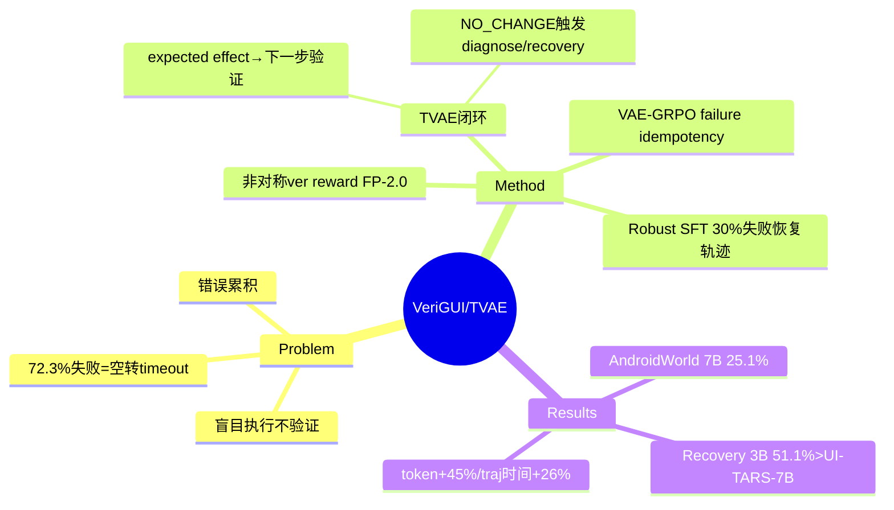

## Summary

VeriGUI 针对 GUI agent"盲目执行、不验证上一步是否成功"的问题，提出 Thinking–Verification–Action–Expectation (TVAE) 闭环：每步预测动作的 expected effect，下一步用它作为验证假设对照实际屏幕，检测到 NO_CHANGE 则进入 diagnose/recovery——配合 Robust SFT（30% 合成失败恢复轨迹）+ VAE-GRPO，在噪声真实环境下显著提升 recovery success 与在线成功率。

## Problem & Motivation

现有基于 VLM 的 GUI agent 默认环境响应是**确定性**的——生成动作后不验证前一步是否真的生效。但真实环境有网络延迟、渲染延迟、系统中断，这个假设导致**未检测的动作失败、重复无效行为、灾难性错误累积**。作者给出一个关键统计：在 1,265 次任务执行中，**72.3% 的失败来自重复无效动作导致的 execution timeout**——即 agent 在"以为动作成功了"的错误信念下反复空转。这把 GUI 可靠性问题从"grounding 不准"重新 framing 为"缺乏 action-effect 自我验证"。

## Method

**TVAE 闭环**（每步四要素，时序耦合）：
- **Think (Tt)**：结构化推理，正常执行用 `[Verify]`/`[Recall]`/`[Grounding]`/`[Action]` 标签，纠错时切到 `[Diagnose]`/`[Recovery]`
- **Verification (Vt)**：二元判断——当前屏幕 vs 上一步预测的 effect，匹配则 SUCCESS，不匹配则 NO_CHANGE
- **Action (At)**：JSON 可执行命令
- **Expected Effect (Et)**：预测本步导致的屏幕变化，作为**下一步的验证目标**——step t 的预测 effect 成为 step t+1 的验证假设，强制全轨迹因果一致

**两阶段训练**：
1. **Robust SFT**：Type A（70%，成功轨迹）+ Type B（30%，合成"no change"失败恢复轨迹，agent 必须 diagnose + 生成纠正动作），GPT-4o 生成 CoT 标注——防止模型过拟合"所有动作都成功"的乐观假设
2. **VAE-GRPO**：用 **GUI failure idempotency**（错误动作通常不改变屏幕这一经验观察）做隐式环境模拟，避免昂贵的 64 并行 Android emulator 在线 RL。复合 reward $R_t = R_{act} + \alpha R_{eff} + \beta R_{ver}$：
   - Action reward（type match + coordinate IoU）
   - Effect reward（预测 vs 参考 effect 的 BERTScore 语义一致性）
   - **Verification reward（非对称惩罚）**：正确验证 +1.0，false negative（漏检失败）−0.5，**false positive（幻觉成功）−2.0**——重罚幻觉，逼模型把内部信念对齐视觉现实

## Key Results

- **失败模式统计**：1,265 次执行中 72.3% 失败 = 重复无效动作的 execution timeout（本文核心动机数字）
- **Robustness（失败注入测试）**：VeriGUI-3B recovery success 51.1% / 7B 52.5%，**3B 超过 UI-TARS-7B（45.5%）5+ pp**，参数不到一半；Loop Rate 7B 降到 15.6%
- **AndroidControl-High（离线）**：7B Step Success 51.1% vs UI-TARS-7B 47.7%；所有无显式验证的 3B baseline 在 pseudo-online 下 Sim-TSR = 0
- **在线**：MiniWoB++ 7B 59.7%（best baseline 56.6%）；AndroidWorld 7B 25.1%（best baseline 22.7%）
- **开销**：每步 token +~45%，但轨迹级 3B 仅 +26% 时间（early recovery 提前终止使 7B tokens/traj 712 反低于 baseline 847）

## Strengths & Weaknesses

**Strengths**：
- **问题 framing 精准**：72.3% 失败是"空转 timeout"这个数字直接把可靠性瓶颈定位到 action-effect 验证缺失，而非 grounding——是本方向少见的"先量化失败结构再设计方法"的范例
- **非对称 verification reward** 是关键设计：false positive（幻觉成功）−2.0 vs false negative −0.5，把"宁可多疑不可自欺"编码进 reward，直接对治错误累积
- **VAE-GRPO 借 failure idempotency 做隐式模拟** 省去 64 并行 emulator——务实的低成本 RL 路径

**Weaknesses / 存疑**：
- **Idempotency 假设是双刃剑**：整个 robustness 评估假设"失败动作不改变屏幕"，但作者自己承认不覆盖 unintended navigation、partial transition、app crash 等 non-idempotent 失败——而这些恰是真实部署最危险的（[[Papers/2606-XiaomiGUI0]] 的 14 类异常态多数是 non-idempotent）
- **step-level 验证不替代 hierarchical planning**：作者明确承认长程任务成功率随轨迹长度显著下降——TVAE 治的是局部执行错误，长程状态维护仍需别的机制
- AndroidWorld 25.1% 的绝对值仍低，验证机制的收益在离线/注入测试更明显，真实长程收益有限

**对领域的影响**：把"每个动作都有 expected effect 并被下一步验证"作为 agent 内建契约，是 runtime self-verification 的一种轻量实现——与 [[Papers/2606-OSOracle]] 的外部 step critic、[[Papers/2606-XiaomiGUI0]] 的 teacher takeover recovery 形成"内建 vs 外挂"验证的对照谱系。

## Mind Map

## Notes

- **对 AFE Runtime 方向的启示**：TVAE 的 "expected effect → 下一步验证" 是把 verify affordance **内建进 agent 权重**的路线；AFE 假设的是把 verify affordance **暴露给 frozen agent**。VeriGUI 恰好提供了"内建版"的收益上界参照——如果 AFE 的 agent-facing verify 能在不重训的前提下达到相近 recovery rate，则证明 affordance 暴露的因果价值。
- **failure idempotency 的边界**是全文最脆弱处：它对 GUI（点错通常无变化）成立，但对 web 表单提交、支付、导航等 non-idempotent 场景失效——这正是 [[Papers/2605-SaaSBench]]/[[Papers/2606-OSWorld2]] 长程失败的高发区。一个 idea 缺口：non-idempotent 失败的检测需要 external state observation（AFE observe affordance），单靠屏幕对照不够。
- 关联：[[Papers/2606-OSOracle]]（step critic 外部版）、[[Papers/2600-BeapAgentBacktrackableExecution]]（backtracking 恢复）、[[Topics/GUIAgent-Survey]]。
