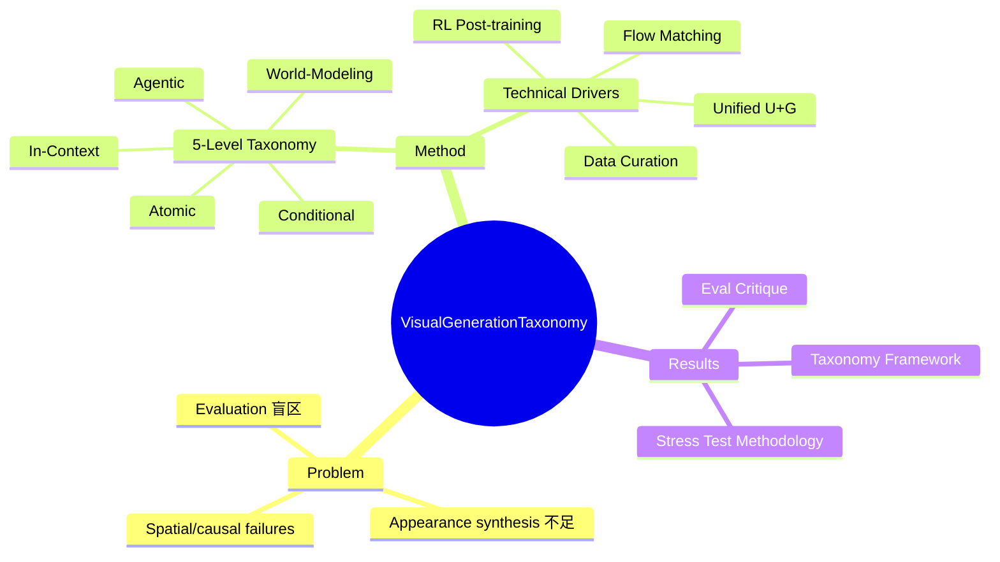

## Summary
提出视觉生成系统的五层能力 taxonomy（Atomic → Conditional → In-Context → Agentic → World-Modeling），从被动渲染器演进到交互式、agent 化、world-aware 生成器。系统分析了 flow matching、统一理解生成模型、post-training RL、data curation 等技术驱动，并批判当前评估过于关注 perceptual quality 而忽视 structure/temporal/causal failures。

## Problem & Motivation
当前视觉生成模型在 photorealism、typography、instruction following 方面进展显著，但在 **spatial reasoning、persistent state、long-horizon consistency、causal understanding** 上仍严重不足。作者认为领域应从 appearance synthesis 转向 **intelligent visual generation**：生成的内容需 grounded in structure、dynamics、domain knowledge 和 causal relations。

核心问题：如何系统性地理解和推进视觉生成系统的能力演进？现有 benchmark 往高估进展，因为只测 perceptual quality 而遗漏更深层的能力缺失。

## Method
### 五层 Taxonomy
1. **Level 1: Atomic Generation** — 无条件生成，纯分布匹配（如早期 GAN）
2. **Level 2: Conditional Generation** — 给定条件（text/image）生成，但无上下文记忆
3. **Level 3: In-Context Generation** — 支持多轮编辑、保持参考图像 identity，具备 context awareness
4. **Level 4: Agentic Generation** — agent 化：理解意图、规划生成流程、调用工具、迭代优化
5. **Level 5: World-Modeling Generation** — 生成世界模拟器，具备物理一致性、因果推理、long-horizon dynamics

### 技术驱动分析
- **生成范式**：GAN → Diffusion → Flow Matching → Autoregressive → Hybrid AR+Diffusion
- **架构演进**：U-Net → Transformer backbone；VAE latent → VQ discrete token；分离式 fusion → unified early fusion
- **训练管线**：pre-training data curation（waterfall filtering、synthetic annotation）；SFT（VLM relabeling）；RL alignment（DDPO、DPOK、Diffusion-DPO、GRPO）
- **推理加速**：ODE solver、distillation、feature caching、structured pruning
- **评估**：VLM-as-judge、arena-based human preference、domain-specific benchmark

### 闭源系统逆向分析
对 GPT-Image、 frontier 系统的推测架构：dual-path encoder（fidelity + semantics）、generation-time understanding loop、external agent orchestration。

## Key Results
Survey 论文，无 quantitative results。核心贡献：
1. 提出五层 taxonomy 框架，为视觉生成系统提供能力分级 lens
2. 系统梳理技术演进路径（从 GAN 到 Flow Matching 到 Unified Understanding-Generation）
3. 批判现有评估方法论，指出 benchmark 对 structural/temporal/causal failures 的盲区
4. Stress test 方法论：结合 benchmark review、in-the-wild 测试、expert-constrained case study

## Strengths & Weaknesses
### Strengths
- Taxonomy 设计清晰，从被动到主动的演进逻辑合理，与世界模型研究方向的 connection 明确
- 对技术驱动因素的分析全面，覆盖了从架构到训练到推理的全链路
- 评估批判有价值：确实 FID/IoU 等 metric 遗漏了高层次能力
- 对闭源系统的"speculative reading" 有洞察，承认 open-closed gap 的具体 failure mode

### Weaknesses
- Taxonomy 的边界定义偏模糊：Level 3 vs Level 4 的区分缺乏明确操作标准
- Survey 深度不足：部分技术点（如 flow matching 数学细节）仅点到为止
- Stress test 方法论停留在概念层面，缺少具体 implementation 或 case study 结果
- 27 人作者团队，贡献分工不明，survey 的 coherence 受影响
- Level 5 World-Modeling 基本纯 speculation，没有 grounding 在现有工作

## Mind Map

## Notes
- Taxonomy 的 Level 4 Agentic Generation 与 GUI Agent 的 core capability 有 overlap：理解意图、规划、调用工具
- Level 5 World-Modeling Generation 是 Embodied AI + World Model 研究方向的交汇点，可能成为 future survey 的子方向
- 评估批判部分可借鉴：当前 VLM-as-judge 对 structural/temporal failures 的 detection 能力不足
- 与 [[Papers/2411-WorldModelSurvey]] 有 overlap，但视角不同：本文从生成系统演进角度切入