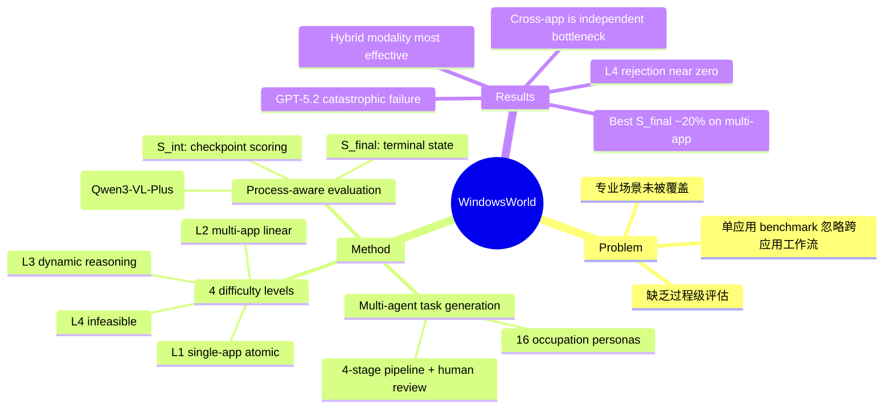

## Summary
提出了 WindowsWorld，一个面向跨应用专业工作流的 GUI Agent benchmark，通过多 agent 生成框架和 16 个职业 persona 构建了 181 个任务，揭示当前所有 computer-use agent 在多应用任务上成功率不超过 21%。

## Problem & Motivation
现有 GUI agent benchmark（如 OSWorld、AndroidWorld）主要聚焦单应用、孤立任务，忽略了真实专业场景中跨多个桌面应用协调完成复杂工作流的需求。具体而言，OSWorld 仅 27.4% 任务涉及多应用，且缺乏过程级评估（intermediate checkpoint），无法诊断 agent 在长链任务中的具体失败环节。这导致对 agent 能力的评估过于乐观，掩盖了跨应用状态维护和上下文切换的核心瓶颈。

## Method

### 任务生成管线（Multi-Agent Pipeline）
1. **Generator**：基于 DeepSeek-V3.2，以 16 个职业 persona 的日常工作流为约束生成任务描述，支持 web search 在 GitHub/Wikipedia/StackOverflow 上查找可访问资源
2. **Refiner**（4 节点管线）：
   - Semantic Deduplicator：基于 embedding cosine similarity（τ=0.85）去重
   - Validity Auditor：异步 HTTP 验证 URL 可达性，交叉检查文件引用
   - Dependency Reasoner：LLM 将过程性前提转化为声明式环境状态
   - Metric Refiner：标准化评估标准，确保每个 checkpoint 无歧义
3. **Human Reviewer**：4 名标注员做最终质量控制（1.5 USD/task）
4. **Environment Generator**：LLM 生成所需文件（.xlsx/.docx/.py 等），Smart File Merging 跨任务保持数据一致性

### 任务体系
- **L1**（Single-App Atomic）：单应用内复杂操作，平均 9.67 步
- **L2**（Multi-App Linear）：跨应用顺序工作流，平均 18.13 步
- **L3**（Dynamic Reasoning）：需条件判断和跨应用推理，平均 27.81 步
- **L4**（Infeasible）：因无效 URL/缺失文件/需认证而不可完成的任务，测试拒绝能力

覆盖 17 个桌面应用、16 个职业 persona，78% 任务为多应用，平均每任务 5.0 个 sub-goal。

### 评估方式
- **S_int（Intermediate Check Score）**：VLM judge（Qwen3-VL-Plus）逐 checkpoint 评估过程进度，平均每任务 4.97 个 checkpoint
- **S_final（Final Check Score）**：评估终态正确性（含 L4 拒绝能力）
- VLM judge Cohen's κ：checkpoint 级 0.867，final 级 0.827

## Key Results

### 主要结论
- **所有 agent 在多应用任务上表现极差**：最佳 S_final 仅 ~20%（Gemini-3-flash-preview, Hybrid 模态）
- **跨应用是独立瓶颈**：step-matched 对比下，L1 S_final 46.15% vs L2 S_final 14.29%，证明上下文切换而非步数长度是核心难点
- **Hybrid 模态（Screenshot + Accessibility Tree）最有效**：Gemini-3-pro S_int 比纯截图提升 +7.9%
- **GPT-5.2 灾难性失败**：几乎所有设置下 S_final ≈ 0
- **Agent 框架（S3）对弱 grounding 模型有显著帮助**：Qwen3-vl-plus S_int 近乎翻倍，但对强模型边际收益递减
- **失败模式**：agent 在第 1-2 个 checkpoint 即失败，或产生"低效漂移"——执行局部合理但全局错误的动作而不终止
- **L4 拒绝能力极弱**：最佳仅 GPT-5.2 (SoM) 25%，多数模型接近 0

### 效率分析
- Gemini-3-flash 每步延迟 9.6-16.9s，Claude-Sonnet 4.5 达 11.5-25.8s
- 中文 vs 英文指令：英文 L3 S_final 高出 6.3 个百分点

## Strengths & Weaknesses

### Strengths
1. **过程级评估设计精良**：intermediate checkpoint 机制能精确诊断 agent 失败位置，比仅看终态的 benchmark 信息量大得多
2. **跨应用占比高（78%）**：真实反映了专业工作流的多应用特性，与 OSWorld（27.4%）形成鲜明对比
3. **任务生成管线可复现**：multi-agent pipeline + human review 的组合在质量与可扩展性之间取得了合理平衡
4. **L4 infeasible tasks**：测试 agent 的自我认知和拒绝能力，是少见但重要的评估维度
5. **ablation 扎实**：step-matched 跨应用难度分析、failure distribution、语言差异等分析有实际洞察

### Weaknesses
1. **规模偏小**：181 个任务远少于 OSWorld（49 但更精）和其他大型 benchmark，统计显著性存疑，尤其 L4 仅 12 个任务
2. **缺乏 human performance baseline**：没有报告人类在这些任务上的成功率/步数，难以判断任务是否本身过难或定义是否合理
3. **VLM judge 依赖**：S_int 的可靠性完全取决于 Qwen3-VL-Plus 的判断质量，虽然报告了 agreement 数据，但 judge 本身可能对特定失败模式有系统性偏差
4. **环境为模拟而非真实 OS**：任务执行在模拟环境中，可能无法完全复现真实 Windows 桌面的交互复杂性（如延迟、弹窗、系统更新等）
5. **未评估 MCP 工具使用**：作为 2026 年的 benchmark，忽略了当前 agent 生态中日益重要的 MCP tool integration 是一个盲点
6. **应用覆盖偏科**：Excel（73 个任务）和 Thunderbird（72 个任务）占比过高，而多媒体应用（VLC 仅 1 个）覆盖不足

## Mind Map

## Notes
- 与 OSWorld 的关系：WindowsWorld 可以看作 OSWorld 在跨应用场景下的深化，但规模更小、评估更细
- GPT-5.2 的灾难性失败值得深究——是否与 action space 映射有关，还是模型本身在 GUI grounding 上的能力缺陷？
- S3 agent 框架的差异化收益暗示：对于 GUI agent，grounding 能力（定位元素）比 reasoning 能力更关键
- 78% 多应用任务占比是合理的，但缺少对"应用切换频率"与"任务难度"关系的更细粒度分析
