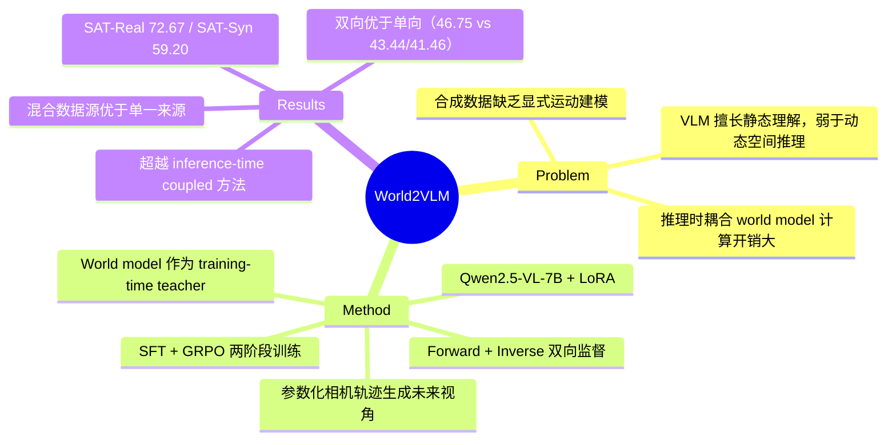

## Summary

提出 World2VLM 训练框架，将生成式 world model 的空间想象能力蒸馏到 VLM 中，使 VLM 在推理时无需调用 world model 即可进行动态空间推理（前向与逆向），在多个 benchmark 上超越 test-time world-model-coupled 方法。

## Problem & Motivation

VLM 在静态视觉理解上表现强劲，但在需要想象自我中心运动下场景如何演变的动态空间推理上仍然薄弱。现有两类方案各有局限：(1) 用合成数据扩充空间监督，但缺乏显式的运动条件状态转移建模；(2) 推理时耦合 VLM 与 world model，但计算开销大。核心问题是：能否在训练阶段就把 world model 的"想象"能力内化到 VLM 中？

## Method

**核心思路**：World model 作为 teacher，在训练时生成几何对齐的未来视角作为监督信号，蒸馏到 student VLM 中。

**数据生成管线**：
- 给定初始观测图像 + 参数化相机轨迹（包含平移和旋转步），使用 view-consistent world model 合成几何对齐的未来视角
- 将每帧与其最远的合成帧配对，强调大幅度视角变化
- 在文本 prompt 中嵌入 object tracking metadata 作为空间锚点

**双向空间推理监督**：
- **Forward（action-to-outcome）**：给定相机运动，预测物体如何移动/消失
- **Inverse（outcome-to-action）**：给定两帧图像，推断连接它们的相机运动
- 双向设计迫使模型将 action、视角变化、物体级几何绑定为统一表示

**两阶段训练**：
1. **SFT**：用结构化空间 query 对齐 VLM
2. **GRPO**（Group Relative Policy Optimization）：优化格式正确性、数值精度、几何准确度和序列排序

**模型配置**：
- Student：Qwen2.5-VL-7B-Instruct + LoRA
- Teacher 1：基于 diffusion 的视角合成模型（SVC），从相机参数合成视角
- Teacher 2：基于 action 序列训练的交互式视频生成器
- World model 仅在离线数据生成时使用，部署时无额外开销

## Key Results

在四个空间推理 benchmark 上评估：

| Benchmark | SVC Teacher | Video Teacher |
|:----------|:----------:|:------------:|
| SAT-Real | 72.67 | 69.33 |
| SAT-Syn | 59.20 | 65.20 |
| VSI-Bench | 41.55 | 39.07 |
| MindCube | 34.86 | 36.85 |

两种 teacher 配置均超越 inference-time world-model-coupled 基线方法。

**Ablation 结果**（平均分）：
- Full bidirectional: 46.75
- Forward only: 43.44
- Inverse only: 41.46
- Real only: 42.20
- Sim only: 42.67

混合真实与合成图像源训练优于仅用单一来源；双向推理优于单向。

## Strengths & Weaknesses

**Strengths**：
- World model 作为 training-time teacher 的范式转换，优雅且实用——消除了推理时的计算开销
- Forward + inverse 双向推理设计有良好动机，强制模型学习 action-viewpoint-geometry 的统一表示
- 在 7B 模型上用 compact dataset 即可蒸馏出显著增益，scalability 好
- 在 SAT-Real 等真实场景 benchmark 上的提升说明方法有实际价值

**Weaknesses**：
- 评估主要聚焦自我中心视角预测（SAT、VSI-Bench、MindCube），未覆盖更广泛的空间推理任务（如空间关系问答、导航推理等）
- 学生模型能力上界受限于 teacher world model 的生成质量——若 world model 在复杂场景中产生几何失真，监督信号会带噪
- 未讨论方法在更大 VLM（如 70B+）上的 scaling 行为
- GRPO 阶段的 reward 设计（格式、数值、几何、排序）较复杂，各 reward 分量的贡献和敏感度未充分分析

## Mind Map

## Notes

- 这篇工作的核心 insight——world model 不仅可以作为推理时工具，还可以作为训练时 teacher——与 knowledge distillation 的经典思路一脉相承，但将其应用到空间想象能力的迁移上是有价值的视角
- 与 WorldR1 等同期工作形成有趣对比：WorldR1 侧重 RL 驱动的世界理解，本文侧重蒸馏范式
- 可以关注该方法是否能扩展到 3D 空间推理、导航规划等更复杂的 embodied 任务
- 代码和数据已在 GitHub/HuggingFace 开源，值得检查数据生成管线的细节
