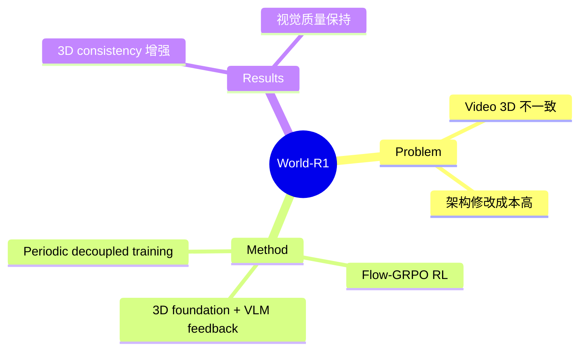

## Summary

World-R1 通过 RL（Flow-GRPO）对齐视频生成与 3D 约束，解决 video foundation models 的几何不一致问题。引入纯文本数据集用于 world simulation training，用 3D foundation models + VLM 提供反馈，不修改底层架构。

## Problem & Motivation

Video foundation models 存在几何不一致问题：
- 3D 结构不连贯
- 现有方法通过架构修改注入 3D priors，但计算成本高且限制 scalability

## Method

**核心设计**：
1. **Flow-GRPO**: RL 框架，用 3D foundation models + VLM 反馈 enforce structural coherence
2. **纯文本数据集**: 专门为 world simulation 设计
3. **Periodic Decoupled Training**: 平衡刚性几何一致性 + 动态场景流动性

**优势**: 不修改底层架构

## Key Results

- 显著增强 3D consistency
- 保持原 foundation model 的视觉质量
- 59 HF upvotes

## Strengths & Weaknesses

**亮点**：
- RL 方式而非架构修改，更 scalable
- Flow-GRPO + 3D feedback 的设计合理
- 不改变底层模型

**局限**：
- "纯文本数据集用于 world simulation"概念模糊
- 缺少与 Sora、Runway 等主流 video generation 的对比
- 3D consistency 具体提升幅度未量化

## Mind Map

## Notes

> [基于 arXiv abstract]

将 RL 用于 video generation 的 3D consistency 对齐，与 SpatialEvo 用 DGE + GRPO 的思路相似。关键是"不修改架构"的承诺。