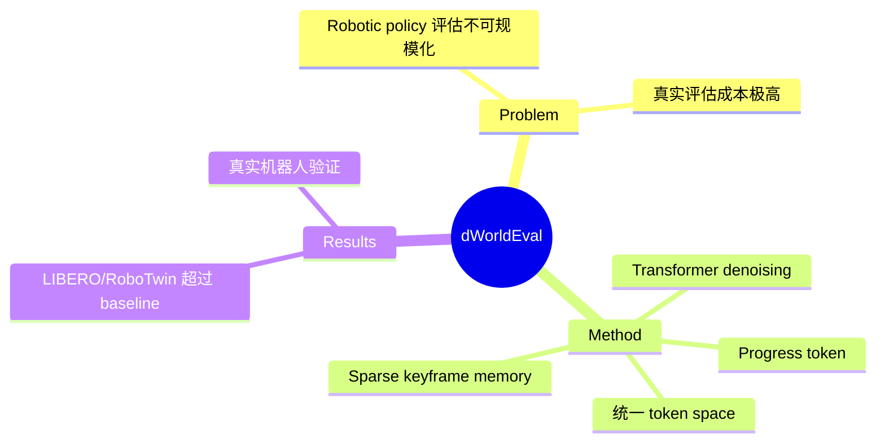

## Summary

dWorldEval 用离散 diffusion world model 作为 robotics policy 的可扩展评估代理。将 vision、language、robotic action 映射到统一 token space，用单一 transformer denoising network 建模。引入 sparse keyframe memory + progress token（任务完成度指示），自动判断 success。

## Problem & Motivation

Robotic policy evaluation的规模化问题：
- 跨数千环境 + 数千任务评估不可行
- 真实世界评估成本极高

## Method

**核心架构**：
1. **统一 token space**: vision + language + action 全部 token 化
2. **Transformer denoising network**: 单一网络建模所有模态
3. **Sparse keyframe memory**: 维护 spatiotemporal consistency
4. **Progress token**: 任务完成度指示，progress=1 时判定 success

**推理**: 联合预测未来观测 + progress token

## Key Results

- 在 LIBERO、RoboTwin 和真实机器人任务上超过 WorldEval、Ctrl-World、WorldGym
- 2 HF upvotes（热度不高）

## Strengths & Weaknesses

**亮点**：
- 统一 token space 设计符合多模态建模趋势
- Progress token 是有价值的 idea——将任务完成度显式编码
- Sparse keyframe memory 处理长序列一致性

**局限**：
- 热度低（2 upvotes），可能影响力有限
- "discrete diffusion" vs "continuous diffusion" 的 trade-off 未分析
- 与真实评估的 fidelity 差多少？

## Mind Map

## Notes

> [基于 arXiv abstract]

Progress token 是有趣的 idea——将任务完成状态编码进 world model。与 L3 Evolver 的"自主修正"有概念关联。