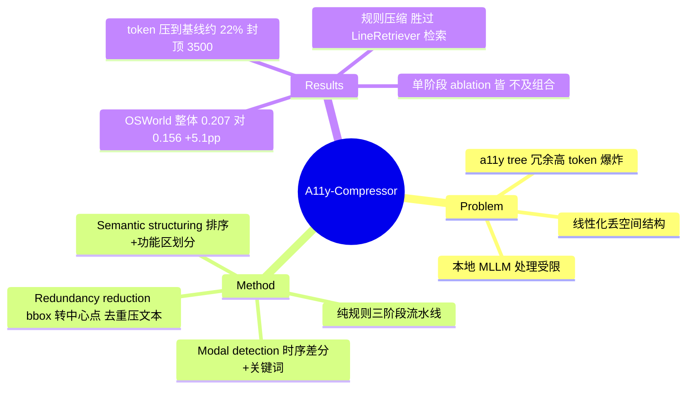

## Summary
针对 GUI agent 用 accessibility (a11y) tree 作观察时冗余高、缺空间结构的问题，提出纯规则的 A11y-Compressor（实现名 Compressed-a11y），经 modal detection → redundancy reduction → semantic structuring 三阶段把线性化 a11y tree 重构为紧凑结构化表示；在 OSWorld 上 token 压到基线的约 22%，同时平均成功率提升 5.1pp。

## Problem & Motivation
GUI agent 需要可靠 grounding 的观察表示。a11y tree 是常用的文本格式，编码 UI 元素属性，但两大缺陷：(1) **冗余高**——大 UI 下 token 爆炸，本地 MLLM 处理成本高；(2) **缺结构信息**——线性化后丢失元素间空间关系。作者主张：与其换更强模型或上纯视觉截图，不如把已有的 a11y 文本"重构"成信息密度更高、带空间语义的表示。动机偏工程效率，落点是让本地 MLLM（Qwen3-VL-32B）在受限 token 下也能稳定操作桌面应用。

## Method
纯 **rule-based / heuristic** 流水线（无训练、无可学习组件），三阶段：

- **Modal detection（§3.1）**：识别遮挡背景、阻断交互的前景元素（弹窗/cookie 框等）。两条互补策略——(a) **temporal-difference**：比较相邻步 t 与 t−1 的线性化 a11y tree，若屏幕状态未变但出现新元素，判为 modal 候选；(b) **keyword-based**：匹配 "cookie"、"accept" 等 modal 关键词。产出 modal 集 M 与 background 集 B。
- **Redundancy reduction（§3.2）**：把 bounding box 转成 **center coordinates** 简化空间推理；再做规则预处理——过滤无关元素、合并重复、归一化属性、压缩文本，得到精简集 (M′,B′)。
- **Semantic structuring（§3.3）**：先按 center 坐标从左上到右下排序，再用"由空间布局导出的 application-specific heuristics"划分为功能区（如 APP_LAUNCHER、CONTENT），细则在 Appendix D。

启发式规则来自 9 个应用域的 **145 个 screen state**，仅依赖结构/视觉特征、无 task-specific tuning，且与评测集独立以避免 benchmark bias。作者称该表示 model-agnostic，只要 MLLM 接受文本 GUI 观察即可用。

## Key Results
评测：OSWorld，358 个任务（剔除环境错误任务），推理模型统一为 **Qwen3-VL-32B**；每任务跑 **2 次 trial，至少一次成功即算成功**（即 best-of-2，非平均）。基线：Screenshot、Linearized a11y tree、LineRetriever（把 web-based 动态选行法扩到多域，retriever 用 Qwen3-4B）。

**效率（主要且大的收益）**：Compressed-a11y 各域 input token 稳定压到约 **3,500 或以下**，整体约为 linearized a11y tree 基线的 **22%**（≈78% 削减）。

**准确率（次要且较小的收益）**：整体成功率 Table 1——Screenshot 0.070 / Linearized a11y 0.156 / LineRetriever 0.151 / **Compressed-a11y 0.207**。即相对 linearized 基线 +5.1pp（0.207−0.156）。收益不均匀，集中于少数域：Writer 0.087→0.304、Thunderbird 0.267→0.467、Chrome 0.182→0.250；而 Multi Apps 0.108 无变化、Calc 仍仅 0.043。注意学习式的 LineRetriever（0.151）整体反而略低于朴素 linearized（0.156）——纯规则压缩胜过动态检索基线。

**Ablation（Table 2，整体列）**：Full 0.207 / Modal-only 0.134 / Redundancy-only 0.156 / Semantic-only 0.134。三点值得注意：(1) 任一单阶段整体都 ≤ 基线 0.156，Modal-only 与 Semantic-only 甚至低于基线（0.134<0.156）——收益是三阶段组合的涌现效应；(2) Redundancy-only 恰等于 linearized 基线 0.156，说明冗余削减本身几乎不带来准确率增益（其价值在 token 侧）；(3) 域级看，Thunderbird 上 Redundancy-only 已达 0.467（= full），该域全部增益来自冗余削减；而 Semantic-only 在 Writer/Thunderbird 掉到 0.000，说明单独上语义分区可能反伤。

## Evidence Ledger
| Claim ID | Claim | Type | Source locator | Evidence excerpt | Status |
|:--|:--|:--|:--|:--|:--|
| C1 | token 压到 linearized a11y 基线的约 22% | number/comparison | Abstract; §6.1 | "reducing the number of input tokens to approximately 22% of that required by the baseline linearized a11y tree" | source-verified |
| C2 | 整体成功率相对 linearized 基线平均 +5.1pp（0.207 vs 0.156） | number/comparison | Abstract; Table 1; §6.1 | "average improvement of 5.1 percentage points"；Overall 0.207 vs 0.156 | source-verified |
| C3 | Table 1 整体：Compressed 0.207 / Linearized 0.156 / LineRetriever 0.151 / Screenshot 0.070 | benchmark number | Table 1 (S5.T1) Overall 列 | "Compressed-a11y (ours) … 0.207"; "Linearized … 0.156"; "LineRetriever … 0.151" | source-verified |
| C4 | Ablation：Full 0.207 / Modal 0.134 / Redundancy 0.156 / Semantic 0.134；Thunderbird Redundancy-only=full=0.467 | benchmark number | Table 2 (S5.T2) Overall 列 | "Full pipeline … 0.207 … Modal … 0.134 … Redundancy … 0.156 … Semantic … 0.134" | source-verified |
| C5 | 各域 input token 稳定 ≤ ~3,500 | number | §5.1 / Fig.3 | "consistently limits the number of input tokens to approximately 3,500 or fewer across all application domains" | source-verified |
| C6 | OSWorld 358 任务；每任务 2 trial，至少一次成功即算成功；启发式来自 9 域 145 screen state、与评测集独立 | benchmark-setting | §4.1, §4.4, §4.2 | "358 tasks … two trials … successful if at least one trial succeeds … 145 screen states … independent of the evaluation set" | source-verified |
| C7 | 推理用 Qwen3-VL-32B；LineRetriever 的 retriever 用 Qwen3-4B | benchmark-setting | §4.1, §4.3 | "we employ Qwen3-VL-32B … as the MLLM"; LineRetriever uses "(Qwen3-4B) as the retriever" | source-verified |

## Strengths & Weaknesses
**亮点**
- 问题 formulation 干净：观察表示的瓶颈是"冗余 + 缺空间结构"，方法就对症下药，simple 且 model-agnostic，无需训练即部署，符合 simple/scalable 的 taste。
- 效率收益扎实且大（token ≈22%、封顶 ~3,500），对本地 MLLM 部署有实际意义；这一点比准确率增益更有说服力。
- 一个反直觉发现有价值：纯规则压缩整体 0.207 高于学习式动态检索 LineRetriever 0.151（后者甚至低于朴素 linearized 0.156）——提示 GUI 观察的收益更多来自"结构重构"而非"选行检索"。

**局限 / 失效边界**
- **准确率增益小且脆**：整体仅 +5.1pp、绝对 SR 只有 20.7%；ablation 显示任一单阶段整体都 ≤ 基线，Modal-only/Semantic-only 反而低于基线，增益是三阶段耦合的涌现——组件间存在互相拖累（Semantic-only 在 Writer/Thunderbird 掉到 0.000），鲁棒性存疑。
- **纯 a11y 单源**：作者自陈无法利用不在 a11y tree 中的纯视觉线索（图标形状、颜色），视觉主导的任务会失效；这是把 belief source 收窄到 structure 的直接代价。
- **重启发式 + 阈值**：145 screen state 手工规则、阈值 Θ 靠启发式，只在 OSWorld 桌面域验证，未测 mobile / 其他生态，泛化性未知。
- **评测口径宽松**：best-of-2 抬高了所有方法的报告 SR，跨方法比较仍成立，但绝对数字不等价于单次可靠性。
- 增益高度域依赖：Multi Apps 零增益、Calc 近零，密集网格类 UI（表格）a11y 表示信息量本就不足。

## Mind Map

## Notes
- **与论点的关系**（"action 必须可追溯到某个 belief source——像素/结构/记忆/先验——并留下可验证的状态改变；hybrid 观察可能放大 stale evidence"）：本文是**单源（structure-only）**的对照点。它把 belief source 完全压在 a11y 结构上，失效边界恰好落在"只有像素才承载的证据"（图标/颜色）——正面印证 belief source 的选择决定能力上限。它不做 hybrid，因此不直接检验"hybrid 放大 stale evidence"；但其 temporal-difference modal detection 依赖相邻步 a11y tree 的差分，一旦 a11y 更新滞后于真实屏幕，diff 就会误判 modal——这正是"跨步证据可能 stale"的一个小型实例，值得在 hybrid 设计中警惕。
- 效率 vs 准确率必须分开读：headline 的两个数字量级悬殊——token 侧是稳健的大收益（78% 削减），SR 侧是小而脆的 +5.1pp。abstract 把二者并列易让人误读为"又快又准"。
- 一个可复用观察：学习式选行（LineRetriever）不敌规则重构，暗示"给 MLLM 什么结构"可能比"给它选哪些行"更关键——对 observation representation 研究是一个 problem-formulation 层面的信号。
