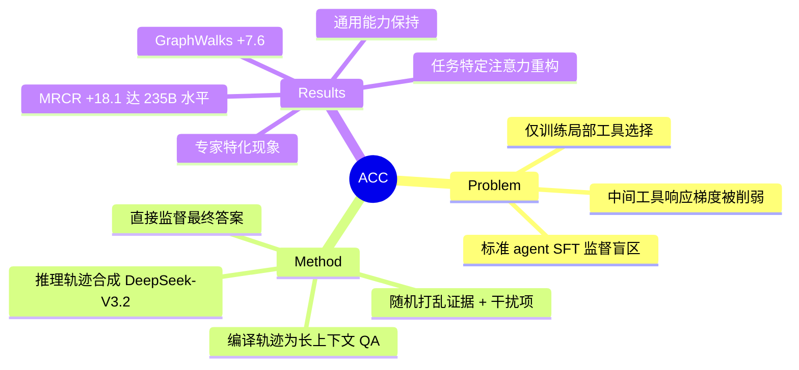

## Summary
提出 Agent Context Compilation (ACC)，将 agent 多轮轨迹编译为长上下文 QA 对，直接训练模型从完整证据中推理答案，绕过标准 agent SFT 的"监督盲区"，在 MRCR 和 GraphWalks 上大幅提升长上下文推理能力（+18.1 / +7.6），达到 8 倍参数量模型的水平。

## Problem & Motivation
Agent 在解决问题时产生大量多轮轨迹，证据分散在多次工具调用和观察中。标准 agent SFT 屏蔽工具响应，仅训练下一步工具选择，导致"监督盲区"：中间工具输出的梯度主要通过短路径传递到下一个动作，而非最终答案，限制了长上下文推理能力的发展。作者形式化证明，前 k-1 轮监督的是"局部下一工具选择"，只有最后一轮覆盖"最终答案预测"，从答案回传到中间工具响应的梯度"必须反向传播穿过长链条的中间轮次"，被严重削弱。

## Method
**核心思路**：将所有证据聚合到一个长上下文 C 中，训练模型直接从问题 q 和上下文 C 生成推理轨迹 r 和答案 y，消除中间动作项，使"最终答案监督直接到达每个证据 token"。

**上下文构建**（§3.3）：
- **Search**：访问页面的完整文本 + 未访问的候选结果作为干扰项
- **SWE**：正确 patch 中的文件 + 额外检查的上下文文件作为干扰项
- **SQL**：所有查询表的完整内容

证据片段随机打乱并拼接（token 预算 B），强制模型"通过语义关联而非顺序位置定位相关信息"。

**推理轨迹合成**：使用 DeepSeek-V3.2-Thinking 生成，仅保留导向正确答案的轨迹。通过率：Search ~100%，SQL ~50%，SWE ~10%。

**训练设置**：
- 基座模型：Qwen3-30B-A3B-Thinking
- 训练数据：10,802 条编译轨迹（Search: 3,369; SWE: 4,368; SQL: 3,065），上下文长度 2K–128K tokens
- 序列长度 131,072 tokens，全局 batch size 16，学习率 1×10⁻⁵（cosine schedule，5% warmup），4 epochs

## Key Results
**长上下文推理 benchmark**：
- **MRCR**（多轮指代消解）：50.19 → 68.28 (+18.09)，其中 4-needle 子任务 +21.16
- **GraphWalks**（图遍历）：69.92 → 77.51 (+7.59)，Parents 子任务 +10.31

这些结果与 Qwen3-235B-A22B（MRCR: 67.51, GraphWalks: 76.63）相当，尽管后者有约 8 倍的激活参数。

**通用能力保持**：
- GPQA-Diamond: 67.71 → 70.20 (+2.49)
- MMLU-Pro: 74.50 → 76.00 (+1.50)
- AIME'24: 90.00 → 90.00 (0.00)
- AIME'25: 86.67 → 90.00 (+3.33)
- IFEval: 86.69 → 86.14 (−0.55)

数据重叠分析显示训练查询与 benchmark 问题的平均最近邻余弦相似度低于 0.36，线性分类器分离两者的 AUC 为 0.9986，表明提升反映"可迁移推理而非数据泄漏"。

**与长上下文后训练方法对比**：
- QwenLong-L1.5 在 MRCR 上领先（92.30），但使用复杂的多阶段 RL pipeline
- ACC 在 GraphWalks 上超越（77.51 vs. 73.85），仅需标准 SFT
- LongRLVR 和 LongPO（在 Qwen2.5 上训练）在两个 benchmark 上得分低得多

**Ablation 研究**：
- **Agent 类型**：原始 search 轨迹 + 标准 Agent SFT（屏蔽观察）*低于*基座模型（MRCR: 42.16, GraphWalks: 57.87），证实监督盲区。单 agent ACC 变体均提升 MRCR；GraphWalks 上仅 SQL 提升（+5.58），可能因为 SQL 表"本质上是关系型的，适合图遍历"。完整混合超越所有单 agent 变体。
- **干扰项**：移除 Search/SWE 的干扰项使 MRCR 下降 3.34/3.81 点，证实干扰项帮助学习证据定位。在 GraphWalks 单 agent 设置中效果相反——干扰项"与查询语义无关，帮助模型学习噪声过滤，但对图遍历几乎无益"。

**机制分析**（§4.6）：
- **任务特定注意力重构**：GraphWalks 上，ACC 模型在近距离和远距离 bin 的注意力均增加（局部邻域检查 + 远距离节点跳转）；MRCR 上，增强主要在近距离 bin（候选验证）。两个任务中注意力变化最大的三层"完全不同"。
- **专家特化**：GraphWalks 上，对远距离 token 的更高激活"分布在多个专家上，表明平衡处理"；MRCR 上，一个专家显示更高激活而其他被抑制，"指向扫描和验证的专用处理"。

## Strengths & Weaknesses
**Strengths**：
- **理论洞察清晰**：形式化"监督盲区"问题，解释了为什么标准 agent SFT 难以发展长上下文推理
- **方法简洁有效**：无需复杂 RL pipeline，仅用标准 SFT 即达到 8 倍参数量模型的性能
- **实验设计严谨**：数据重叠分析、ablation 研究、机制分析（注意力模式、专家特化）均充分
- **通用性强**：兼容任何长上下文扩展或训练方法，适用于多种 agent 类型

**Weaknesses**：
- **评估范围有限**：仅在三种 agent 类型和一个模型上评估，泛化性待验证
- **推理合成依赖**：依赖强教师模型（DeepSeek-V3.2-Thinking），可能传播偏见；SWE 通过率仅 10%，数据质量存疑
- **隐私与版权风险**：原始轨迹可能泄露私人信息，编译上下文可能包含版权材料
- **扩展性未知**：百万 token 级别上下文的扩展性尚未研究
- **与 agent 能力的权衡**：训练模型"不使用工具直接回答"，可能削弱工具使用能力（论文未评估）

**潜在影响**：
为 agent 训练提供了新范式——从"训练工具选择"转向"训练从完整证据推理"。如果能扩展到更多 agent 类型和更长上下文，可能成为长上下文 agent 训练的标准方法。但需要解决推理合成的质量和成本问题。

## Mind Map

## Notes
- 这篇论文的核心贡献是**问题诊断**而非方法创新——"监督盲区"的形式化分析很有洞察力，解释了为什么 agent SFT 难以发展长上下文推理。方法本身（编译轨迹为长上下文 QA）是自然的解决方案。
- **与 agentic RL 的关系**：ACC 绕过了工具使用的 RL 训练，直接训练"从证据推理"。这可能是一种更高效的路径，但也可能牺牲了 agent 的交互式探索能力。论文未评估训练后的模型在需要工具使用的任务上的表现。
- **数据效率**：仅用 10,802 条轨迹即达到显著提升，数据效率很高。但推理合成的成本（DeepSeek-V3.2-Thinking）和质量（SWE 通过率 10%）是瓶颈。
- **与 long-context post-training 的对比**：ACC 在 GraphWalks 上超越 QwenLong-L1.5，但在 MRCR 上落后（68.28 vs. 92.30）。这表明 ACC 更适合"关系推理"任务，而非"信息检索"任务。
- **未来方向**：扩展到更多 agent 类型（code generation、embodied agent）、更长上下文（百万 token）、更高质量的推理合成（self-training、RL fine-tuning）。
