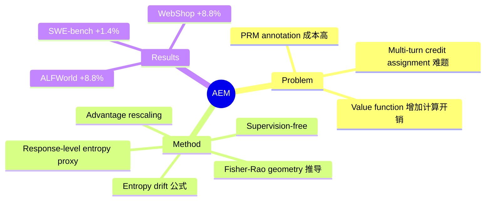

## Summary

AEM 提出一种 supervision-free 的 response-level credit assignment 方法。核心理论发现：entropy drift 由 advantage 与 relative surprisal 的交互决定。AEM 用 response-level entropy proxy rescale advantage，实现从 exploration 到 exploitation 的自适应过渡。在 ALFWorld/WebShop 上 GRPO+1.5B 提升 8.8%，SWE-bench-Verified 上 DeepSWE+32B 提升 1.4%。

## Problem & Motivation

当前 LLM agent 的 RL 优化面临 credit assignment 难题：multi-turn 交互中，最终 reward 难以归因到具体的 response。现有方法要么需要额外的 process reward model（PRM）annotation，要么依赖 value function 增加计算开销。如何在不引入额外监督信号的情况下实现有效的 response-level credit assignment？

## Method

核心设计：

1. **理论推导**：从 Fisher-Rao geometry + natural gradient 推导 entropy drift 公式，发现 entropy drift 由 advantage 与 relative surprisal 的交互决定
2. **Entropy Proxy**：用 token-level entropy sum 代替 response surprisal，作为 Doob decomposition 的 predictable 部分
3. **Advantage Rescaling**：用 response-level entropy proxy rescale advantage，实现从 exploration 到 exploitation 的自适应过渡
4. **Supervision-free**：完全不需要 PRM annotation 或额外 value function

理论基础清晰——不是凭经验调参，而是从几何视角推导出的 principled 方法。

## Key Results

| Benchmark | AEM | 提升 | 备注 |
|:----------|:----|:-----|:-----|
| ALFWorld | GRPO+1.5B | +8.8% | 文本家庭环境 |
| WebShop | GRPO+1.5B | +8.8% | Web 购物任务 |
| SWE-bench-Verified | DeepSWE+32B | +1.4% | 代码修复 |

## Strengths & Weaknesses

**Strengths:**

- **理论扎实**：从 Fisher-Rao geometry + natural gradient 推导 entropy drift 公式，数学基础清晰
- **Supervision-free**：PRM 需要 annotation，value function 需要额外模型，AEM 完全 intrinsic
- **跨 benchmark 提升**：在 ALFWorld/WebShop/SWE-bench 上都有提升

**Weaknesses:**

- **Entropy proxy 是近似**：用 token-level entropy sum 代替 response surprisal，理论上只是部分逼近
- **缺乏与 PRM 的对比**：只对比了 RL baselines，未展示 supervision-free 相比 PRM 的 trade-off（性能/成本）
- **Response-level 假设的适用边界未讨论**：某些 streaming feedback 或 step-level reward 场景可能不适用
- **提升幅度有限**：SWE-bench 上仅 1.4% 提升，可能在统计误差范围内

## Notes

- 理论驱动的方法，从几何视角推导而非经验调参
- 与 GRPO 系列的关系值得深入对比——是否只是 advantage rescaling 的 incremental 改进？
- 需要全文确认：entropy proxy 的具体计算方式、与 PRM 的 head-to-head 对比
- 属于"有参考价值"而非"必读"——supervision-free 设计有启发，但提升幅度有限

## Mind Map

