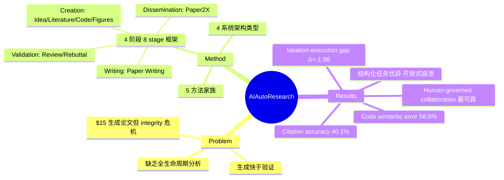

## Summary
首个覆盖完整学术研究生命周期的 AI 辅助研究 survey，将研究流程拆解为 4 个阶段 8 个 stage（从 idea generation 到 dissemination），系统梳理每个 stage 的方法、benchmark 和能力边界。核心发现：AI 在结构化任务上表现优异，但在开放式创新、科学判断和验证上严重滞后——生成速度远超验证能力，human-governed collaboration 是当前最可靠的部署范式。

## Problem & Motivation
AI 系统已能以 ~\$15 成本生成研究论文（FARS 系统 100 篇论文平均 2.3 小时一篇），但这种生产力暴露了完整性危机："即使是 frontier LLMs 仍会捏造结果、遗漏隐藏错误、无法可靠判断 novelty"。现有工作聚焦单点任务（如 literature review、code generation），缺乏对完整研究生命周期的统一分析。本文填补这一空白，提供 taxonomy、benchmark suite、tool inventory 和 practitioner playbook。

## Method
### 四阶段八 Stage 框架
1. **Creation（创造）**
   - S1: Idea Generation — 生成研究想法
   - S2: Literature Review — 文献调研
   - S3: Coding & Experiments — 代码实现与实验
   - S4: Tables & Figures — 可视化与表格生成
2. **Writing（写作）**
   - S5: Paper Writing — 论文撰写
3. **Validation（验证）**
   - S6: Peer Review — 同行评审
   - S7: Rebuttal & Revision — 回复与修订
4. **Dissemination（传播）**
   - S8: Paper2X — 多模态转换（poster、slides、video、social media、agent）

### 五大方法家族
- Prompt engineering
- RAG（检索增强生成）
- Training-free agentic methods
- Training-based methods
- Hybrid approaches

### 系统架构分类
- Sequential pipelines（顺序流水线）
- Search-based self-improving systems（搜索式自改进）
- Skill-based tool-integrated systems（技能库+工具集成）
- Multi-agent community-scale systems（多 agent 社区规模）

## Key Results
### 五大核心发现
1. **结构化任务优异，开放式任务崩溃**：AI 能力在"需要 novelty、隐式领域知识的开放式研究任务上急剧下降"
2. **生成快于验证**：AI 生成 plausible output 的速度远超证明其正确性的能力
3. **人类主导的协作最可靠**：研究者必须保留对判断、解释、实验设计的责任
4. **分层架构占主导**：有效系统结合"探索、基于工具的执行、验证"三层
5. **治理而非检测是关键**：AI 在研究中的使用正从检测问题转变为治理问题

### Stage 级别结果
**S1: Idea Generation**
- LLM 生成的 idea 在 novelty 上评分高于人类（p<0.05），但存在 **ideation-execution gap**：实现前评分高的 idea 在实现后退化严重（Δ=-1.98 vs. 人类 -0.63）
- Novelty-feasibility tradeoff 持续存在：novelty >0.6 但 feasibility <0.5
- "Diversity collapse 可能是当前模型的结构性属性"

**S2: Literature Review**
- "成熟最快的 stage"，两年内四代演进
- Citation accuracy 仍然糟糕：top-1 仅 40.1%
- 架构收敛：plan → retrieve → read → update → synthesize

**S3: Coding & Experiments**
- Frontier systems 在 SWE-bench Verified 超过 76%，但在更难变体（SWE-bench Pro）降至 ~23%
- ResearchCodeBench（novel ML code）最佳模型仅 37.3%，"58.6% 的错误是语义错误"（代码运行但实现错误行为）
- Paper-to-code 天花板 ~39%（SciReplicate-Bench）

**S4: Tables & Figures**
- "相对欠发达，尽管在日常研究实践中很重要"

**S5-S8**
- Paper Writing：从语法纠正到全文生成
- Peer Review：自动评审"连贯但宽松或易受操纵"
- Rebuttal：回复"可能承诺未兑现的修订"
- Dissemination：Paper2X 系统"可能过度简化超出证据的结果"

### Benchmark 盘点
- 编目 52 个 benchmark（Table 2）
- 几乎所有 benchmark 集中在 ML/NLP 领域，跨领域泛化未经测试

## Strengths & Weaknesses
### Strengths
- **首个全生命周期分析**：从 idea 到 dissemination 的完整覆盖，填补系统性空白
- **诚实的能力边界刻画**：不回避 AI 的失败模式（fabrication、semantic errors、ideation-execution gap）
- **实用价值高**：提供 practitioner playbook + tool inventory + benchmark suite，可直接指导研究者选型
- **治理视角前瞻**：明确指出"更大的自动化可能掩盖而非消除失败模式"，human-governed collaboration 是当前最可信范式

### Weaknesses
- **覆盖不均**：Creation 阶段（P1）文献最丰富，Dissemination 工具多为商业/workflow-specific，评估标准化程度低
- **领域局限**：几乎所有 benchmark 和系统聚焦 ML/NLP，对物理、化学、生物等领域的适用性未知
- **20 人作者团队**：贡献分工不明，survey 类论文的 authorship inflation 问题
- **缺少定量 meta-analysis**：52 个 benchmark 的统计特征（任务分布、难度梯度、评估指标一致性）未深入分析
- **方法家族分类粗糙**：五大家族（prompt/RAG/agentic/training-based/hybrid）边界模糊，hybrid 成为 catch-all category

## Mind Map

## Notes
- 与 [[2604-AutoResearchBench]] 形成互补：后者提供 literature discovery 的 benchmark 基础设施，本文提供全局 roadmap
- 与 [[2603-EvoScientist]] 对比：EvoScientist 是 end-to-end system 实例，本文是 meta-level 的 landscape analysis
- **Ideation-execution gap** 是最有价值的发现之一——揭示了 LLM 在"评估自己生成的 idea 的可行性"上的盲区，这对 auto-research 系统设计有直接启示：需要独立的 feasibility verification module
- **治理 > 检测** 的论断值得深思：当 AI 生成内容质量接近人类时，watermarking/detection 失效，必须转向 disclosure + accountability 机制
- 52 个 benchmark 的编目是重要资源，但缺少 benchmark-of-benchmarks 的 meta-evaluation（如：哪些 benchmark 真正测到了 research-level capability？哪些只是 engineering task？）
